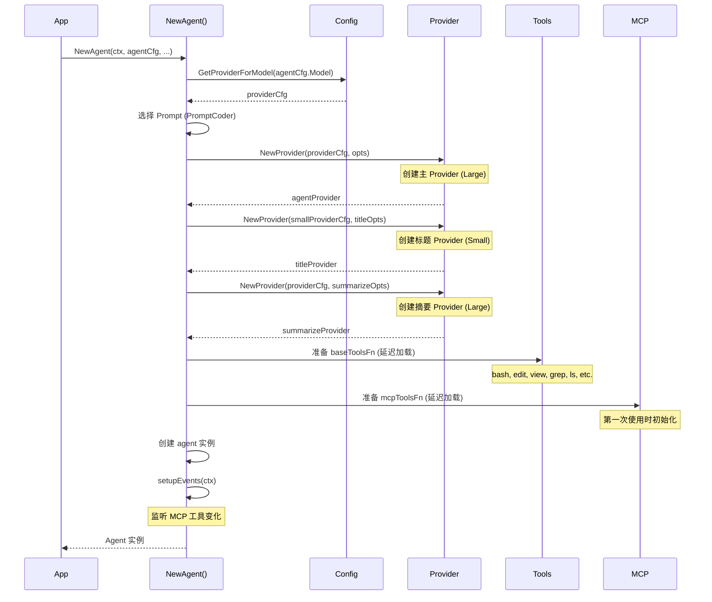
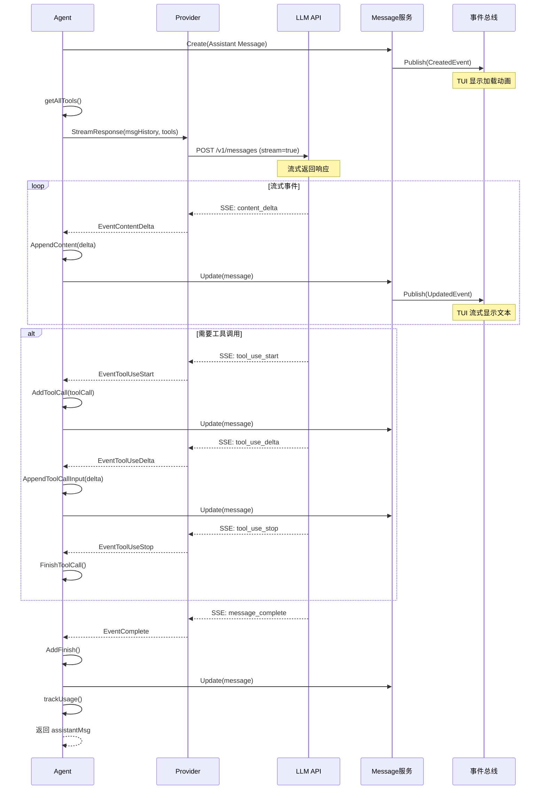
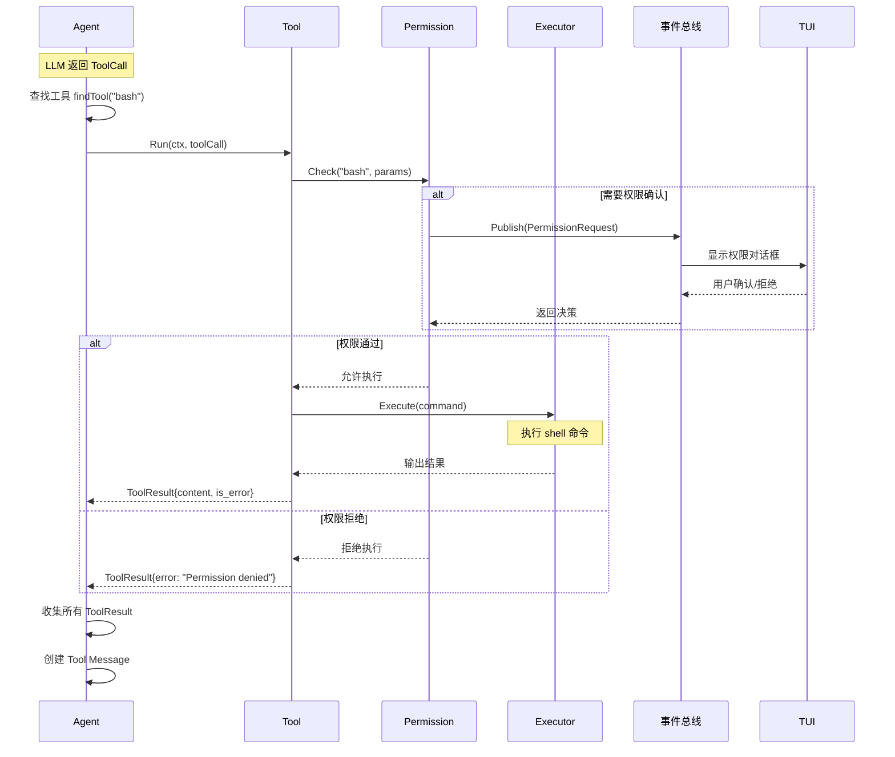
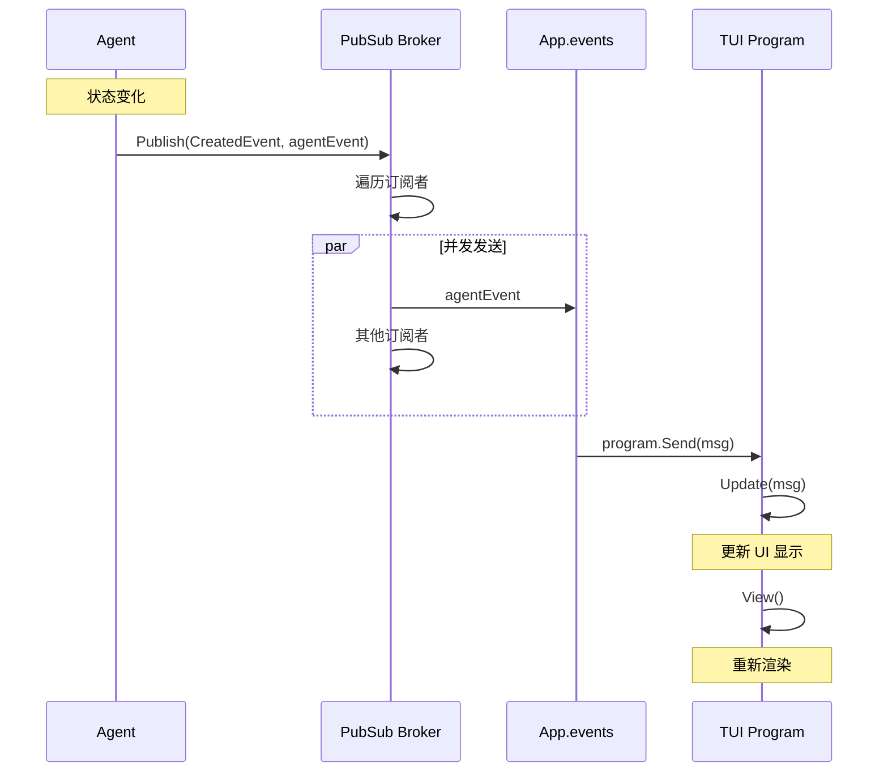
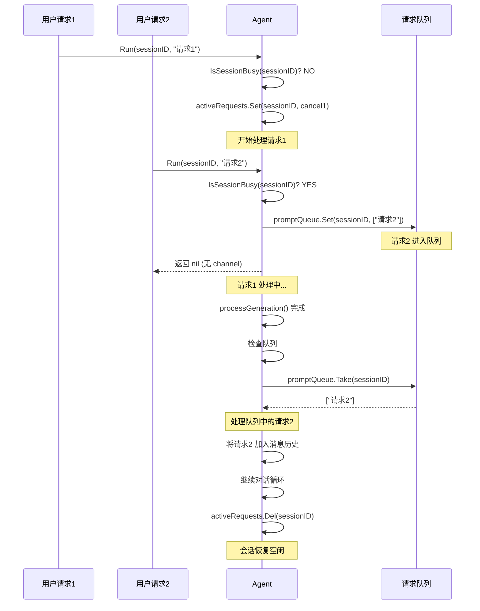
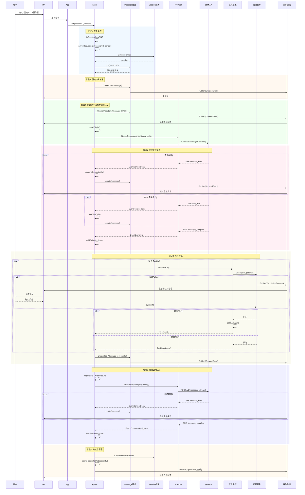
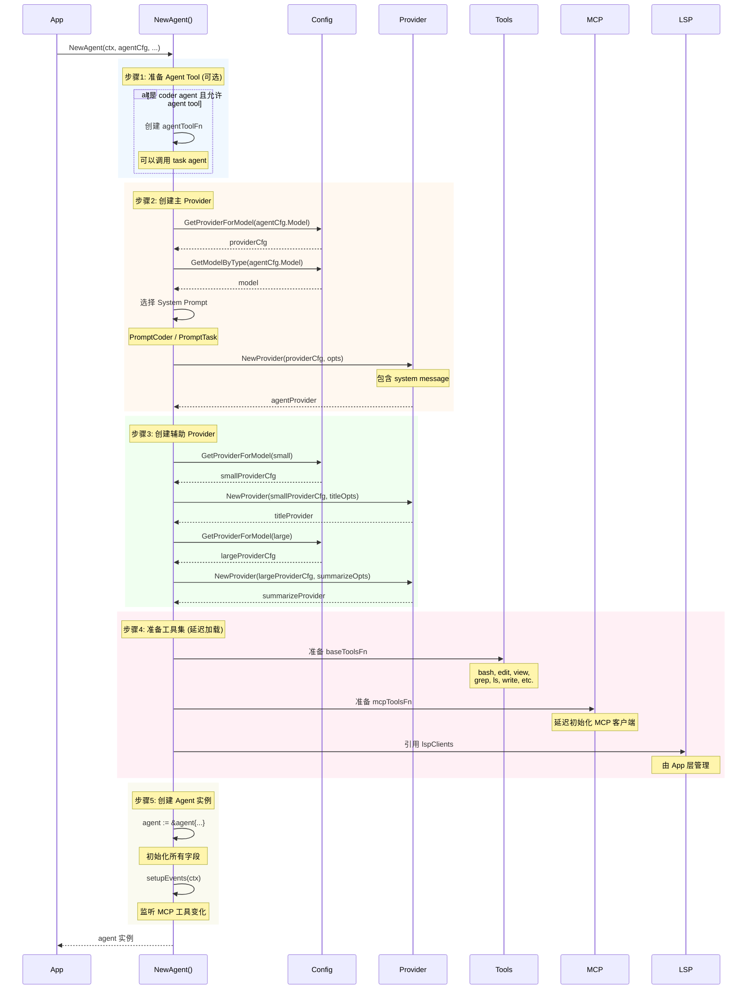
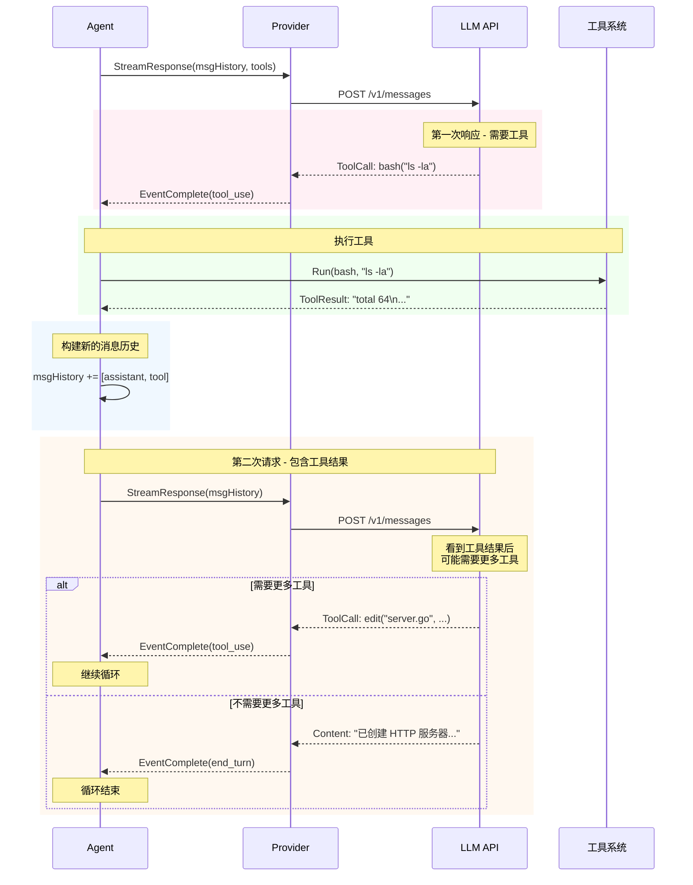
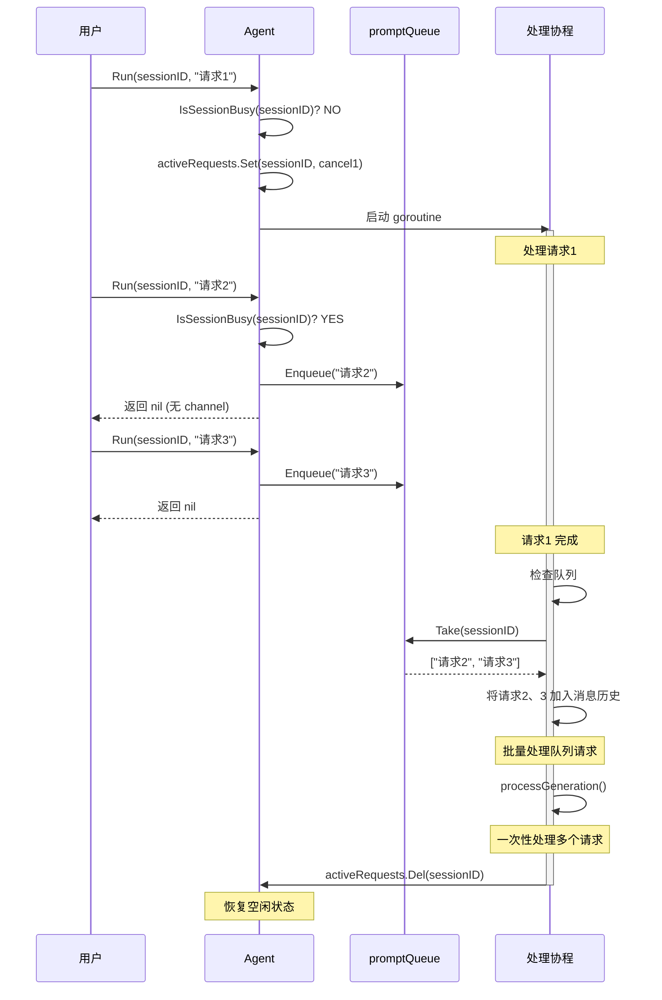

# Crush AI Agent 架构深度解析

> 本文档深入剖析 Crush 项目中 AI Agent 的设计架构、工作流程和实现细节

## 目录

- [一、Agent 架构概览](#一agent-架构概览)
- [二、Agent 核心结构](#二agent-核心结构)
- [三、Agent 初始化流程](#三agent-初始化流程)
- [四、对话请求生命周期](#四对话请求生命周期)
- [五、Agent 与 Provider 交互](#五agent-与-provider-交互)
- [六、工具系统集成](#六工具系统集成)
- [七、事件流转机制](#七事件流转机制)
- [八、并发控制与状态管理](#八并发控制与状态管理)
- [九、核心时序图](#九核心时序图)
- [十、源码阅读指南](#十源码阅读指南)

---

## 一、Agent 架构概览

### 1.1 Agent 在系统中的位置

```
┌─────────────────────────────────────────────────────────┐
│                      App 层                              │
│  ┌──────────────────────────────────────────────────┐  │
│  │              CoderAgent (Agent 服务)              │  │
│  │                                                    │  │
│  │  ┌──────────────┐  ┌──────────────┐             │  │
│  │  │   Provider   │  │  Tool System │             │  │
│  │  │   (LLM API)  │  │  (工具集成)  │             │  │
│  │  └──────────────┘  └──────────────┘             │  │
│  │                                                    │  │
│  │  ┌──────────────┐  ┌──────────────┐             │  │
│  │  │   Messages   │  │   Sessions   │             │  │
│  │  │   (消息服务)  │  │   (会话服务)  │             │  │
│  │  └──────────────┘  └──────────────┘             │  │
│  │                                                    │  │
│  │  ┌──────────────┐  ┌──────────────┐             │  │
│  │  │  Permission  │  │   LSP/MCP    │             │  │
│  │  │  (权限控制)   │  │   (扩展)     │             │  │
│  │  └──────────────┘  └──────────────┘             │  │
│  └──────────────────────────────────────────────────┘  │
└─────────────────────────────────────────────────────────┘
                         ↕
                    Event Bus
                         ↕
                    TUI Layer
```

### 1.2 Agent 的核心职责

1. **对话管理**
   - 接收用户输入
   - 维护对话历史
   - 管理多轮对话

2. **LLM 交互**
   - 构造请求
   - 流式接收响应
   - 解析响应事件

3. **工具调度**
   - 识别工具调用
   - 执行工具
   - 返回结果

4. **状态管理**
   - 会话状态
   - 请求状态
   - 队列管理

5. **事件发布**
   - 进度通知
   - 状态变更
   - 错误处理

### 1.3 设计原则

- ✅ **单一职责**：Agent 专注于对话编排，具体执行交给工具
- ✅ **异步处理**：所有耗时操作异步执行，不阻塞主线程
- ✅ **可取消性**：通过 Context 实现随时取消
- ✅ **流式响应**：实时反馈，提升用户体验
- ✅ **并发安全**：使用 sync.Map 保证并发场景下的安全性
- ✅ **事件驱动**：通过 PubSub 解耦与 UI 的通信

---

## 二、Agent 核心结构

### 2.1 Agent 接口定义

```go
// internal/llm/agent/agent.go

type Service interface {
    pubsub.Suscriber[AgentEvent]
    
    // 核心方法
    Model() catwalk.Model
    Run(ctx context.Context, sessionID string, content string, 
        attachments ...message.Attachment) (<-chan AgentEvent, error)
    
    // 控制方法
    Cancel(sessionID string)
    CancelAll()
    IsSessionBusy(sessionID string) bool
    IsBusy() bool
    
    // 高级功能
    Summarize(ctx context.Context, sessionID string) error
    UpdateModel() error
    
    // 队列管理
    QueuedPrompts(sessionID string) int
    ClearQueue(sessionID string)
}
```

**接口设计要点**：
- 继承 `pubsub.Suscriber` 支持事件订阅
- `Run()` 返回 channel，支持异步处理
- 提供完整的生命周期控制方法
- 支持队列管理，处理并发请求

### 2.2 Agent 实现结构

```go
// internal/llm/agent/agent.go

type agent struct {
    // PubSub 能力
    *pubsub.Broker[AgentEvent]
    
    // 配置
    agentCfg config.Agent  // Agent 配置（允许的工具、LSP、MCP）
    
    // 依赖的服务
    sessions    session.Service
    messages    message.Service
    permissions permission.Service
    
    // 工具集合
    baseTools *csync.Map[string, tools.BaseTool]  // 基础工具
    mcpTools  *csync.Map[string, tools.BaseTool]  // MCP 工具
    lspClients *csync.Map[string, *lsp.Client]    // LSP 客户端
    
    // Agent 工具（递归调用）
    agentToolFn func() (tools.BaseTool, error)
    cleanupFuncs []func()
    
    // Provider（多个）
    provider            provider.Provider  // 主 Provider（Large 模型）
    providerID          string
    titleProvider       provider.Provider  // 标题生成（Small 模型）
    summarizeProvider   provider.Provider  // 摘要生成（Large 模型）
    summarizeProviderID string
    
    // 并发控制
    activeRequests *csync.Map[string, context.CancelFunc]  // 活跃请求
    promptQueue    *csync.Map[string, []string]           // 提示词队列
}
```

**结构设计亮点**：

1. **工具分层管理**
   - `baseTools`：bash、edit、view 等基础工具
   - `mcpTools`：通过 MCP 协议扩展的工具
   - `lspClients`：LSP 客户端提供的能力

2. **多 Provider 策略**
   - 主对话使用 Large 模型（高质量）
   - 标题生成使用 Small 模型（成本优化）
   - 摘要生成使用 Large 模型（质量保证）

3. **并发控制**
   - `activeRequests`：存储每个 session 的取消函数
   - `promptQueue`：当 session 繁忙时，新请求进入队列

4. **事件能力**
   - 继承 `pubsub.Broker` 可以发布事件
   - 其他组件订阅 Agent 事件实时响应

---

## 三、Agent 初始化流程

### 3.1 初始化步骤详解

```go
// internal/llm/agent/agent.go:94
func NewAgent(
    ctx context.Context,
    agentCfg config.Agent,
    permissions permission.Service,
    sessions session.Service,
    messages message.Service,
    history history.Service,
    lspClients *csync.Map[string, *lsp.Client],
) (Service, error)
```

#### 步骤 1：准备 Agent Tool（可选）

```go
// 如果是 coder agent 并且允许使用 agent 工具
var agentToolFn func() (tools.BaseTool, error)
if agentCfg.ID == "coder" && slices.Contains(agentCfg.AllowedTools, AgentToolName) {
    agentToolFn = func() (tools.BaseTool, error) {
        // 创建 task agent
        taskAgentCfg := config.Get().Agents["task"]
        taskAgent, err := NewAgent(ctx, taskAgentCfg, ...)
        return NewAgentTool(taskAgent, sessions, messages), nil
    }
}
```

**设计思想**：
- Coder Agent 可以调用 Task Agent
- Task Agent 只能使用只读工具（view、grep、ls）
- 实现"思考"与"执行"的分离

#### 步骤 2：创建主 Provider

```go
// 获取配置的模型
providerCfg := config.Get().GetProviderForModel(agentCfg.Model)
model := config.Get().GetModelByType(agentCfg.Model)

// 选择 Prompt
promptID := agentPromptMap[agentCfg.ID]  // coder -> PromptCoder

// 创建 Provider
opts := []provider.ProviderClientOption{
    provider.WithModel(agentCfg.Model),
    provider.WithSystemMessage(prompt.GetPrompt(promptID, providerCfg.ID, ...)),
}
agentProvider, err := provider.NewProvider(*providerCfg, opts...)
```

**关键点**：
- 根据 Agent 类型选择不同的 System Prompt
- System Prompt 包含工具使用说明、项目上下文等

#### 步骤 3：创建辅助 Provider

```go
// Small 模型用于标题生成
titleOpts := []provider.ProviderClientOption{
    provider.WithModel(config.SelectedModelTypeSmall),
    provider.WithSystemMessage(prompt.GetPrompt(prompt.PromptTitle, ...)),
}
titleProvider, err := provider.NewProvider(*smallModelProviderCfg, titleOpts...)

// Large 模型用于摘要生成
summarizeOpts := []provider.ProviderClientOption{
    provider.WithModel(config.SelectedModelTypeLarge),
    provider.WithSystemMessage(prompt.GetPrompt(prompt.PromptSummarizer, ...)),
}
summarizeProvider, err := provider.NewProvider(*providerCfg, summarizeOpts...)
```

#### 步骤 4：准备工具集

```go
// 基础工具（延迟加载）
baseToolsFn := func() map[string]tools.BaseTool {
    result := make(map[string]tools.BaseTool)
    for _, tool := range []tools.BaseTool{
        tools.NewBashTool(permissions, cwd, cfg.Options.Attribution),
        tools.NewEditTool(lspClients, permissions, history, cwd),
        tools.NewViewTool(lspClients, permissions, cwd),
        tools.NewGrepTool(cwd),
        // ... 更多工具
    } {
        result[tool.Name()] = tool
    }
    return result
}

// MCP 工具（延迟加载）
mcpToolsFn := func() map[string]tools.BaseTool {
    mcpToolsOnce.Do(func() {
        doGetMCPTools(ctx, permissions, cfg)
    })
    return maps.Collect(mcpTools.Seq2())
}
```

**延迟加载设计**：
- 工具集只在第一次使用时初始化
- MCP 工具可能需要网络连接，延迟加载避免阻塞启动

#### 步骤 5：创建 Agent 实例

```go
a := &agent{
    Broker:              pubsub.NewBroker[AgentEvent](),
    agentCfg:            agentCfg,
    provider:            agentProvider,
    providerID:          string(providerCfg.ID),
    messages:            messages,
    sessions:            sessions,
    titleProvider:       titleProvider,
    summarizeProvider:   summarizeProvider,
    summarizeProviderID: string(providerCfg.ID),
    agentToolFn:         agentToolFn,
    activeRequests:      csync.NewMap[string, context.CancelFunc](),
    mcpTools:            csync.NewLazyMap(mcpToolsFn),
    baseTools:           csync.NewLazyMap(baseToolsFn),
    promptQueue:         csync.NewMap[string, []string](),
    permissions:         permissions,
    lspClients:          lspClients,
}
```

#### 步骤 6：设置事件监听

```go
a.setupEvents(ctx)  // 监听 MCP 工具变化
```

### 3.2 初始化时序图




---

## 四、对话请求生命周期

### 4.1 Run() 方法 - 请求入口

```go
// internal/llm/agent/agent.go:348
func (a *agent) Run(ctx context.Context, sessionID string, content string, 
                    attachments ...message.Attachment) (<-chan AgentEvent, error)
```

#### 4.1.1 方法签名解析

**输入参数**：
- `ctx`：请求上下文，支持取消
- `sessionID`：会话 ID，标识对话
- `content`：用户输入内容
- `attachments`：文件附件（图片、文档等）

**返回值**：
- `<-chan AgentEvent`：事件通道，异步返回进度
- `error`：立即返回的错误

#### 4.1.2 执行流程

```go
func (a *agent) Run(...) (<-chan AgentEvent, error) {
    // 1. 检查会话是否繁忙
    if a.IsSessionBusy(sessionID) {
        // 如果繁忙，加入队列
        existing, _ := a.promptQueue.Get(sessionID)
        existing = append(existing, content)
        a.promptQueue.Set(sessionID, existing)
        return nil, nil  // 返回 nil，不创建新的 channel
    }
    
    // 2. 创建可取消的上下文
    genCtx, cancel := context.WithCancel(ctx)
    a.activeRequests.Set(sessionID, cancel)
    startTime := time.Now()
    
    // 3. 创建事件通道
    events := make(chan AgentEvent, 1)
    
    // 4. 异步处理生成
    go func() {
        defer log.RecoverPanic("agent.Run", func() {
            events <- a.err(fmt.Errorf("panic while running the agent"))
        })
        
        // 处理附件
        var attachmentParts []message.ContentPart
        for _, attachment := range attachments {
            attachmentParts = append(attachmentParts, message.BinaryContent{
                Path: attachment.FilePath, 
                MIMEType: attachment.MimeType, 
                Data: attachment.Content,
            })
        }
        
        // 核心生成逻辑
        result := a.processGeneration(genCtx, sessionID, content, attachmentParts)
        
        // 记录事件
        if result.Error != nil {
            if isCancelledErr(result.Error) {
                slog.Error("Request canceled", "sessionID", sessionID)
            } else {
                slog.Error("Request errored", "sessionID", sessionID, "error", result.Error)
                event.Error(result.Error)
            }
        }
        
        // 清理
        a.eventPromptResponded(sessionID, time.Since(startTime))
        a.activeRequests.Del(sessionID)
        cancel()
        
        // 发布事件
        a.Publish(pubsub.CreatedEvent, result)
        events <- result
        close(events)
    }()
    
    // 5. 记录开始事件
    a.eventPromptSent(sessionID)
    
    return events, nil
}
```

**设计要点**：

1. **队列机制**
   - 一个 session 同时只能有一个活跃请求
   - 新请求自动进入队列，按顺序处理

2. **Context 管理**
   - 每个请求有独立的 Context
   - 可以通过 `Cancel(sessionID)` 取消

3. **异步处理**
   - 主逻辑在 goroutine 中执行
   - 通过 channel 返回进度和结果

4. **错误恢复**
   - `defer log.RecoverPanic` 捕获 panic
   - 保证 channel 正确关闭

### 4.2 processGeneration() - 核心生成逻辑

```go
// internal/llm/agent/agent.go:398
func (a *agent) processGeneration(ctx context.Context, sessionID, content string, 
                                   attachmentParts []message.ContentPart) AgentEvent
```

#### 4.2.1 完整流程

```
┌────────────────────────────────────────┐
│  1. 加载历史消息                        │
│     messages.List(sessionID)           │
└────────────────────────────────────────┘
                  ↓
┌────────────────────────────────────────┐
│  2. 如果是新会话，异步生成标题            │
│     go generateTitle(...)              │
└────────────────────────────────────────┘
                  ↓
┌────────────────────────────────────────┐
│  3. 创建用户消息                        │
│     messages.Create(User, content)     │
└────────────────────────────────────────┘
                  ↓
┌────────────────────────────────────────┐
│  4. 构建消息历史                        │
│     msgHistory = append(msgs, userMsg) │
└────────────────────────────────────────┘
                  ↓
┌────────────────────────────────────────┐
│  5. 进入工具调用循环                    │
│     for { ... }                        │
└────────────────────────────────────────┘
                  ↓
┌────────────────────────────────────────┐
│  5.1 流式处理并处理事件                 │
│      streamAndHandleEvents(...)        │
└────────────────────────────────────────┘
                  ↓
┌────────────────────────────────────────┐
│  5.2 判断 FinishReason                 │
│      - tool_use: 继续循环              │
│      - end_turn: 检查队列              │
│      - 其他: 返回结果                  │
└────────────────────────────────────────┘
```

#### 4.2.2 代码实现

```go
func (a *agent) processGeneration(ctx context.Context, sessionID, content string, 
                                   attachmentParts []message.ContentPart) AgentEvent {
    // 1. 加载历史消息
    msgs, err := a.messages.List(ctx, sessionID)
    if err != nil {
        return a.err(fmt.Errorf("failed to list messages: %w", err))
    }
    
    // 2. 新会话：异步生成标题
    if len(msgs) == 0 {
        go func() {
            defer log.RecoverPanic("agent.Run", func() {
                slog.Error("panic while generating title")
            })
            titleErr := a.generateTitle(ctx, sessionID, content)
            if titleErr != nil && !errors.Is(titleErr, context.Canceled) {
                slog.Error("failed to generate title", "error", titleErr)
            }
        }()
    }
    
    // 3. 处理摘要（如果有）
    session, err := a.sessions.Get(ctx, sessionID)
    if session.SummaryMessageID != "" {
        // 找到摘要消息，从这里开始
        for i, msg := range msgs {
            if msg.ID == session.SummaryMessageID {
                msgs = msgs[i:]
                msgs[0].Role = message.User  // 摘要作为 User 消息
                break
            }
        }
    }
    
    // 4. 创建用户消息
    userMsg, err := a.createUserMessage(ctx, sessionID, content, attachmentParts)
    if err != nil {
        return a.err(fmt.Errorf("failed to create user message: %w", err))
    }
    
    // 5. 构建消息历史
    msgHistory := append(msgs, userMsg)
    
    // 6. 工具调用循环
    for {
        // 检查取消
        select {
        case <-ctx.Done():
            return a.err(ctx.Err())
        default:
        }
        
        // 流式处理
        agentMessage, toolResults, err := a.streamAndHandleEvents(ctx, sessionID, msgHistory)
        if err != nil {
            if errors.Is(err, context.Canceled) {
                agentMessage.AddFinish(message.FinishReasonCanceled, "Request cancelled", "")
                a.messages.Update(context.Background(), agentMessage)
                return a.err(ErrRequestCancelled)
            }
            return a.err(fmt.Errorf("failed to process events: %w", err))
        }
        
        // 判断 FinishReason
        if agentMessage.FinishReason() == message.FinishReasonToolUse && toolResults != nil {
            // 需要工具调用，继续循环
            msgHistory = append(msgHistory, agentMessage, *toolResults)
            
            // 检查队列
            nextPrompts, ok := a.promptQueue.Take(sessionID)
            if ok {
                for _, prompt := range nextPrompts {
                    userMsg, _ := a.createUserMessage(ctx, sessionID, prompt, nil)
                    msgHistory = append(msgHistory, userMsg)
                }
            }
            continue
        } else if agentMessage.FinishReason() == message.FinishReasonEndTurn {
            // 正常结束，检查队列
            queuePrompts, ok := a.promptQueue.Take(sessionID)
            if ok {
                for _, prompt := range queuePrompts {
                    userMsg, _ := a.createUserMessage(ctx, sessionID, prompt, nil)
                    msgHistory = append(msgHistory, userMsg)
                }
                continue
            }
        }
        
        // 完成
        return AgentEvent{
            Type:    AgentEventTypeResponse,
            Message: agentMessage,
            Done:    true,
        }
    }
}
```

**设计亮点**：

1. **摘要支持**
   - 长对话可以 summarize
   - 摘要消息作为新的起点
   - 减少 token 消耗

2. **工具调用循环**
   - LLM 返回工具调用 → 执行工具 → 再次调用 LLM
   - 支持多轮工具调用
   - 直到 LLM 返回最终答案

3. **队列处理**
   - 在工具调用间隙处理队列
   - 批量处理多个请求
   - 提高效率

---

## 五、Agent 与 Provider 交互

### 5.1 streamAndHandleEvents() - 流式处理核心

```go
// internal/llm/agent/agent.go:541
func (a *agent) streamAndHandleEvents(ctx context.Context, sessionID string, 
                                       msgHistory []message.Message) (message.Message, *message.Message, error)
```

#### 5.1.1 方法职责

1. **创建 Assistant 消息**（立即显示加载动画）
2. **获取所有可用工具**
3. **调用 Provider 流式接口**
4. **处理事件流**
5. **执行工具调用**
6. **返回结果**

#### 5.1.2 完整实现

```go
func (a *agent) streamAndHandleEvents(ctx context.Context, sessionID string, 
                                       msgHistory []message.Message) (message.Message, *message.Message, error) {
    // 1. 创建 Assistant 消息（空内容）
    assistantMsg, err := a.messages.Create(ctx, sessionID, message.CreateMessageParams{
        Role:     message.Assistant,
        Parts:    []message.ContentPart{},
        Model:    a.Model().ID,
        Provider: a.providerID,
    })
    if err != nil {
        return assistantMsg, nil, fmt.Errorf("failed to create assistant message: %w", err)
    }
    
    // 2. 获取所有可用工具
    allTools, toolsErr := a.getAllTools()
    if toolsErr != nil {
        return assistantMsg, nil, toolsErr
    }
    
    // 3. 流式调用 Provider
    eventChan := a.provider.StreamResponse(ctx, msgHistory, allTools)
    
    // 4. 添加 Context 值
    ctx = context.WithValue(ctx, tools.SessionIDContextKey, sessionID)
    ctx = context.WithValue(ctx, tools.MessageIDContextKey, assistantMsg.ID)
    
    // 5. 处理事件流
loop:
    for {
        select {
        case event, ok := <-eventChan:
            if !ok {
                break loop  // channel 关闭
            }
            
            // 处理事件
            if processErr := a.processEvent(ctx, sessionID, &assistantMsg, event); processErr != nil {
                if errors.Is(processErr, context.Canceled) {
                    a.finishMessage(context.Background(), &assistantMsg, 
                                    message.FinishReasonCanceled, "Request cancelled", "")
                } else {
                    a.finishMessage(ctx, &assistantMsg, 
                                    message.FinishReasonError, "API Error", processErr.Error())
                }
                return assistantMsg, nil, processErr
            }
            
        case <-ctx.Done():
            a.finishMessage(context.Background(), &assistantMsg, 
                            message.FinishReasonCanceled, "Request cancelled", "")
            return assistantMsg, nil, ctx.Err()
        }
    }
    
    // 6. 执行工具调用
    toolResults := make([]message.ToolResult, len(assistantMsg.ToolCalls()))
    toolCalls := assistantMsg.ToolCalls()
    
    for i, toolCall := range toolCalls {
        select {
        case <-ctx.Done():
            // 取消，标记剩余工具为取消
            for j := i; j < len(toolCalls); j++ {
                toolResults[j] = message.ToolResult{
                    ToolCallID: toolCalls[j].ID,
                    Content:    "Tool execution canceled by user",
                    IsError:    true,
                }
            }
            goto out
        default:
            // 执行工具
            var tool tools.BaseTool
            allTools, _ = a.getAllTools()
            for _, availableTool := range allTools {
                if availableTool.Info().Name == toolCall.Name {
                    tool = availableTool
                    break
                }
            }
            
            if tool == nil {
                toolResults[i] = message.ToolResult{
                    ToolCallID: toolCall.ID,
                    Content:    fmt.Sprintf("Tool not found: %s", toolCall.Name),
                    IsError:    true,
                }
                continue
            }
            
            // 异步执行工具（支持取消）
            resultChan := make(chan toolExecResult, 1)
            go func() {
                response, err := tool.Run(ctx, tools.ToolCall{
                    ID:    toolCall.ID,
                    Name:  toolCall.Name,
                    Input: toolCall.Input,
                })
                resultChan <- toolExecResult{response: response, err: err}
            }()
            
            // 等待结果或取消
            select {
            case <-ctx.Done():
                // 标记剩余为取消
                for j := i; j < len(toolCalls); j++ {
                    toolResults[j] = message.ToolResult{
                        ToolCallID: toolCalls[j].ID,
                        Content:    "Tool execution canceled by user",
                        IsError:    true,
                    }
                }
                goto out
            case result := <-resultChan:
                if result.err != nil {
                    if errors.Is(result.err, permission.ErrorPermissionDenied) {
                        // 权限拒绝，停止后续工具
                        toolResults[i] = message.ToolResult{
                            ToolCallID: toolCall.ID,
                            Content:    "Permission denied",
                            IsError:    true,
                        }
                        for j := i + 1; j < len(toolCalls); j++ {
                            toolResults[j] = message.ToolResult{
                                ToolCallID: toolCalls[j].ID,
                                Content:    "Tool execution canceled by user",
                                IsError:    true,
                            }
                        }
                        a.finishMessage(ctx, &assistantMsg, 
                                        message.FinishReasonPermissionDenied, "Permission denied", "")
                        break
                    }
                }
                toolResults[i] = message.ToolResult{
                    ToolCallID: toolCall.ID,
                    Content:    result.response.Content,
                    Metadata:   result.response.Metadata,
                    IsError:    result.response.IsError,
                }
            }
        }
    }
    
out:
    // 7. 创建 Tool 消息
    if len(toolResults) == 0 {
        return assistantMsg, nil, nil
    }
    
    parts := make([]message.ContentPart, 0)
    for _, tr := range toolResults {
        parts = append(parts, tr)
    }
    
    msg, err := a.messages.Create(context.Background(), assistantMsg.SessionID, 
                                   message.CreateMessageParams{
        Role:     message.Tool,
        Parts:    parts,
        Provider: a.providerID,
    })
    if err != nil {
        return assistantMsg, nil, fmt.Errorf("failed to create tool message: %w", err)
    }
    
    return assistantMsg, &msg, nil
}
```

### 5.2 Provider 事件处理

```go
// internal/llm/agent/agent.go:710
func (a *agent) processEvent(ctx context.Context, sessionID string, 
                              assistantMsg *message.Message, event provider.ProviderEvent) error {
    select {
    case <-ctx.Done():
        return ctx.Err()
    default:
    }
    
    switch event.Type {
    case provider.EventThinkingDelta:
        // Claude 的推理过程
        assistantMsg.AppendReasoningContent(event.Thinking)
        return a.messages.Update(ctx, *assistantMsg)
        
    case provider.EventSignatureDelta:
        // 推理签名
        assistantMsg.AppendReasoningSignature(event.Signature)
        return a.messages.Update(ctx, *assistantMsg)
        
    case provider.EventContentDelta:
        // 文本内容（流式）
        assistantMsg.FinishThinking()
        assistantMsg.AppendContent(event.Content)
        return a.messages.Update(ctx, *assistantMsg)
        
    case provider.EventToolUseStart:
        // 工具调用开始
        assistantMsg.FinishThinking()
        slog.Info("Tool call started", "toolCall", event.ToolCall)
        assistantMsg.AddToolCall(*event.ToolCall)
        return a.messages.Update(ctx, *assistantMsg)
        
    case provider.EventToolUseDelta:
        // 工具参数（流式）
        assistantMsg.AppendToolCallInput(event.ToolCall.ID, event.ToolCall.Input)
        return a.messages.Update(ctx, *assistantMsg)
        
    case provider.EventToolUseStop:
        // 工具调用完成
        slog.Info("Finished tool call", "toolCall", event.ToolCall)
        assistantMsg.FinishToolCall(event.ToolCall.ID)
        return a.messages.Update(ctx, *assistantMsg)
        
    case provider.EventError:
        return event.Error
        
    case provider.EventComplete:
        // 完成
        assistantMsg.FinishThinking()
        assistantMsg.SetToolCalls(event.Response.ToolCalls)
        assistantMsg.AddFinish(event.Response.FinishReason, "", "")
        if err := a.messages.Update(ctx, *assistantMsg); err != nil {
            return fmt.Errorf("failed to update message: %w", err)
        }
        // 追踪使用情况
        return a.trackUsage(ctx, sessionID, a.Model(), event.Response.Usage)
    }
    
    return nil
}
```

**事件类型说明**：

| 事件类型 | 触发时机 | 处理方式 |
|---------|---------|---------|
| `EventThinkingDelta` | Claude 推理过程 | 追加到 ReasoningContent |
| `EventSignatureDelta` | 推理签名 | 追加签名 |
| `EventContentDelta` | 流式返回文本 | 追加到 TextContent |
| `EventToolUseStart` | 开始工具调用 | 添加 ToolCall |
| `EventToolUseDelta` | 工具参数流式 | 追加 Input |
| `EventToolUseStop` | 工具调用结束 | 标记完成 |
| `EventError` | 发生错误 | 返回错误 |
| `EventComplete` | 完成 | 添加 Finish |


### 5.3 Agent 与 Provider 交互时序图



---

## 六、工具系统集成

### 6.1 工具集合管理

```go
// internal/llm/agent/agent.go:518
func (a *agent) getAllTools() ([]tools.BaseTool, error) {
    var allTools []tools.BaseTool
    
    // 1. 基础工具（根据配置过滤）
    for tool := range a.baseTools.Seq() {
        if a.agentCfg.AllowedTools == nil || 
           slices.Contains(a.agentCfg.AllowedTools, tool.Name()) {
            allTools = append(allTools, tool)
        }
    }
    
    // 2. MCP 工具（仅 coder agent）
    if a.agentCfg.ID == "coder" {
        allTools = slices.AppendSeq(allTools, a.mcpTools.Seq())
        
        // 3. LSP 工具（如果有 LSP 客户端）
        if a.lspClients.Len() > 0 {
            allTools = append(allTools, 
                tools.NewDiagnosticsTool(a.lspClients),
                tools.NewReferencesTool(a.lspClients),
            )
        }
    }
    
    // 4. Agent 工具（coder 可以调用 task）
    if a.agentToolFn != nil {
        agentTool, agentToolErr := a.agentToolFn()
        if agentToolErr != nil {
            return nil, agentToolErr
        }
        allTools = append(allTools, agentTool)
    }
    
    return allTools, nil
}
```

**工具分类**：

| 工具类型 | 包含工具 | 适用 Agent | 说明 |
|---------|---------|-----------|------|
| 基础工具 | bash, edit, view, grep, ls, write, glob | 所有 | 文件和命令操作 |
| MCP 工具 | 自定义 | coder | 通过 MCP 协议扩展 |
| LSP 工具 | diagnostics, references | coder | 代码分析能力 |
| Agent 工具 | agent | coder | 调用 task agent |

### 6.2 工具执行流程

```
┌─────────────────────────────────────────┐
│  LLM 返回 ToolCall                       │
│  {                                      │
│    id: "call_123",                     │
│    name: "bash",                       │
│    input: "{\"command\":\"ls -la\"}"   │
│  }                                      │
└─────────────────────────────────────────┘
                  ↓
┌─────────────────────────────────────────┐
│  查找对应工具                            │
│  tool := findTool(allTools, "bash")    │
└─────────────────────────────────────────┘
                  ↓
┌─────────────────────────────────────────┐
│  权限检查                                │
│  permission.Check("bash", input)       │
│  → 如需确认，显示对话框                   │
└─────────────────────────────────────────┘
                  ↓
┌─────────────────────────────────────────┐
│  执行工具（异步）                         │
│  go tool.Run(ctx, toolCall)            │
└─────────────────────────────────────────┘
                  ↓
┌─────────────────────────────────────────┐
│  等待结果或取消                           │
│  select {                               │
│    case result := <-resultChan:        │
│    case <-ctx.Done():                  │
│  }                                      │
└─────────────────────────────────────────┘
                  ↓
┌─────────────────────────────────────────┐
│  创建 ToolResult                         │
│  {                                      │
│    tool_call_id: "call_123",           │
│    content: "total 64\ndrwxr-xr-x...", │
│    is_error: false                     │
│  }                                      │
└─────────────────────────────────────────┘
                  ↓
┌─────────────────────────────────────────┐
│  创建 Tool Message                      │
│  messages.Create(Tool, [toolResults])  │
└─────────────────────────────────────────┘
                  ↓
┌─────────────────────────────────────────┐
│  再次调用 LLM                            │
│  msgHistory += [assistantMsg, toolMsg] │
│  provider.StreamResponse(msgHistory)   │
└─────────────────────────────────────────┘
```

### 6.3 工具执行时序图



---

## 七、事件流转机制

### 7.1 事件类型定义

```go
// internal/llm/agent/event.go

type AgentEventType string

const (
    AgentEventTypeError     AgentEventType = "error"
    AgentEventTypeResponse  AgentEventType = "response"
    AgentEventTypeSummarize AgentEventType = "summarize"
)

type AgentEvent struct {
    Type    AgentEventType
    Message message.Message
    Error   error
    
    // Summarize 专用
    SessionID string
    Progress  string
    Done      bool
}
```

### 7.2 事件发布流程

```
Agent 内部状态变化
       ↓
a.Publish(pubsub.CreatedEvent, agentEvent)
       ↓
PubSub Broker 分发给所有订阅者
       ↓
┌──────────────┬──────────────┬──────────────┐
│ 订阅者 1      │ 订阅者 2      │ 订阅者 3      │
│ (TUI)        │ (Metrics)    │ (Logger)     │
└──────────────┴──────────────┴──────────────┘
```

### 7.3 事件订阅

```go
// internal/app/app.go:293
setupSubscriber(app.eventsCtx, app.serviceEventsWG, "coderAgent", 
                app.CoderAgent.Subscribe, app.events)

// TUI 订阅
func (app *App) Subscribe(program *tea.Program) {
    app.tuiWG.Add(1)
    defer app.tuiWG.Done()
    
    for {
        select {
        case <-tuiCtx.Done():
            return
        case msg, ok := <-app.events:
            if !ok {
                return
            }
            program.Send(msg)  // 发送到 TUI
        }
    }
}
```

### 7.4 事件流转时序图



---

## 八、并发控制与状态管理

### 8.1 请求状态管理

```go
type agent struct {
    // 活跃请求：sessionID -> cancelFunc
    activeRequests *csync.Map[string, context.CancelFunc]
    
    // 提示词队列：sessionID -> []prompt
    promptQueue *csync.Map[string, []string]
}
```

**状态转换**：

```
┌─────────────┐
│   空闲       │
│  (Idle)     │
└─────────────┘
       ↓ Run()
┌─────────────┐
│   繁忙       │
│  (Busy)     │  ← 有活跃请求
└─────────────┘
       ↓ Complete/Cancel
┌─────────────┐
│   空闲       │
│  (Idle)     │
└─────────────┘
```

### 8.2 并发请求处理

```go
func (a *agent) Run(ctx context.Context, sessionID string, content string, ...) (<-chan AgentEvent, error) {
    // 1. 检查是否繁忙
    if a.IsSessionBusy(sessionID) {
        // 繁忙 → 加入队列
        existing, _ := a.promptQueue.Get(sessionID)
        existing = append(existing, content)
        a.promptQueue.Set(sessionID, existing)
        return nil, nil  // 不创建新 channel
    }
    
    // 2. 标记为繁忙
    genCtx, cancel := context.WithCancel(ctx)
    a.activeRequests.Set(sessionID, cancel)
    
    // 3. 异步处理
    go func() {
        result := a.processGeneration(genCtx, sessionID, content, attachmentParts)
        
        // 4. 清理状态
        a.activeRequests.Del(sessionID)
        cancel()
        
        events <- result
        close(events)
    }()
    
    return events, nil
}
```

### 8.3 取消机制

```go
// 取消特定会话
func (a *agent) Cancel(sessionID string) {
    // 1. 取消活跃请求
    if cancel, ok := a.activeRequests.Take(sessionID); ok && cancel != nil {
        slog.Info("Request cancellation initiated", "session_id", sessionID)
        cancel()
    }
    
    // 2. 取消摘要请求
    if cancel, ok := a.activeRequests.Take(sessionID + "-summarize"); ok && cancel != nil {
        slog.Info("Summarize cancellation initiated", "session_id", sessionID)
        cancel()
    }
    
    // 3. 清空队列
    if a.QueuedPrompts(sessionID) > 0 {
        slog.Info("Clearing queued prompts", "session_id", sessionID)
        a.promptQueue.Del(sessionID)
    }
}

// 取消所有请求
func (a *agent) CancelAll() {
    if !a.IsBusy() {
        return
    }
    
    // 取消所有活跃请求
    for key := range a.activeRequests.Seq2() {
        a.Cancel(key)
    }
    
    // 执行清理函数
    for _, cleanup := range a.cleanupFuncs {
        if cleanup != nil {
            cleanup()
        }
    }
    
    // 等待所有请求完成（最多 5 秒）
    timeout := time.After(5 * time.Second)
    for a.IsBusy() {
        select {
        case <-timeout:
            return
        default:
            time.Sleep(200 * time.Millisecond)
        }
    }
}
```

### 8.4 并发控制时序图




---

## 九、核心时序图

### 9.1 完整对话流程时序图



### 9.2 Agent 启动时序图



### 9.3 工具调用循环时序图



### 9.4 并发请求处理时序图



---

## 十、源码阅读指南

### 10.1 核心文件清单

#### 必读文件（按顺序）

1. **agent.go** (1135 行)
   ```
   internal/llm/agent/agent.go
   ```
   - **核心内容**：
     - `Service` 接口定义 (line 50-63)
     - `agent` 结构体 (line 64-87)
     - `NewAgent()` 初始化 (line 94-237)
     - `Run()` 请求入口 (line 348-396)
     - `processGeneration()` 生成逻辑 (line 398-507)
     - `streamAndHandleEvents()` 流式处理 (line 541-703)
     - `processEvent()` 事件处理 (line 710-754)
   
   **阅读建议**：
   - 先看接口定义，理解 Agent 的能力
   - 再看结构体，了解内部组成
   - 按照调用顺序阅读主要方法

2. **event.go** (100 行)
   ```
   internal/llm/agent/event.go
   ```
   - **核心内容**：
     - `AgentEvent` 定义
     - 事件发布辅助函数
   
3. **agent-tool.go** (200 行)
   ```
   internal/llm/agent/agent-tool.go
   ```
   - **核心内容**：
     - Agent 工具实现
     - Coder 调用 Task Agent

4. **mcp-tools.go** (400 行)
   ```
   internal/llm/agent/mcp-tools.go
   ```
   - **核心内容**：
     - MCP 客户端管理
     - MCP 工具加载

#### 相关文件

5. **Provider 接口**
   ```
   internal/llm/provider/provider.go
   ```
   - `Provider` 接口定义
   - `StreamResponse()` 方法签名

6. **工具系统**
   ```
   internal/llm/tools/tools.go
   ```
   - `BaseTool` 接口
   - `ToolCall` 和 `ToolResponse` 定义

7. **消息服务**
   ```
   internal/message/message.go
   internal/message/content.go
   ```
   - `Message` 结构体
   - `ContentPart` 类型

### 10.2 代码阅读路线

#### 路线 1：从入口开始（推荐）

```
main.go
  ↓
cmd/root.go (setupApp)
  ↓
app/app.go (InitCoderAgent)
  ↓
agent/agent.go (NewAgent)
  ↓
agent/agent.go (Run)
  ↓
agent/agent.go (processGeneration)
  ↓
agent/agent.go (streamAndHandleEvents)
```

#### 路线 2：从核心方法开始

1. **阅读 Run()** - 理解请求如何开始
2. **阅读 processGeneration()** - 理解生成逻辑
3. **阅读 streamAndHandleEvents()** - 理解流式处理
4. **阅读 processEvent()** - 理解事件处理
5. **阅读 getAllTools()** - 理解工具管理

#### 路线 3：按功能模块

**模块 1: 初始化**
- `NewAgent()`
- `setupEvents()`
- Provider 创建

**模块 2: 请求处理**
- `Run()`
- `processGeneration()`
- 队列管理

**模块 3: LLM 交互**
- `streamAndHandleEvents()`
- `processEvent()`
- Provider 调用

**模块 4: 工具执行**
- `getAllTools()`
- 工具调用循环
- 权限检查

**模块 5: 状态管理**
- `Cancel()`
- `IsSessionBusy()`
- 并发控制

### 10.3 调试技巧

#### 添加日志

```go
// 在关键位置添加日志
slog.Info("Agent Run started", 
    "sessionID", sessionID, 
    "content", content)

slog.Debug("Processing event", 
    "type", event.Type, 
    "sessionID", sessionID)

slog.Error("Failed to process", 
    "error", err, 
    "sessionID", sessionID)
```

#### 断点位置建议

1. **agent.go:353** - `Run()` 开始
2. **agent.go:405** - `processGeneration()` 开始
3. **agent.go:549** - `streamAndHandleEvents()` 开始
4. **agent.go:568** - 事件循环开始
5. **agent.go:588** - 工具调用开始
6. **agent.go:718** - `processEvent()` switch

#### 追踪工具

```bash
# 启用 debug 模式
crush -d

# 实时查看日志
crush logs -f | grep "Agent"

# 查看特定 session
crush logs | grep "session_id: xxx"

# 查看工具调用
crush logs | grep "Tool call"
```

### 10.4 常见问题与解答

**Q: Agent 如何知道要使用哪些工具？**

A: 通过 `getAllTools()` 方法，根据配置过滤可用工具，然后将工具列表传递给 Provider，Provider 会将工具转换为 LLM 理解的 JSON Schema。

**Q: 工具调用循环何时结束？**

A: 当 LLM 返回的 `FinishReason` 是 `end_turn` 或其他非 `tool_use` 的原因时，循环结束。

**Q: 如何支持并发请求？**

A: 每个 session 同时只能有一个活跃请求，新请求自动进入队列，在当前请求完成后批量处理。

**Q: 如何取消正在执行的请求？**

A: 调用 `Cancel(sessionID)`，会通过 context 取消正在执行的 goroutine，并清空队列。

**Q: 为什么有多个 Provider？**

A: 不同任务使用不同模型优化成本：
- 主对话：Large 模型（质量）
- 标题生成：Small 模型（便宜）
- 摘要生成：Large 模型（准确）

---

## 总结

### Agent 设计的核心思想

1. **异步处理**
   - 所有耗时操作在 goroutine 中执行
   - 通过 channel 返回结果
   - 不阻塞调用方

2. **流式响应**
   - 实时反馈 LLM 输出
   - 提升用户体验
   - 减少等待时间

3. **工具编排**
   - LLM 决策 → 工具执行 → LLM 反馈
   - 形成闭环
   - 实现复杂任务

4. **并发安全**
   - sync.Map 保护共享状态
   - Context 控制生命周期
   - 队列化处理并发请求

5. **事件驱动**
   - PubSub 解耦组件
   - 实时通知 UI
   - 可扩展架构

### 学习建议

1. **第一遍**：快速浏览，建立整体印象
2. **第二遍**：详细阅读核心方法，理解流程
3. **第三遍**：跟踪实际执行，打断点调试
4. **第四遍**：尝试修改，添加新功能

### 进阶方向

1. **优化性能**
   - 工具并行执行
   - 缓存策略
   - 减少数据库操作

2. **扩展功能**
   - 添加新工具
   - 支持新的 Provider
   - 实现自定义 Agent

3. **增强可靠性**
   - 错误重试机制
   - 超时控制
   - 优雅降级

---

**文档版本**: 1.0  
**适用版本**: Crush v0.11.2+  
**最后更新**: 2025-01-20

---

*本文档专注于 AI Agent 架构，帮助理解源码设计和实现细节。*

