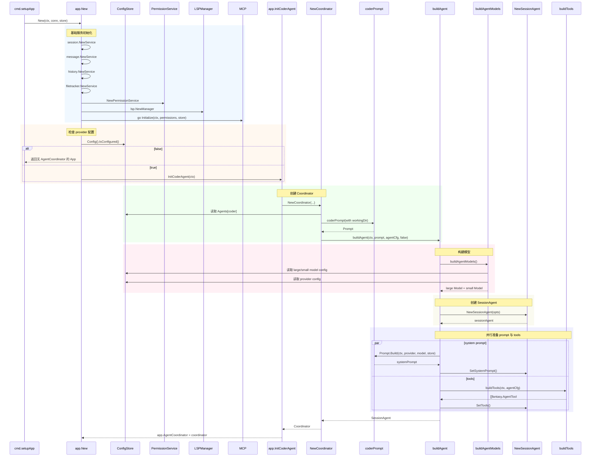
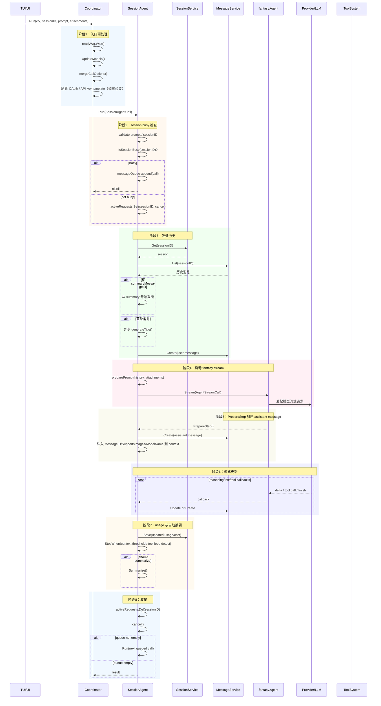
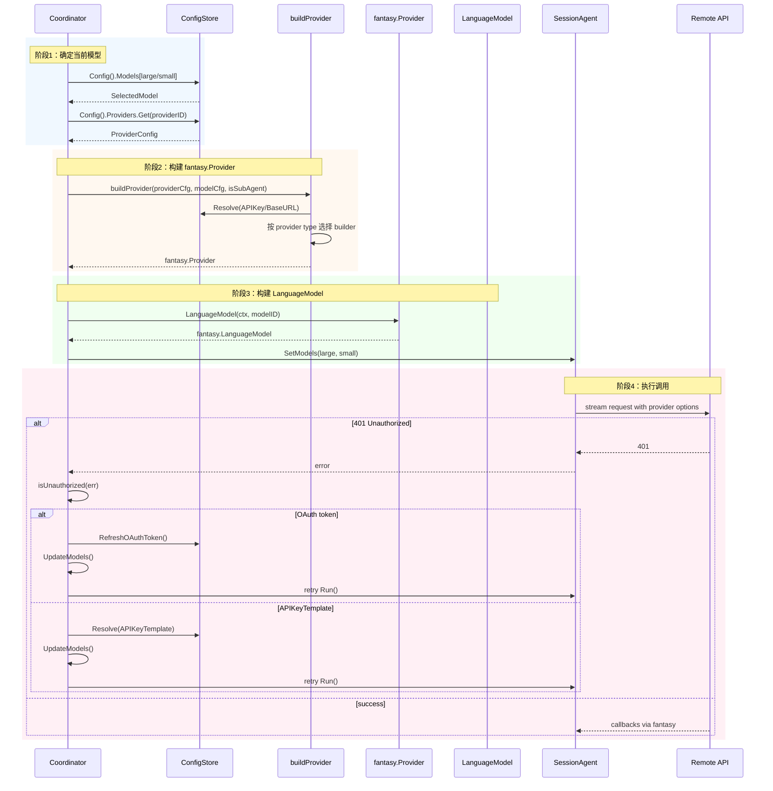
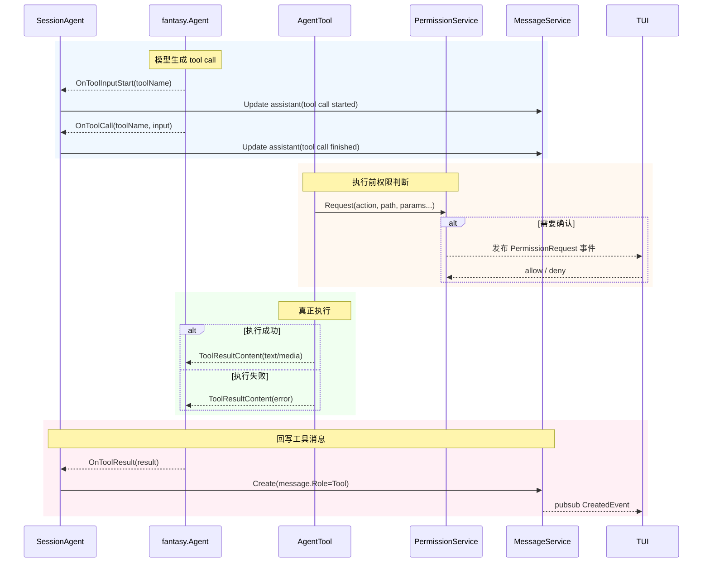
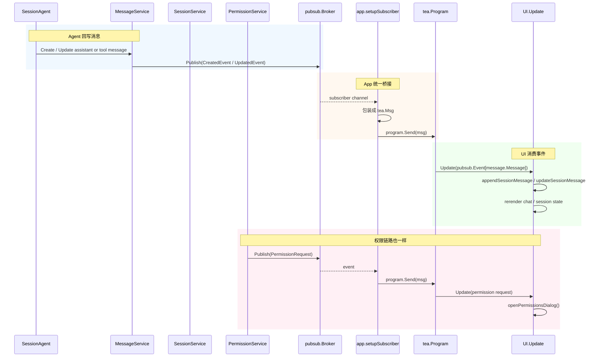
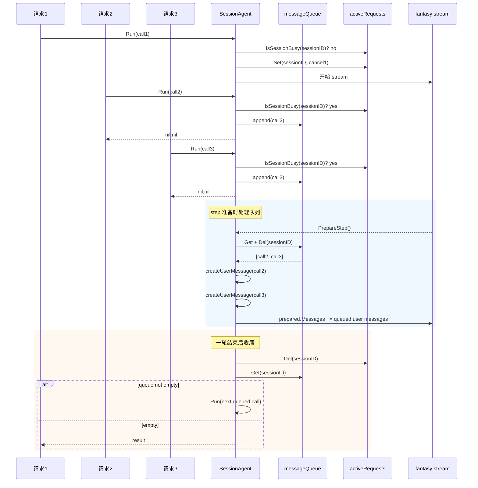
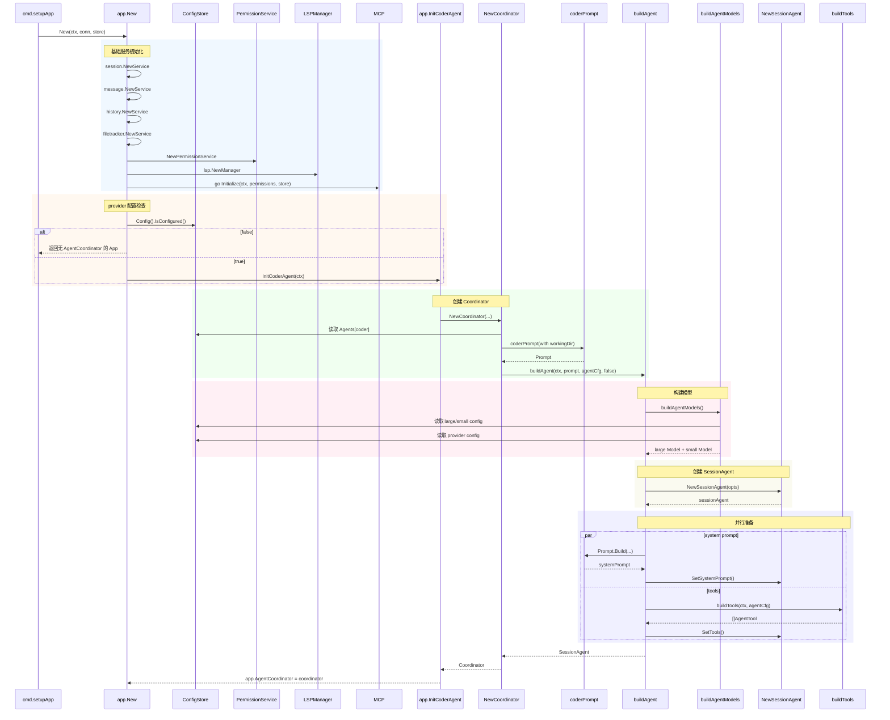
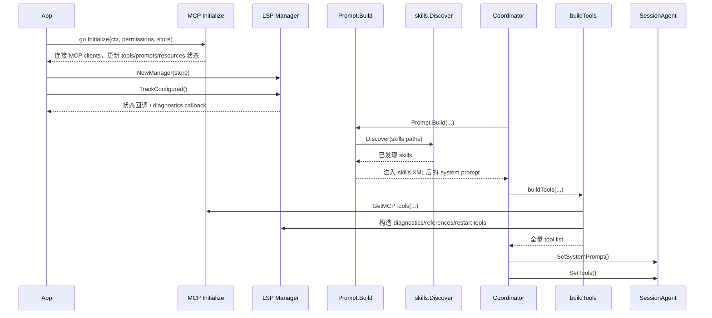
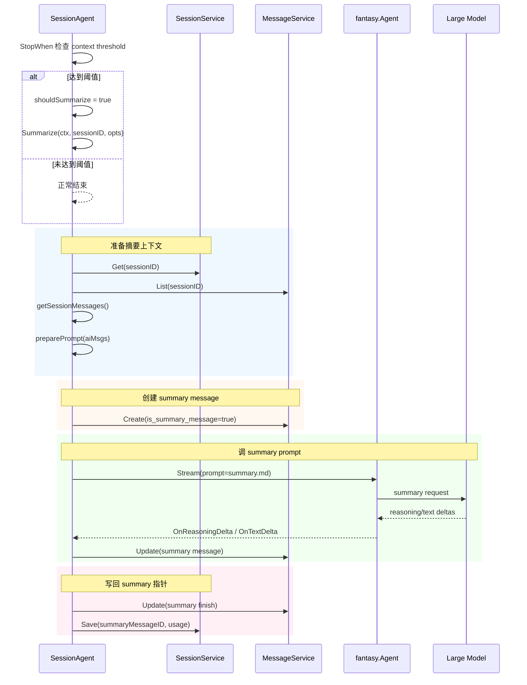

# Crush AI Agent 架构深度解析（基于最新源码）

> 本文档深入剖析 Crush 最新版本中 AI Agent 的设计架构、工作流程和实现细节。
>
> 这份文档沿用了历史文档的章节结构，但全部内容已经切换到当前仓库实现。重点不是泛泛介绍，而是帮助新同事在阅读完后，能够真正理解 Crush 中 Agent 的整体工作流，并具备继续迭代 `agent`、`tool`、`mcp`、`lsp`、`skills`、`ui`、`session/message` 的能力。

---

## 目录

- [一、Agent 架构概览](#一agent-架构概览)
- [二、Agent 核心结构](#二agent-核心结构)
- [三、Agent 初始化流程](#三agent-初始化流程)
- [四、对话请求生命周期](#四对话请求生命周期)
- [五、Agent 与 Provider 交互](#五agent-与-provider-交互)
- [六、工具系统集成](#六工具系统集成)
- [七、事件流转机制](#七事件流转机制)
- [八、并发控制与状态管理](#八并发控制与状态管理)
- [九、核心时序图](#九核心时序图)
- [十、源码阅读指南](#十源码阅读指南)

---

## 一、Agent 架构概览

### 1.1 Agent 在系统中的位置

先看当前版本里 Agent 在系统中的真实位置。这里不画抽象的“几层图”，而是按功能模块关系来画。

```text
┌──────────────────────────────────────────────────────────────────────────────┐
│                                  App 层                                     │
│                            internal/app/app.go                              │
│                                                                              │
│  ┌────────────────────────────────────────────────────────────────────────┐  │
│  │                            AgentCoordinator                           │  │
│  │                     internal/agent/coordinator.go                     │  │
│  │                                                                        │  │
│  │   ┌────────────────────┐      ┌────────────────────────────────────┐  │  │
│  │   │   SessionAgent     │─────▶│ fantasy.Agent.Stream 执行主循环    │  │  │
│  │   │ internal/agent     │      │ 文本流 / reasoning / tool steps    │  │  │
│  │   └────────────────────┘      └────────────────────────────────────┘  │  │
│  │             │                                   │                      │  │
│  │             │                                   │                      │  │
│  │             ▼                                   ▼                      │  │
│  │   ┌────────────────────┐      ┌────────────────────────────────────┐  │  │
│  │   │ Message / Session  │      │ Provider 抽象层                    │  │  │
│  │   │ SQLite 持久化       │      │ openai / anthropic / google ...   │  │  │
│  │   └────────────────────┘      └────────────────────────────────────┘  │  │
│  │             │                                   │                      │  │
│  │             ▼                                   ▼                      │  │
│  │   ┌────────────────────┐      ┌────────────────────────────────────┐  │  │
│  │   │ Tool System        │─────▶│ Permission / MCP / LSP / Skills    │  │  │
│  │   │ buildTools()       │      │ 外部能力、权限和上下文扩展          │  │  │
│  │   └────────────────────┘      └────────────────────────────────────┘  │  │
│  └────────────────────────────────────────────────────────────────────────┘  │
│                                     │                                        │
└─────────────────────────────────────┼────────────────────────────────────────┘
                                      │ pubsub.Event / tea.Msg
                                      ▼
┌──────────────────────────────────────────────────────────────────────────────┐
│                                  TUI 层                                     │
│                        internal/ui/model/ui.go                              │
│                                                                              │
│  会话列表 / 聊天流 / 权限弹窗 / 模型切换 / MCP 状态 / LSP 状态 / Tool 输出   │
└──────────────────────────────────────────────────────────────────────────────┘
```

### 1.2 Agent 的核心职责

当前版本的 Agent 已经不再是旧版本那种“单个 Agent 服务对象，自己维护全部 provider 事件循环”的结构，而是拆成了两层：

1. **Coordinator：编排层**
   - 选择 large/small 模型。
   - 组装工具列表。
   - 合并 provider options、采样参数、reasoning 参数。
   - 处理 401 后的 token/API key 刷新与重试。
   - 暴露统一 `Run()`、`Cancel()`、`Summarize()` 等入口。

2. **SessionAgent：执行层**
   - 处理单个 session 的真实运行。
   - 创建用户消息、assistant 消息、tool 消息。
   - 驱动 `fantasy.Agent.Stream(...)`。
   - 在 callback 中持续回写消息与 usage。
   - 管理每个 session 的 active request 和 message queue。

3. **Tool System：动作执行层**
   - 文件系统、shell、搜索、网络、LSP、MCP、todos、子代理等动作都封装成 `fantasy.AgentTool`。
   - Agent 本身不直接操作文件、命令或网络，而是把动作下放给工具。

4. **Session/Message：状态真相源**
   - 所有对话状态最终都以数据库为准。
   - UI 只是展示，不是状态主存储。

5. **Permission / MCP / LSP / Skills：外部能力补充**
   - Permission 控制工具执行。
   - MCP 动态扩展工具和资源。
   - LSP 提供诊断、引用等 IDE 能力。
   - Skills 为模型提供额外的工作规范和操作能力描述。

### 1.3 设计原则

- **单一职责**：Coordinator 负责编排，SessionAgent 负责执行，Tool 负责动作，UI 负责展示。
- **流式优先**：文本、reasoning、tool call、tool result 都边生成边落库，边推送 UI。
- **持久化优先**：消息和会话是系统真相源，避免“内存里状态对，UI 里状态错”的问题。
- **可取消性**：Context 贯穿整个请求链路。
- **并发安全**：通过 `csync` 系列结构管理可变共享状态。
- **事件驱动**：UI 不直接盯住 Agent 内部状态，而是消费服务层 pubsub 事件。
- **扩展优先**：MCP、LSP、Skills、Provider 都是可插拔能力，而不是硬编码死逻辑。

---

## 二、Agent 核心结构

### 2.1 Coordinator 接口定义

当前版本外部统一依赖的入口是 `internal/agent/coordinator.go`：

```go
type Coordinator interface {
    Run(ctx context.Context, sessionID, prompt string, attachments ...message.Attachment) (*fantasy.AgentResult, error)
    Cancel(sessionID string)
    CancelAll()
    IsSessionBusy(sessionID string) bool
    IsBusy() bool
    QueuedPrompts(sessionID string) int
    QueuedPromptsList(sessionID string) []string
    ClearQueue(sessionID string)
    Summarize(context.Context, string) error
    Model() Model
    UpdateModels(ctx context.Context) error
}
```

#### 接口设计要点

- `Run()` 不再返回 `<-chan AgentEvent`，而是直接返回 `*fantasy.AgentResult`。
- 对 UI 的实时反馈不靠 Agent 返回 channel，而是靠 `message/session/permission/mcp/lsp` 的 pubsub 事件。
- `UpdateModels()` 是当前版本中很关键的方法。每次运行前都会刷新模型与工具。

### 2.2 SessionAgent 接口定义

真正负责“跑一轮会话”的是 `internal/agent/agent.go` 中的 `SessionAgent`：

```go
type SessionAgent interface {
    Run(context.Context, SessionAgentCall) (*fantasy.AgentResult, error)
    SetModels(large Model, small Model)
    SetTools(tools []fantasy.AgentTool)
    SetSystemPrompt(systemPrompt string)
    Cancel(sessionID string)
    CancelAll()
    IsSessionBusy(sessionID string) bool
    IsBusy() bool
    QueuedPrompts(sessionID string) int
    QueuedPromptsList(sessionID string) []string
    ClearQueue(sessionID string)
    Summarize(context.Context, string, fantasy.ProviderOptions) error
    Model() Model
}
```

#### 当前版本的关键信号

- SessionAgent 是**单个运行时执行器**。
- Coordinator 可以在外部刷新：
  - model
  - tools
  - system prompt
- 这使得 Agent 可以在配置变化后不需要重建整个 App，就能更新能力。

### 2.3 SessionAgentCall 结构

旧版本的队列主要存 prompt 字符串。当前版本已经升级为完整的调用对象：

```go
type SessionAgentCall struct {
    SessionID        string
    Prompt           string
    ProviderOptions  fantasy.ProviderOptions
    Attachments      []message.Attachment
    MaxOutputTokens  int64
    Temperature      *float64
    TopP             *float64
    TopK             *int64
    FrequencyPenalty *float64
    PresencePenalty  *float64
    NonInteractive   bool
}
```

#### 这意味着什么

- 一个排队请求不会只记住“文字提示词”。
- 附件、温度、provider options、非交互模式标记都不会丢失。
- 并发管理比旧版本更完整、更工程化。

### 2.4 核心实现结构

当前版本最重要的内部结构可以用下面这张图概括：

```text
Coordinator
├── cfg *config.ConfigStore
├── sessions session.Service
├── messages message.Service
├── permissions permission.Service
├── history history.Service
├── filetracker filetracker.Service
├── lspManager *lsp.Manager
├── notify pubsub.Publisher[notify.Notification]
├── currentAgent SessionAgent
└── agents map[string]SessionAgent

sessionAgent
├── largeModel         *csync.Value[Model]
├── smallModel         *csync.Value[Model]
├── systemPromptPrefix *csync.Value[string]
├── systemPrompt       *csync.Value[string]
├── tools              *csync.Slice[fantasy.AgentTool]
├── sessions           session.Service
├── messages           message.Service
├── notify             pubsub.Publisher[notify.Notification]
├── messageQueue       *csync.Map[string, []SessionAgentCall]
└── activeRequests     *csync.Map[string, context.CancelFunc]
```

### 2.5 结构设计亮点

#### 1. 模型与工具是可热更新的

不是每次配置变化都重建整个 Agent，而是：

- `SetModels()`
- `SetTools()`
- `SetSystemPrompt()`

这些方法直接更新 SessionAgent 内部运行态。

#### 2. 有明确的大模型/小模型职责分工

- large model：主对话执行
- small model：标题生成
- large model：摘要生成

#### 3. 并发状态只按 session 隔离

- `activeRequests[sessionID]`
- `messageQueue[sessionID]`

这保证一个 session 同一时刻只存在一个活跃请求，同时不同 session 间互不影响。

#### 4. system prompt 支持 prefix 和动态 instructions

system prompt 最终由三部分叠加：

- Prompt 模板生成出的系统提示
- Provider 级 `SystemPromptPrefix`
- MCP 初始化返回的 instructions

这使得 Agent 的系统提示是**运行时拼装**的，而不是一段静态文本。

### 2.6 和旧版本相比的本质变化

旧版本更像：

- 一个 `agent.Service`
- 自己管理 provider event channel
- 自己管理 tool loop 和 AgentEvent channel

当前版本更像：

- Coordinator 负责编排与刷新
- SessionAgent 负责运行
- `fantasy.Agent.Stream` 提供统一事件回调机制
- 服务层的 pubsub 负责对 UI 暴露运行状态

这是一种更清晰的分层：

- 运行主循环交给 `fantasy`
- 状态存储交给 message/session
- UI 同步交给 pubsub + app bridge

---

## 三、Agent 初始化流程

### 3.1 初始化入口

Agent 初始化不是直接从 `internal/agent` 包开始，而是从应用装配入口开始：

```text
main.go
  ↓
internal/cmd/root.go -> setupApp()
  ↓
internal/app/app.go -> New()
  ↓
app.InitCoderAgent()
  ↓
agent.NewCoordinator()
  ↓
coordinator.buildAgent()
  ↓
NewSessionAgent()
```

### 3.2 初始化步骤详解

#### 步骤 1：App 层先装配基础服务

`app.New()` 做的第一批工作：

- `session.NewService(q, conn)`
- `message.NewService(q)`
- `history.NewService(q, conn)`
- `filetracker.NewService(q)`
- `permission.NewPermissionService(...)`
- `lsp.NewManager(store)`
- `go mcp.Initialize(ctx, permissions, store)`

这里说明一个很重要的事实：

> 当前版本中，Agent 不是最先启动的。  
> 在 Agent 启动前，数据库、会话服务、消息服务、权限服务、LSP、MCP 都已经先存在了。

#### 步骤 2：判断是否具备启动 Agent 的配置

`app.New()` 会检查：

```go
if !cfg.IsConfigured() {
    slog.Warn("No agent configuration found")
    return app, nil
}
```

也就是说：

- provider 没配置时，App 可以启动
- TUI 也可以启动
- 但不会有 `AgentCoordinator`

这使得“先进入程序再配置 provider”成为可能。

#### 步骤 3：InitCoderAgent 初始化主 Agent

`app.InitCoderAgent()` 只负责一件事：

- 取 `config.AgentCoder`
- 调 `agent.NewCoordinator(...)`

当前版本默认主 Agent 就是 `coder`。

#### 步骤 4：NewCoordinator 创建编排器

`NewCoordinator(...)` 主要做这些事：

1. 保存各类依赖到 coordinator 结构体
2. 从配置里读取 `Agents[coder]`
3. 生成 coder prompt：`coderPrompt(prompt.WithWorkingDir(...))`
4. 调 `buildAgent(...)`
5. 把结果设置为 `currentAgent`

#### 步骤 5：buildAgent 并行构造 SessionAgent 运行态

`buildAgent(...)` 里面的关键步骤：

1. `buildAgentModels(...)` 构建 large/small model
2. 创建 `NewSessionAgent(...)`
3. 并行执行：
   - `prompt.Build(...)` 生成 system prompt
   - `buildTools(...)` 生成工具列表

4. 最后：
   - `SetSystemPrompt(systemPrompt)`
   - `SetTools(tools)`

### 3.3 初始化时序图



### 3.4 MCP、LSP、Skills 在初始化中的位置

这三个模块在初始化中的位置非常重要，必须单独说明。

#### MCP

- MCP 客户端初始化是在 `app.New()` 中通过 `go mcp.Initialize(...)` 后台启动的。
- Agent 构建工具时会读取已经初始化完成的 MCP 工具清单。
- 非交互模式下会显式 `mcp.WaitForInit(ctx)`，保证 MCP 工具可用后再运行。

#### LSP

- `lsp.NewManager(store)` 在 `app.New()` 中创建。
- `app.New()` 之后会设置 callback，并 `TrackConfigured()`。
- Agent 的 LSP 工具实际是构建在 `buildTools()` 中的，是否加入取决于：
  - 是否配置了 LSP
  - 是否启用了 auto LSP

#### Skills

- Skills 不参与 Agent 实例初始化本身。
- Skills 的发现和注入发生在 prompt 构建阶段。
- `view` 工具也会接收 `SkillsPaths`，用于处理 skills 目录下内容的读取。

换句话说：

- MCP 更偏执行能力接入
- LSP 更偏 IDE 能力接入
- Skills 更偏 prompt 上下文接入

---

## 四、对话请求生命周期

### 4.1 Run() 请求入口

在交互模式下，一条用户消息通常从 `internal/ui/model/ui.go` 的 `sendMessage()` 进入：

```text
UI.sendMessage()
  ↓
App.AgentCoordinator.Run(ctx, sessionID, prompt, attachments...)
  ↓
Coordinator.Run(...)
  ↓
SessionAgent.Run(...)
```

### 4.2 Coordinator.Run() 的职责

当前版本里，Coordinator.Run() 不是简单转发，它在进入 SessionAgent 前还做了重要预处理：

1. 等待初始化完成
2. 每次运行前刷新模型
3. 计算 `MaxOutputTokens`
4. 过滤不支持的图片附件
5. 取 provider 配置
6. 合并 provider-specific 选项
7. 检查 OAuth 过期并刷新
8. 若收到 401，支持重试

这意味着：

> Coordinator.Run() 是“运行前调度层”，SessionAgent.Run() 是“运行中的执行层”。

### 4.3 SessionAgent.Run() 的完整职责

SessionAgent.Run() 才是真正的一轮对话执行主体。它主要做：

1. 校验 prompt 和 session
2. 如果 session 正忙，则把 `SessionAgentCall` 入队
3. 拷贝当前 tools/models/system prompt
4. 收集 MCP instructions 并注入 system prompt
5. 创建 `fantasy.Agent`
6. 获取 session 和历史消息
7. 如是新会话则异步生成标题
8. 创建用户消息
9. 准备 messages history 和 file attachments
10. 调 `fantasy.Agent.Stream(...)`
11. 在回调中持续创建/更新 assistant 和 tool message
12. 更新 session usage/cost
13. 判断是否需要自动摘要
14. 释放 active request
15. 继续处理排队消息

### 4.4 生命周期流程图

```text
┌────────────────────────────────────────────┐
│ 1. UI 调用 Coordinator.Run()              │
└────────────────────────────────────────────┘
                     ↓
┌────────────────────────────────────────────┐
│ 2. Coordinator 预处理                     │
│    - UpdateModels()                       │
│    - mergeCallOptions()                   │
│    - refresh OAuth/API key if needed      │
└────────────────────────────────────────────┘
                     ↓
┌────────────────────────────────────────────┐
│ 3. SessionAgent.Run()                     │
│    - validate prompt/session              │
│    - if busy -> queue                     │
└────────────────────────────────────────────┘
                     ↓
┌────────────────────────────────────────────┐
│ 4. 读取 session / 历史消息                │
│    - sessions.Get()                       │
│    - messages.List()                      │
│    - 处理 summaryMessageID                │
└────────────────────────────────────────────┘
                     ↓
┌────────────────────────────────────────────┐
│ 5. 创建 user message                      │
│    messages.Create(role=user)             │
└────────────────────────────────────────────┘
                     ↓
┌────────────────────────────────────────────┐
│ 6. Stream 执行                            │
│    fantasy.Agent.Stream(...)              │
└────────────────────────────────────────────┘
                     ↓
┌────────────────────────────────────────────┐
│ 7. callback 回写状态                      │
│    - OnReasoningDelta                     │
│    - OnTextDelta                          │
│    - OnToolInputStart                     │
│    - OnToolCall                           │
│    - OnToolResult                         │
│    - OnStepFinish                         │
└────────────────────────────────────────────┘
                     ↓
┌────────────────────────────────────────────┐
│ 8. 更新 session usage/cost               │
└────────────────────────────────────────────┘
                     ↓
┌────────────────────────────────────────────┐
│ 9. 判断是否自动摘要                       │
└────────────────────────────────────────────┘
                     ↓
┌────────────────────────────────────────────┐
│ 10. 继续处理 messageQueue 或结束          │
└────────────────────────────────────────────┘
```

### 4.5 历史消息与摘要的处理逻辑

当前版本支持自动摘要。其做法不是简单“把前文抹掉”，而是：

1. Session 里保存 `SummaryMessageID`
2. 下次读取历史消息时，如果有 `SummaryMessageID`：
   - 截断到该消息开始
   - 并把这个 summary 消息的 role 改成 `user`

这意味着摘要消息会成为新的对话起点，从而节省上下文窗口。

### 4.6 MCP instructions 的注入

在每次 `SessionAgent.Run()` 开头，会遍历当前已连接 MCP server：

- 如果 server 处于 `StateConnected`
- 且 `InitializeResult().Instructions` 非空

就把这些 instructions 拼进：

```text
<mcp-instructions>
...
</mcp-instructions>
```

插入到最终 system prompt 中。

这个设计的意义是：

- MCP server 可以向模型声明自己的使用注意事项
- Agent 不需要在代码里硬编码这些说明

### 4.7 生命周期详细时序图



---

## 五、Agent 与 Provider 交互

### 5.1 Provider 构建链路

Provider 构建发生在 `coordinator.buildAgentModels()` 中。

它的主要过程：

1. 读取 `Config.Models[large]` 和 `Config.Models[small]`
2. 读取对应 provider 配置
3. 通过 `buildProvider()` 构造 `fantasy.Provider`
4. 调 `provider.LanguageModel(ctx, modelID)` 得到 `fantasy.LanguageModel`
5. 组合成 `Model`：

```go
type Model struct {
    Model      fantasy.LanguageModel
    CatwalkCfg catwalk.Model
    ModelCfg   config.SelectedModel
}
```

### 5.2 当前支持的 Provider 类型

当前版本里，`buildProvider()` 已经支持以下 provider type：

- `openai`
- `anthropic`
- `openrouter`
- `vercel`
- `azure`
- `bedrock`
- `google`
- `google-vertex`
- `openai-compat`
- `hyper`

这比旧版本复杂得多，也意味着 provider 交互逻辑已经成为 Agent 架构的重要一层。

### 5.3 ProviderOptions 合并策略

Agent 并不是简单地把模型配置直接传给 provider，而是经过合并：

1. Catwalk 模型默认 options
2. ProviderConfig.ProviderOptions
3. SelectedModel.ProviderOptions

之后再根据 provider 类型补 reasoning / thinking 等特定参数。

例如：

- OpenAI/Azure：可能补 `reasoning_effort`
- Anthropic：可能补 `thinking` 或 `effort`
- OpenRouter/Vercel：可能补 `reasoning.enabled`
- Google：补 `thinking_config`

这说明当前版本已经把 provider-specific 行为统一收口在 Coordinator 层。

### 5.4 401 自动恢复与重试

当前版本的一个工程亮点是：`Coordinator.Run()` 在遇到 401 时不会立刻失败，而是尝试恢复。

#### 路径 1：OAuth Token 过期

如果 `providerCfg.OAuthToken` 存在且已过期：

1. `cfg.RefreshOAuthToken(...)`
2. `UpdateModels()`
3. 重新执行当前 `Run()`

#### 路径 2：API Key 模板重新解析

如果 `APIKeyTemplate` 里是 `$OPENAI_API_KEY` 这种模板形式：

1. 重新 `Resolve(APIKeyTemplate)`
2. 更新 provider config
3. `UpdateModels()`
4. 重试

这比旧版本直接失败的模式更加健壮。

### 5.5 Provider 与 SessionAgent 的交互方式

当前版本并没有单独定义 provider event channel，而是走 `fantasy.Agent.Stream(...)` 的 callback：

- `PrepareStep`
- `OnReasoningStart`
- `OnReasoningDelta`
- `OnReasoningEnd`
- `OnTextDelta`
- `OnToolInputStart`
- `OnToolCall`
- `OnToolResult`
- `OnStepFinish`

这意味着：

- provider 交互已经被 fantasy 统一抽象
- SessionAgent 不必关心每个 provider 的底层流协议差异

### 5.6 Provider 交互时序图



### 5.7 设计亮点

1. Provider 交互复杂性被统一隔离在 Coordinator。
2. SessionAgent 聚焦“运行语义”，不直接处理 provider builder 细节。
3. 401 自恢复减少了用户侧无意义失败。
4. model/provider 配置变更后可通过 `UpdateModels()` 动态生效。

---

## 六、工具系统集成

### 6.1 工具装配入口

所有工具统一由 `coordinator.buildTools()` 构造。这里是当前版本工具能力的主入口。

它的工作可以概括成四步：

1. 加入 Agent 级工具（`agent`、`agentic_fetch`）
2. 加入固定内置工具
3. 按条件加入 LSP / MCP 资源工具
4. 根据 `AllowedTools` 和 `AllowedMCP` 做最终过滤

### 6.2 当前版本工具分类

```text
Tool System
├── Agent 工具
│   ├── agent
│   └── agentic_fetch
├── 基础内置工具
│   ├── bash
│   ├── job_output / job_kill
│   ├── download / fetch
│   ├── edit / multiedit / write / view
│   ├── glob / grep / ls
│   ├── sourcegraph
│   └── todos
├── LSP 工具
│   ├── lsp_diagnostics
│   ├── lsp_references
│   └── lsp_restart
├── MCP 基础桥接工具
│   ├── list_mcp_resources
│   └── read_mcp_resource
└── 动态 MCP 工具
    └── mcp_<server>_<tool>
```

### 6.3 Tool、MCP、LSP、Skills 的关系图

这是当前版本非常关键的一张关系图。

```text
Coordinator.buildTools()
├── 本地工具
│   ├── 文件读写：view / write / edit / multiedit
│   ├── 搜索遍历：glob / grep / ls
│   ├── 命令执行：bash / job_output / job_kill
│   ├── 网络内容：fetch / download / sourcegraph
│   └── 会话元数据：todos
├── LSP 工具
│   ├── diagnostics
│   ├── references
│   └── lsp_restart
├── MCP 工具
│   ├── list_mcp_resources
│   ├── read_mcp_resource
│   └── 动态 mcp server tools
├── Agent 工具
│   ├── agent
│   └── agentic_fetch
└── Skills
    ├── 不直接作为 Tool 暴露
    ├── 通过 prompt 进入模型上下文
    └── 部分路径也会被 view 工具安全读取
```

### 6.4 `AllowedTools` 与 `permission` 的区别

这是理解 Crush 工具系统时最容易混淆的地方。

#### 第一层：工具可见性控制

`config.Agent.AllowedTools`

- 决定工具是否会出现在 Agent 暴露给模型的工具列表中
- 不在列表里，模型根本不知道这个工具存在

#### 第二层：工具执行控制

`permission.Service.Request(...)`

- 工具即便在列表里，也不代表一定能执行
- 执行时仍可能：
  - 自动放行
  - 需要确认
  - 被拒绝

也就是说：

```text
AllowedTools = “能不能看到”
Permission   = “能不能执行”
```

### 6.5 LSP 在工具系统中的角色

LSP 工具不是单独的 Agent，而是作为内置工具加入 `buildTools()`。

当前版本会在以下条件下加入：

- 用户显式配置了 LSP
- 或者 `AutoLSP` 为开启状态

加入的工具有：

- `diagnostics`
- `references`
- `lsp_restart`

LSP Manager 本身负责：

- 根据文件类型和 root marker lazy start server
- 避免重复启动
- 追踪 server state
- shutdown 时 kill 所有 client

#### LSP 到底是什么

LSP 在 Crush 里扮演的是“**本地代码语义理解层**”，不是通用扩展平台。

它依赖语言服务器，例如：

- Go: `gopls`
- TypeScript: `typescript-language-server`
- Rust: `rust-analyzer`

LSP 不是让模型去“执行任意系统动作”，而是让模型获得更强的代码理解能力，例如：

- 当前文件有哪些诊断错误
- 某个 symbol 被哪些位置引用
- 修改文件后重新通知语言服务器并等待最新 diagnostics

#### 当前版本里 LSP 是怎么工作的

1. `app.New()` 时创建 `lsp.NewManager(store)`
2. `LSPManager.TrackConfigured()` 追踪已配置 server
3. 某些工具在读文件或改文件时会触发：
   - `openInLSPs(...)`
   - `notifyLSPs(...)`
4. `buildTools()` 会注入：
   - `lsp_diagnostics`
   - `lsp_references`
   - `lsp_restart`

#### 典型例子

例子 1：用户让 Agent “修复当前 Go 文件的错误”

- Agent 先调用 `view`
- `view` 内部会 `openInLSPs(...)` 并短暂等待 diagnostics
- 然后 Agent 可能调用 `lsp_diagnostics`
- 得到诸如未使用变量、类型不匹配等错误
- 再决定调用 `edit` 或 `multiedit`

例子 2：用户问 “这个函数在哪里被调用”

- Agent 可以直接调用 `lsp_references`
- 不必再用 `grep` 做字符串级近似搜索
- LSP 返回的是语义级引用，而不是文本包含

#### LSP 的角色总结

LSP 的角色不是“扩展 Agent 的外部世界动作”，而是：

> 给 Agent 提供 IDE 级别的代码语义能力，让它不只会看文本，还能理解符号、诊断和引用。

### 6.6 MCP 在工具系统中的角色

MCP 在当前版本里分两层：

#### 1. MCP 资源桥接工具

- `list_mcp_resources`
- `read_mcp_resource`

只要有 MCP 配置，就会加入。

#### 2. 动态 MCP 工具

通过 `tools.GetMCPTools(...)` 从已连接 MCP server 中读取 tool 列表，并包装成 AgentTool。

这些工具还会再受：

- `AllowedMCP`
- `disabled_tools`
- 每个 MCP server 的 `DisabledTools`

等规则约束。

#### MCP 到底是什么

MCP（Model Context Protocol）在 Crush 里扮演的是“**外部能力接入协议层**”。

和 LSP 不同，MCP 不是专门为代码语义设计的，而是通用扩展协议。  
一个 MCP server 可以暴露：

- tools
- prompts
- resources

当前版本里，Crush 主要消费其中三类能力：

1. **动态工具**
2. **资源读取**
3. **server instructions 注入 system prompt**

#### 当前版本里 MCP 是怎么工作的

1. 启动时：
   - `app.New()` -> `go mcp.Initialize(ctx, permissions, store)`
2. 初始化阶段：
   - 按配置创建 stdio/http/sse transport
   - 连接 server
   - 拉取 tools/prompts/resources
   - 维护 `states`、`sessions`、`broker`
3. Agent 运行阶段：
   - `buildTools()` 加入 `list_mcp_resources` / `read_mcp_resource`
   - `tools.GetMCPTools(...)` 动态包装 `mcp_<server>_<tool>`
   - `SessionAgent.Run()` 把 server instructions 注入 `<mcp-instructions>`

#### 典型例子

例子 1：接一个 GitHub MCP

- server 暴露：
  - `list_issues`
  - `create_issue`
  - `read_repo`
- Agent 看到的工具会变成类似：
  - `mcp_github_list_issues`
  - `mcp_github_create_issue`
  - `mcp_github_read_repo`

这意味着 Agent 不需要内置 GitHub API 代码，也能获得 GitHub 能力。

例子 2：接一个内部文档 MCP

- server 不一定暴露工具，可能主要暴露 resources
- Agent 可以通过：
  - `list_mcp_resources`
  - `read_mcp_resource`
 读取某个知识库资源

#### MCP 的角色总结

MCP 的角色不是“帮你理解代码”，而是：

> 把 Crush 之外的外部系统、服务、资源、工具能力标准化接入 Agent。

### 6.7 Skills 在工具系统中的角色

Skills 不属于“可执行工具”，而属于“可被模型感知的额外工作规范和能力提示”。

`internal/skills/skills.go` 做的事情主要是：

1. 在配置路径中扫描 `SKILL.md`
2. 解析 frontmatter
3. 校验 skill 名称、描述等合法性
4. 生成可注入 system prompt 的 XML

因此：

- Skills 不直接进入 `buildTools()`
- Skills 主要影响模型“如何工作”
- 而 Tool 主要影响模型“能做什么”

这是两个不同层次的扩展系统。

#### Skills 到底是什么

Skills 在 Crush 里扮演的是“**可复用操作知识与规范包**”。

它既不是：

- LSP 这种代码语义服务
- 也不是 MCP 这种外部协议能力

它更像是“给模型的模块化工作说明书”。

一个 Skill 的核心文件是：

- `SKILL.md`

里面包含：

- YAML frontmatter
- 说明文本/操作指南

当前版本会在 prompt 构建时自动发现并注入 skill 元数据。

#### 当前版本里 Skills 是怎么工作的

1. 配置里定义 `SkillsPaths`
2. `prompt.Build()` 时：
   - `skills.Discover(paths)`
   - 解析所有合法 `SKILL.md`
   - `skills.ToPromptXML(...)`
3. 生成的 XML 放入 system prompt 的 `AvailSkillXML`

另外：

- `view` 工具对 skill 文件有特殊处理
- skill 文件可在 skills 路径下被读取而不触发常规外部路径权限提示

#### 典型例子

例子 1：团队内部“写数据库 migration 规范”

你可以创建一个 skill：

- `skills/database-migration/SKILL.md`

内容告诉模型：

- 迁移命名规范
- 回滚要求
- SQL 风格
- 什么时候要写索引

这样模型在需要做数据库改动时，会自动知道团队约束。

例子 2：某个项目特有的前端提交流程

skill 可以描述：

- 组件命名约定
- 状态管理模式
- 必须配套的测试文件
- 发布前 checklist

这类知识不适合做成 MCP 工具，也不是 LSP 能提供的语义能力，但非常适合 skill。

#### Skills 的角色总结

Skills 的角色不是“执行动作”或“提供语义诊断”，而是：

> 给模型补充结构化、可复用、项目/团队级别的工作方法论与规范知识。

### 6.8 MCP / LSP / Skills 对比

这三者在当前版本里很容易被混淆，下面给一个明确对照。

| 维度 | MCP | LSP | Skills |
|---|---|---|---|
| 本质 | 通用外部协议扩展 | 代码语义服务 | 模型工作知识包 |
| 主要作用 | 扩展外部系统能力 | 提供 IDE 级代码理解 | 提供可复用规范与操作方法 |
| 是否可执行动作 | 是 | 间接支持查询类动作 | 否 |
| 是否直接进 tool list | 是 | 是 | 否 |
| 是否进入 prompt | 会注入 instructions | 不直接注入 prompt | 是 |
| 数据来源 | 外部 MCP server | 本地语言服务器 | `SKILL.md` 文件 |
| 典型例子 | GitHub、内部平台、知识库 | gopls、rust-analyzer | 团队规范、专项工作流 |
| 更像什么 | 插件协议 | IDE 后端 | 可复用操作手册 |

#### 一句话对比

- **MCP**：让 Agent 获得“外部世界的手和脚”。
- **LSP**：让 Agent 获得“理解代码语义的眼睛”。
- **Skills**：让 Agent 获得“按团队方式工作的脑内说明书”。

### 6.9 工具执行流程图

```text
┌─────────────────────────────────────────┐
│  1. buildTools() 构造工具清单            │
│     - 内置工具                           │
│     - LSP 工具                           │
│     - MCP 资源工具                       │
│     - 动态 MCP 工具                      │
└─────────────────────────────────────────┘
                  ↓
┌─────────────────────────────────────────┐
│  2. 根据 AllowedTools / AllowedMCP      │
│     过滤出当前 Agent 可见工具            │
└─────────────────────────────────────────┘
                  ↓
┌─────────────────────────────────────────┐
│  3. fantasy.Agent 将工具 schema         │
│     暴露给模型                           │
└─────────────────────────────────────────┘
                  ↓
┌─────────────────────────────────────────┐
│  4. 模型返回 tool call                  │
└─────────────────────────────────────────┘
                  ↓
┌─────────────────────────────────────────┐
│  5. Tool.Run() 触发 Permission.Request  │
└─────────────────────────────────────────┘
                  ↓
┌─────────────────────────────────────────┐
│  6. 执行工具并返回 ToolResult           │
└─────────────────────────────────────────┘
                  ↓
┌─────────────────────────────────────────┐
│  7. SessionAgent 写入 tool message      │
└─────────────────────────────────────────┘
```

### 6.10 工具执行时序图



---

## 七、事件流转机制

### 7.1 必须先纠偏：当前版本 UI 主链路不再依赖 AgentEvent

旧版本文档里，Agent 自己发布 `AgentEvent` 给 UI 是主链路。  
当前版本不是这样。

当前版本中，UI 的主要更新来源是：

- `session.Service.Subscribe`
- `message.Service.Subscribe`
- `permission.Service.Subscribe`
- `permission.Service.SubscribeNotifications`
- `history.Service.Subscribe`
- `agentNotifications.Subscribe`
- `mcp.SubscribeEvents`
- `SubscribeLSPEvents`

Agent 自己在 `internal/agent/event.go` 里做的是 telemetry：

- `PromptSent`
- `PromptResponded`
- `TokensUsed`

这些是统计事件，不是 UI 状态同步主链路。

### 7.2 当前事件流转架构

```text
SessionAgent / Tool / Permission / MCP / LSP
                    │
                    ▼
           各自服务层 Publish(pubsub.Event)
                    │
                    ▼
          app.setupSubscriber(...) 统一桥接
                    │
                    ▼
              app.events chan tea.Msg
                    │
                    ▼
            program.Send(msg) -> UI.Update()
```

### 7.3 App 层事件桥接作用

`app.setupEvents()` 是全系统事件桥接中心，它会为以下来源分别启动 subscriber：

- sessions
- messages
- permissions
- permission notifications
- history
- agent notifications
- mcp
- lsp

它们全部汇聚到 `app.events`。

然后 `App.Subscribe(program)` 负责把 `app.events` 中的消息转成 Bubble Tea 的 `tea.Msg`。

### 7.4 事件桥接时序图



### 7.5 MCP 事件与 UI

MCP 自己也有事件系统：

- `EventStateChanged`
- `EventToolsListChanged`
- `EventPromptsListChanged`
- `EventResourcesListChanged`

这些事件会进入 `app.setupEvents()` 的 `mcp` subscriber，最终送入 UI。

所以 UI 不只是显示聊天，还能实时看到：

- MCP 连接状态
- MCP 工具清单变化
- MCP 资源清单变化

### 7.6 LSP 事件与 UI

LSP 也有自己的状态广播：

- server ready / starting / error / stopped
- diagnostics 更新

这些同样通过 App 的 subscriber 进入 UI。

换句话说，当前版本的 UI 实际上是一个**统一消费所有服务事件的终端状态机**。

### 7.7 当前事件机制的设计亮点

1. Agent 与 UI 解耦。
2. 任意服务都可以成为 UI 事件源。
3. Message/Session 是事实，UI 只是投影。
4. Telemetry 和 UI 事件分层清晰。

---

## 八、并发控制与状态管理

### 8.1 并发控制核心结构

当前版本的并发控制集中在 `sessionAgent`：

```go
type sessionAgent struct {
    ...
    messageQueue   *csync.Map[string, []SessionAgentCall]
    activeRequests *csync.Map[string, context.CancelFunc]
}
```

### 8.2 状态模型

当前版本的核心并发约束很简单：

- **一个 session 同一时间只允许一个活跃请求**
- 新请求不会报错，而是进入 `messageQueue`

状态图如下：

```text
┌─────────────┐
│   空闲       │
│   Idle      │
└─────────────┘
       │ Run()
       ▼
┌─────────────┐
│   活跃       │
│   Busy      │
└─────────────┘
   │       │
   │       └── 新请求 -> queue
   ▼
完成 / 取消 / 摘要
   ▼
┌─────────────┐
│ 处理队列     │
└─────────────┘
   │
   ├── 有排队 -> 继续 Run(next)
   └── 无排队 -> 回到 Idle
```

### 8.3 当前版本和旧版本的关键差异

旧版本是：

- `promptQueue map[string][]string`

当前版本是：

- `messageQueue map[string][]SessionAgentCall`

这意味着排队请求会完整保留：

- prompt
- attachments
- provider options
- top-p / top-k / temperature
- nonInteractive 标志

所以当前版本不是“只排文字”，而是“排一次完整的会话调用”。

### 8.4 取消机制

#### Cancel(sessionID)

会执行三件事：

1. 取消当前普通请求
2. 取消摘要请求（`sessionID + "-summarize"`）
3. 清空该 session 的排队请求

#### CancelAll()

会执行：

1. 遍历所有 active requests
2. 逐个调用 Cancel
3. 最多等待 5 秒

这里配合 App shutdown 的顺序非常关键：

> 先 cancel agent，再关 DB。  
> 否则 assistant/tool message 或 session usage 的最终写入可能丢失。

### 8.5 队列处理机制

当前版本的排队消息不只是在“整轮结束后”处理一次，而是在两个位置介入：

#### 位置 1：PrepareStep

`fantasy.Agent.Stream` 的 `PrepareStep` 中会：

- 取出当前 `messageQueue[sessionID]`
- 删除队列项
- 逐个转成 user message
- 追加到 `prepared.Messages`

这使得排队消息可以“被吸收到当前 step 的上下文里”。

#### 位置 2：一轮结束后

在 `SessionAgent.Run()` 尾部：

- 如果队列仍有剩余
- 取第一条 queued call
- 递归 `Run(nextCall)`

因此当前队列处理更灵活，也更复杂。

### 8.6 并发控制时序图



### 8.7 自动摘要也是一种状态管理机制

自动摘要并不只是“压缩上下文”，它也是当前版本中一种状态迁移手段：

- 长对话上下文过长
- stop condition 触发
- 生成 summary message
- session 保存 `SummaryMessageID`
- 后续继续从 summary 起步

这相当于把会话状态从“全量消息历史”迁移为“摘要 + 最近增量历史”。

---

## 九、核心时序图

本章给出几个最关键的全链路时序图，尽量做到“别人一看就知道 Agent 整体工作流是什么样的”。

### 9.1 完整对话流程时序图

下面这张图要特别注意一个闭环：

- 模型返回 `tool call`
- 工具执行后生成 `tool message`
- 这个 `tool message` 不会直接变成最终答案
- 它会在**下一轮 step 的 `PrepareStep`** 中重新进入 `prepared.Messages`
- 然后再送给 LLM
- 最后由 LLM 决定：
  - 继续调用工具
  - 或输出最终答案

这正是 Crush 当前版本中“工具调用闭环”的核心。

```mermaid
sequenceDiagram
    participant User as 用户
    participant UI as TUI
    participant App as App
    participant Coord as Coordinator
    participant SA as SessionAgent
    participant Sess as Session服务
    participant Msg as Message服务
    participant Fant as fantasy.Agent
    participant LLM as LLM API
    participant Tool as Tool系统
    participant Perm as 权限服务
    participant Bus as PubSub
    participant DB as SQLite

    User->>UI: 输入「帮我创建 HTTP 服务」
    UI->>App: sendMessage()
    App->>Coord: Run(ctx, sessionID, prompt, attachments)

    rect rgb(240, 248, 255)
        Note over Coord: 阶段1：预处理与模型刷新
        Coord->>Coord: readyWg.Wait()
        Coord->>Coord: UpdateModels()
        Coord->>Coord: mergeCallOptions()
        Coord->>Coord: 如有需要刷新 OAuth / API key
    end

    Coord->>SA: Run(SessionAgentCall)

    rect rgb(255, 248, 240)
        Note over SA: 阶段2：会话检查与入队判断
        SA->>SA: 校验 prompt / sessionID
        SA->>SA: IsSessionBusy(sessionID)?
        alt session 正忙
            SA->>SA: messageQueue append(call)
            SA-->>Coord: nil,nil
            Coord-->>UI: 当前回合不新开 stream
        else session 空闲
            SA->>SA: activeRequests.Set(sessionID, cancel)
        end
    end

    rect rgb(240, 255, 240)
        Note over SA,Sess: 阶段3：准备上下文
        SA->>Sess: Get(sessionID)
        Sess-->>SA: session
        SA->>Msg: List(sessionID)
        Msg-->>SA: 历史消息
        alt 有 summaryMessageID
            SA->>SA: 从 summary 消息截断历史
        end
        alt 首条消息
            SA->>SA: 异步 generateTitle()
        end
        SA->>Msg: Create(user message)
        Msg->>DB: INSERT messages
        Msg->>Bus: Publish(CreatedEvent)
        Bus->>UI: 显示用户消息
    end

    rect rgb(255, 240, 245)
        Note over SA,Fant: 阶段4：创建运行 Agent
        SA->>SA: 收集 MCP instructions
        SA->>SA: preparePrompt(history, files)
        SA->>Fant: Stream(AgentStreamCall)
        Fant->>LLM: 发起流式请求
    end

    rect rgb(250, 250, 240)
        Note over Fant,Msg: 阶段5：PrepareStep 创建 assistant message
        Fant-->>SA: PrepareStep()
        SA->>Msg: Create(assistant message)
        Msg->>DB: INSERT assistant
        Msg->>Bus: Publish(CreatedEvent)
        Bus->>UI: 渲染 assistant 气泡 / loading
        SA->>SA: 注入 MessageID / ModelName / SupportsImages 到 context
    end

    rect rgb(240, 240, 255)
        Note over LLM,SA: 阶段6：流式文本 / reasoning 输出
        loop 文本增量
            LLM-->>Fant: text delta / reasoning delta
            Fant-->>SA: OnTextDelta / OnReasoningDelta
            SA->>Msg: Update(assistant message)
            Msg->>DB: UPDATE message
            Msg->>Bus: Publish(UpdatedEvent)
            Bus->>UI: 流式刷新文本
        end
    end

    rect rgb(255, 250, 240)
        Note over LLM,Tool: 阶段7：工具调用与结果落库
        alt 模型决定调用工具
            LLM-->>Fant: tool call
            Fant-->>SA: OnToolInputStart / OnToolCall
            SA->>Msg: Update(assistant tool calls)
            Msg->>Bus: Publish(UpdatedEvent)
            Fant->>Tool: 执行工具

            Tool->>Perm: Request(permission)
            alt 需要确认
                Perm->>Bus: Publish(permission request)
                Bus->>UI: 打开权限弹窗
                UI->>User: 等待 allow/deny
                User-->>UI: allow / deny
                UI-->>Perm: 返回结果
            end

            alt 执行成功
                Tool-->>Fant: ToolResult(text/media)
            else 执行失败
                Tool-->>Fant: ToolResult(error)
            end

            Fant-->>SA: OnToolResult(result)
            SA->>Msg: Create(tool message)
            Msg->>DB: INSERT tool result
            Msg->>Bus: Publish(CreatedEvent)
            Bus->>UI: 渲染工具结果
        end
    end

    rect rgb(240, 248, 255)
        Note over SA,LLM: 阶段8：tool result 回流到下一轮 LLM 上下文
        alt 当前 step 因 tool calls 结束
            Fant-->>SA: OnStepFinish(finishReason=tool_calls)
            SA->>Msg: Update(assistant finish=tool_use)
            SA->>Sess: Save(step usage/cost)
            Fant-->>SA: 下一轮 PrepareStep()
            SA->>Msg: List(sessionID) 或使用当前历史
            SA->>SA: prepared.Messages += assistant message + tool message
            SA->>LLM: 重新发起下一轮请求(包含 tool results)
            alt LLM 认为还需要更多工具
                LLM-->>Fant: 新的 tool call
                Note over SA,LLM: 回到“阶段7：工具调用与结果落库”
            else LLM 已具备足够信息
                LLM-->>Fant: text answer / finish stop
            end
        end
    end

    rect rgb(255, 248, 240)
        Note over Fant,Sess: 阶段9：step 完成与 usage 落账
        LLM-->>Fant: finish reason + usage
        Fant-->>SA: OnStepFinish(stepResult)
        SA->>Sess: Get(sessionID)
        Sess-->>SA: session
        SA->>SA: updateSessionUsage()
        SA->>Sess: Save(updated session)
        Sess->>DB: UPDATE session usage/cost
        SA->>Msg: Update(assistant finish reason)
        Msg->>Bus: Publish(UpdatedEvent)
    end

    rect rgb(240, 255, 240)
        Note over SA: 阶段10：自动摘要与队列处理
        SA->>SA: StopWhen(context threshold / repeated tool loop)
        alt 触发摘要
            SA->>SA: Summarize(sessionID)
            SA->>Msg: Create(summary message)
            SA->>Sess: Save(summaryMessageID)
        end

        SA->>SA: activeRequests.Del(sessionID)
        SA->>SA: cancel()
        alt queue 还有消息
            SA->>SA: Run(next queued call)
        else queue 空
            SA-->>Coord: fantasy.AgentResult
            Coord-->>App: result
            App-->>UI: 当前回合结束
        end
    end
```



### 9.2 Agent 初始化时序图



### 9.3 MCP / LSP / Skills 扩展关系时序图



### 9.4 自动摘要时序图



---

## 十、源码阅读指南

### 10.1 必读文件清单

#### 第一层：启动与装配

1. `main.go`
2. `internal/cmd/root.go`
3. `internal/app/app.go`

#### 第二层：Agent 核心

4. `internal/agent/coordinator.go`
5. `internal/agent/agent.go`
6. `internal/agent/prompts.go`
7. `internal/agent/prompt/prompt.go`
8. `internal/agent/event.go`

#### 第三层：工具系统

9. `internal/agent/tools/tools.go`
10. `internal/agent/tools/*.go`
11. `internal/agent/tools/mcp/init.go`
12. `internal/agent/tools/mcp/tools.go`
13. `internal/agent/tools/mcp/resources.go`
14. `internal/agent/tools/mcp-tools.go`

#### 第四层：LSP / Skills / Permission

15. `internal/lsp/manager.go`
16. `internal/skills/skills.go`
17. `internal/permission/permission.go`

#### 第五层：持久化与服务层

18. `internal/session/session.go`
19. `internal/message/message.go`
20. `internal/history/file.go`
21. `internal/filetracker/service.go`
22. `internal/db/connect.go`
23. `internal/db/sql/*`
24. `internal/db/migrations/*`

#### 第六层：UI 与事件桥接

25. `internal/pubsub/broker.go`
26. `internal/ui/model/ui.go`
27. `internal/ui/chat/*`
28. `internal/ui/dialog/*`

### 10.2 推荐阅读路线

#### 路线 1：从用户输入出发

```text
ui/model/ui.go
  ↓
app/app.go
  ↓
agent/coordinator.go
  ↓
agent/agent.go
  ↓
message/session
```

这条路线最适合第一次读，因为它最贴近真实用户行为。

#### 路线 2：从 Agent 内核出发

```text
agent/coordinator.go
  ↓
agent/agent.go
  ↓
agent/tools/*
  ↓
permission
  ↓
mcp / lsp / skills
```

这条路线最适合理解“Agent 到底怎么工作”。

#### 路线 3：从状态真相源出发

```text
db/connect.go
  ↓
db/sql/*
  ↓
session/message/history
  ↓
app
  ↓
ui
```

这条路线最适合理解“为什么 UI 和会话状态能稳定保持一致”。

### 10.3 调试技巧

#### 推荐断点

如果要顺着一条消息跑完整链路，建议打这些断点：

1. `internal/ui/model/ui.go`：`sendMessage`
2. `internal/agent/coordinator.go`：`Run`
3. `internal/agent/coordinator.go`：`UpdateModels`
4. `internal/agent/agent.go`：`Run`
5. `internal/agent/agent.go`：`PrepareStep`
6. `internal/agent/agent.go`：`OnTextDelta`
7. `internal/agent/agent.go`：`OnToolCall`
8. `internal/agent/agent.go`：`OnToolResult`
9. `internal/agent/agent.go`：`OnStepFinish`
10. `internal/agent/agent.go`：`Summarize`

#### 日志观察建议

- 看消息流：盯 `message.Service.Create/Update`
- 看 session usage：盯 `sessions.Save`
- 看工具边界：盯 `coordinator.buildTools`
- 看权限弹窗：盯 `permission.Service.Request`
- 看 MCP：盯 `mcp.Initialize / updateState`
- 看 LSP：盯 `lsp.Manager.startServer`

### 10.4 常见问题与答案

**Q1：当前版本 UI 是怎么知道 assistant 正在流式输出的？**  
A：不是靠 Agent 自己发 AgentEvent，而是 `message.Service.Update()` 发布 `pubsub.Event[message.Message]`，经 `app.setupSubscriber -> app.events -> program.Send -> UI.Update` 进入 TUI。

**Q2：当前版本工具调用是谁在执行？**  
A：工具调用由 `fantasy.Agent.Stream` 驱动执行，SessionAgent 通过 `OnToolCall` / `OnToolResult` callback 回写消息。

**Q3：为什么要把 Coordinator 和 SessionAgent 拆开？**  
A：因为模型和工具是“全局可刷新资源”，而对话执行是“按 session 的运行态”。拆开之后更利于热更新模型、工具和 prompt。

**Q4：Skills 为什么不直接作为工具？**  
A：Skills 的本质是“给模型看的工作规范与额外能力说明”，不是“可执行动作”。因此它进入 prompt，不进入 tool list。

**Q5：MCP 和 LSP 为什么不是同一类扩展？**  
A：MCP 是外部 server 驱动的通用协议扩展，LSP 是代码智能专用协议。二者都增强 Agent 能力，但接入方式和职责不同。

**Q6：自动摘要为什么要把 summary message 的 role 改成 user？**  
A：这样后续模型会把这条摘要当作新的上下文起点，从而替代被裁剪掉的长对话历史。

### 10.5 新同事的阅读建议

第一遍不要试图一次看懂所有工具细节，建议先掌握这五条主线：

1. `cmd -> app -> coordinator -> sessionAgent`
2. `session/message` 是对话状态真相源
3. `buildTools()` 决定 Agent 能做什么
4. `permission` 决定工具能不能执行
5. `app.setupEvents()` 决定 UI 怎么获得更新

只要这五条打通，后续不管是改 provider、改 UI、加工具、接 MCP、调 LSP，都不会迷路。

---

## 总结

### Agent 设计的核心思想

1. **Coordinator 管编排，SessionAgent 管执行**
2. **运行状态落在 session/message，不落在 UI**
3. **工具系统负责动作，Agent 只负责编排**
4. **MCP/LSP/Skills 分别从执行、代码智能、上下文规范三个维度扩展 Agent**
5. **UI 不直接依赖 Agent 内部状态，而是依赖服务层事件**
6. **自动摘要和消息队列使长会话和并发请求可持续运行**

### 一句话概括当前版本

当前版 Crush 的 Agent，不是“一个会聊天的对象”，而是：

> 一个以 session 为边界、以数据库为状态源、以 fantasy stream 为执行引擎、以 tool/permission/MCP/LSP/Skills 为能力扩展、以 pubsub 驱动 UI 的运行时编排系统。

---

**文档版本**：2.0  
**适用版本**：当前仓库最新实现  
**最后更新**：2026-03-25  

*本文档专注于 Agent 架构，帮助理解 Crush 当前版本的核心设计与执行细节。*
