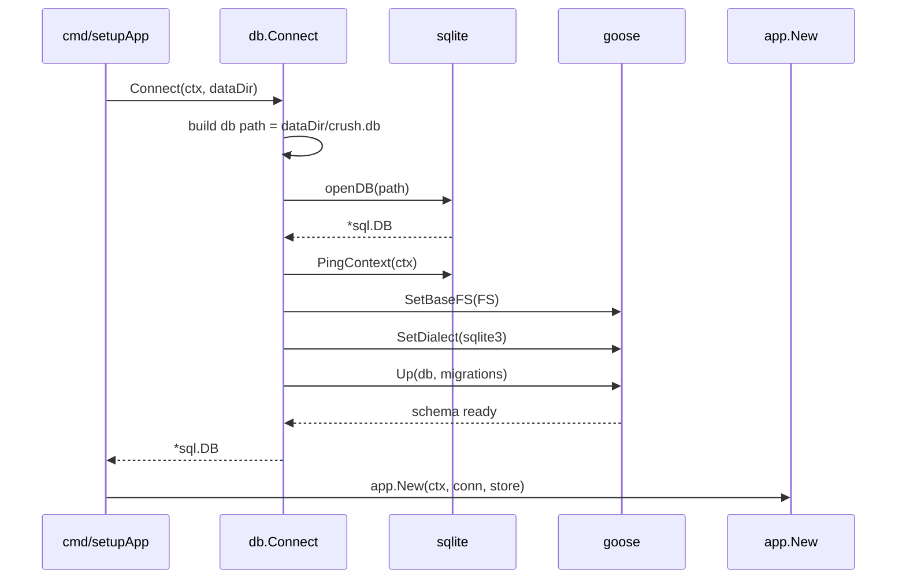
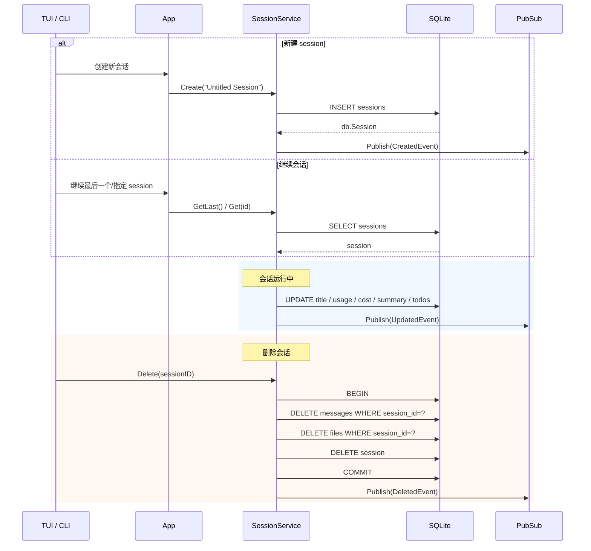
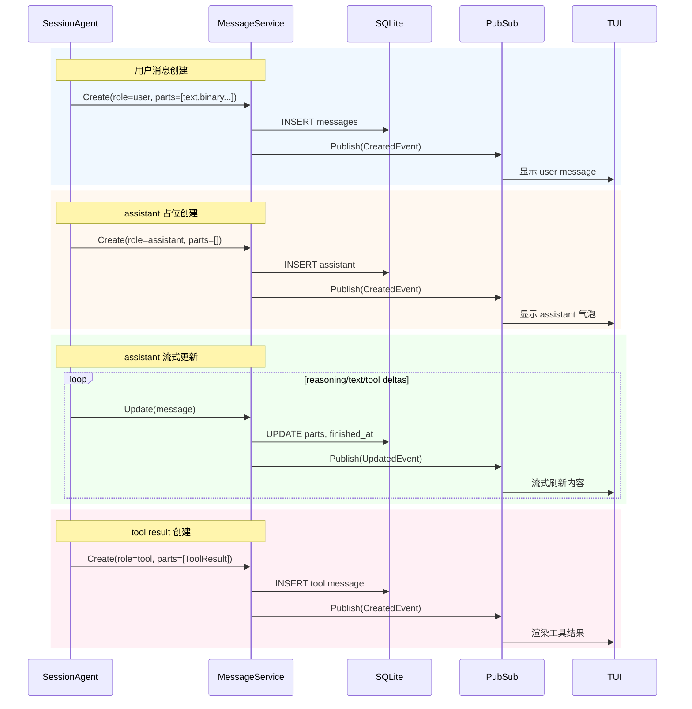
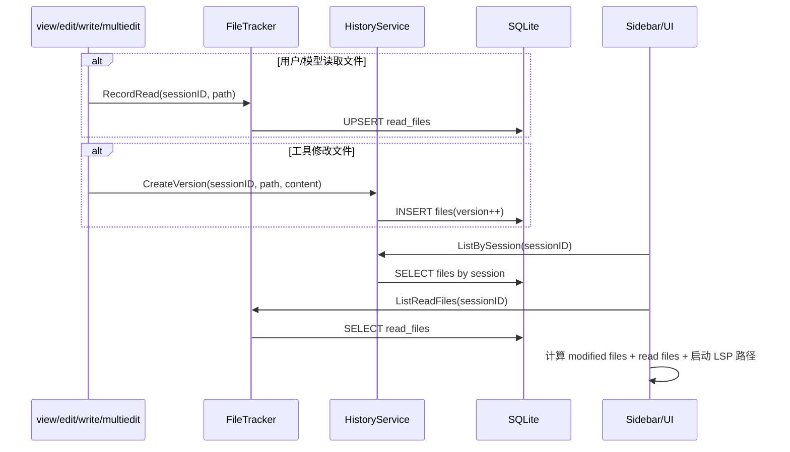
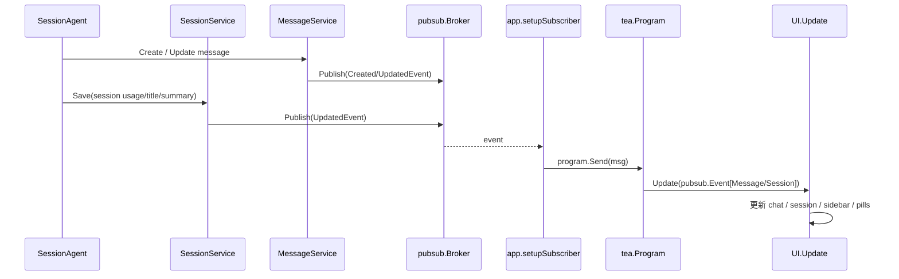
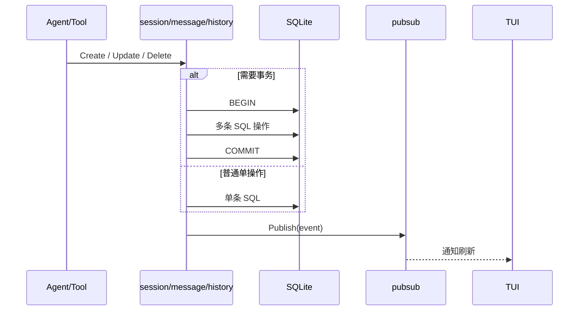
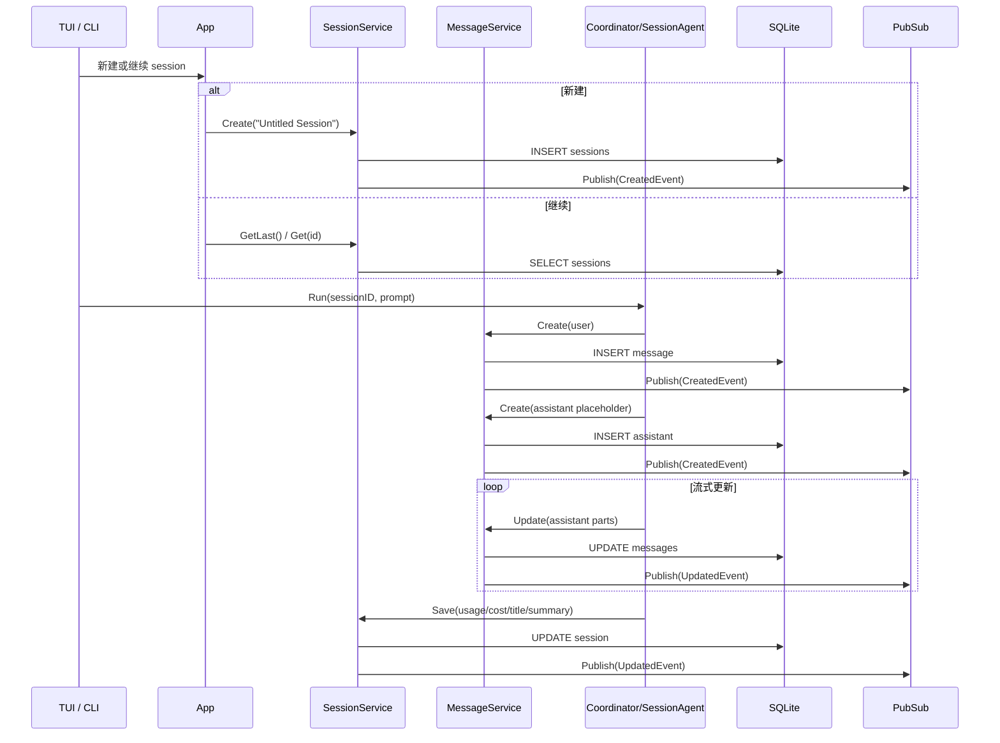
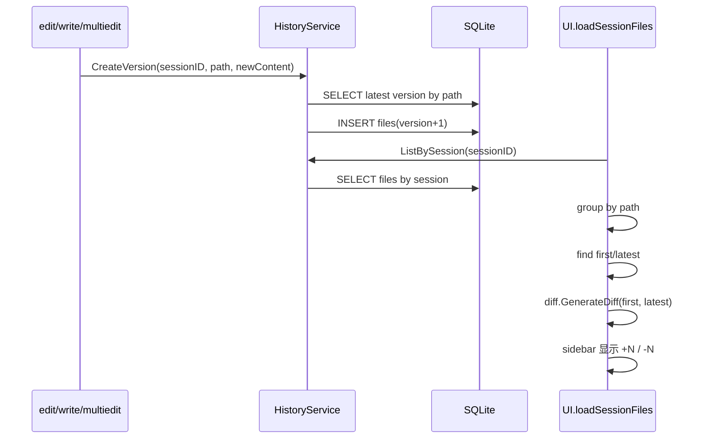
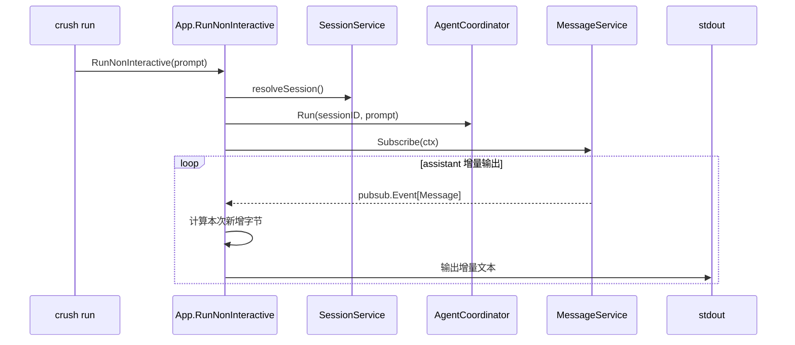
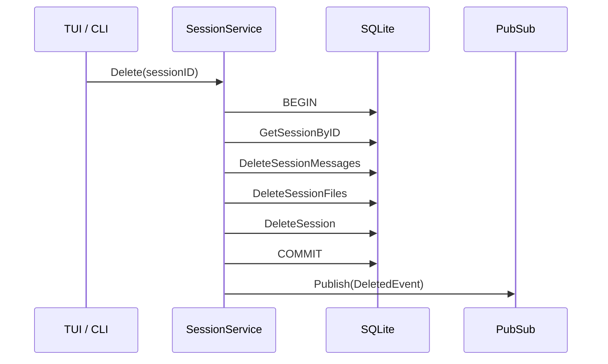

# Crush 数据与会话系统深度解析（基于最新源码）

> 本文档深入剖析 Crush 最新版本中的数据层、会话层、消息层、文件历史层与读取追踪层设计。
>
> 目标不是介绍“有哪些表”，而是帮助读者真正理解：Crush 为什么能稳定保存会话、恢复上下文、计算成本、管理摘要、追踪文件修改历史，并把这些状态可靠地投射到 UI 和非交互模式中。

---

## 目录

- [一、数据系统概览](#一数据系统概览)
- [二、核心数据结构](#二核心数据结构)
- [三、数据库初始化与迁移流程](#三数据库初始化与迁移流程)
- [四、会话生命周期](#四会话生命周期)
- [五、消息生命周期](#五消息生命周期)
- [六、文件历史与读取追踪](#六文件历史与读取追踪)
- [七、事件与状态同步机制](#七事件与状态同步机制)
- [八、并发、一致性与事务设计](#八并发一致性与事务设计)
- [九、核心时序图](#九核心时序图)
- [十、源码阅读指南](#十源码阅读指南)

---

## 一、数据系统概览

### 1.1 数据系统在整体架构中的位置

Crush 的数据系统不是一个“附属模块”，而是整个运行时的事实来源。  
当前版本中：

- Agent 负责生成与编排。
- Tool 负责执行动作。
- UI 负责展示状态。
- **SQLite + session/message/history/filetracker 才是运行状态的真相源。**

从功能模块关系来看，数据系统位于整个应用的中心：

```text
┌─────────────────────────────────────────────────────────────────────────────┐
│                                  App 层                                    │
│                            internal/app/app.go                             │
│                                                                             │
│   ┌─────────────────────┐       ┌───────────────────────────────────────┐  │
│   │  AgentCoordinator   │──────▶│ SessionAgent / Tool System            │  │
│   └─────────────────────┘       └───────────────────────────────────────┘  │
│               │                                  │                         │
│               │                                  │                         │
│               ▼                                  ▼                         │
│   ┌─────────────────────────────────────────────────────────────────────┐   │
│   │                         数据与状态服务层                            │   │
│   │                                                                     │   │
│   │  ┌────────────┐  ┌────────────┐  ┌────────────┐  ┌──────────────┐  │   │
│   │  │ Sessions   │  │ Messages   │  │ History    │  │ FileTracker  │  │   │
│   │  │ 会话元数据  │  │ 对话消息    │  │ 文件版本    │  │ 文件读取轨迹  │  │   │
│   │  └────────────┘  └────────────┘  └────────────┘  └──────────────┘  │   │
│   └─────────────────────────────────────────────────────────────────────┘   │
│                                   │                                         │
└───────────────────────────────────┼─────────────────────────────────────────┘
                                    ▼
                        SQLite + migrations + sqlc
                                    │
                                    ▼
                             UI / CLI / Non-interactive
```

### 1.2 数据系统的核心职责

1. **保存会话**
   - 会话标题
   - 消息数量
   - token 使用量
   - 成本
   - summary 指针
   - todos

2. **保存消息**
   - user / assistant / tool / summary message
   - reasoning、文本、tool call、tool result、finish 等复合 parts

3. **保存文件历史**
   - 每个 session 中工具改过的文件内容版本
   - 支持对比首次版本和最新版本

4. **追踪文件读取**
   - 哪些文件被当前 session 看过
   - 什么时候读过

5. **为 UI 和非交互模式提供状态真相**
   - UI 通过事件实时刷新
   - 非交互模式通过消息流打印 assistant 输出

### 1.3 设计原则

- **SQLite 本地优先**：零外部依赖，适合 CLI/TUI 产品。
- **Schema-first + SQL-first**：通过 goose + sqlc 维持演进和类型安全。
- **服务层封装领域语义**：`session`、`message`、`history`、`filetracker` 不直接暴露数据库细节。
- **发布订阅驱动 UI**：数据库状态变化之后，通过 pubsub 驱动 UI，而不是 UI 自己轮询数据库。
- **可重建历史**：聊天过程、tool 输出、文件改动都能从数据库恢复。

---

## 二、核心数据结构

### 2.1 Session 结构

`internal/session/session.go` 中的 `Session` 是会话元数据根结构：

```go
type Session struct {
    ID               string
    ParentSessionID  string
    Title            string
    MessageCount     int64
    PromptTokens     int64
    CompletionTokens int64
    SummaryMessageID string
    Cost             float64
    Todos            []Todo
    CreatedAt        int64
    UpdatedAt        int64
}
```

#### 字段含义

- `ID`：会话唯一标识。
- `ParentSessionID`：子 session（如 agent tool session、title session）的父会话指针。
- `Title`：会话标题，可由 small model 自动生成。
- `MessageCount`：消息数量。
- `PromptTokens` / `CompletionTokens`：最近一次或当前保存的 token 用量。
- `SummaryMessageID`：自动摘要后，指向摘要消息。
- `Cost`：累计费用。
- `Todos`：会话中的任务状态。
- `CreatedAt` / `UpdatedAt`：时间戳。

#### 当前版本的关键点

`Session` 不只是“聊天容器”，它还承担：

- 成本统计
- 自动摘要锚点
- 子会话树结构
- todos 状态寄存

### 2.2 Message 结构

消息系统比传统聊天产品更复杂，因为 Crush 的 assistant 消息不仅包含文本，还包含：

- reasoning
- tool call
- tool result
- finish 状态
- binary/image content

当前消息通过 `[]ContentPart` 组合。

消息服务的入口参数：

```go
type CreateMessageParams struct {
    Role             MessageRole
    Parts            []ContentPart
    Model            string
    Provider         string
    IsSummaryMessage bool
}
```

#### 关键设计

当前版本并不是“assistant 一条消息里把所有信息塞成一个字符串”，而是把消息拆成多个 part：

- `ReasoningContent`
- `TextContent`
- `ImageURLContent`
- `BinaryContent`
- `ToolCall`
- `ToolResult`
- `Finish`

这让消息既可流式更新，又能被 UI 精准渲染。

### 2.3 History.File 结构

`internal/history/file.go` 中的 `File` 代表某个 session 某个文件的一次版本快照：

```go
type File struct {
    ID        string
    SessionID string
    Path      string
    Content   string
    Version   int64
    CreatedAt int64
    UpdatedAt int64
}
```

它的作用不是替代 Git，而是保存：

- 这个 session 中某文件被工具改过后的内容快照
- 供侧边栏 diff、历史查看、会话恢复使用

### 2.4 FileTracker 追踪结构

`filetracker` 不是完整文件版本历史，而是更轻量的“本 session 看过什么文件”的追踪服务。

它提供：

- `RecordRead(sessionID, path)`
- `LastReadTime(sessionID, path)`
- `ListReadFiles(sessionID)`

#### 为什么要把它单独拆开

因为“看过文件”和“修改文件”是两种不同语义：

- 读取轨迹用于提示模型“你已经读过这个文件”
- 文件版本历史用于展示/回放“你把这个文件改成了什么”

---

## 三、数据库初始化与迁移流程

### 3.1 数据库连接入口

数据库初始化发生在 `internal/db/connect.go`：

```go
func Connect(ctx context.Context, dataDir string) (*sql.DB, error)
```

它的职责：

1. 基于 `dataDir` 计算 `crush.db` 路径
2. 打开 SQLite 连接
3. `PingContext`
4. 设置 Goose dialect
5. 执行 `goose.Up(...)`

### 3.2 SQLite 配置

连接层预置了一组 SQLite pragma：

- `foreign_keys = ON`
- `journal_mode = WAL`
- `page_size = 4096`
- `cache_size = -8000`
- `synchronous = NORMAL`
- `secure_delete = ON`
- `busy_timeout = 30000`

这些设置体现了 Crush 对本地持久化的偏好：

- 可靠
- 支持并发读写
- 对 CLI 场景足够快

### 3.3 迁移机制

数据库迁移文件位于：

- `internal/db/migrations/*.sql`

迁移通过 `embed` 打包进程序，因此：

- 用户不需要单独安装迁移工具
- 启动时会自动执行 schema 升级

### 3.4 SQLC 生成链路

当前项目采用 SQL-first 方式：

```text
internal/db/migrations/*.sql   -> 定义 schema
internal/db/sql/*.sql          -> 定义查询
sqlc generate                  -> 生成 typed Go API
internal/db/*.sql.go           -> 服务层调用
```

这保证：

- schema 演进可追踪
- 查询显式可审查
- Go 层调用强类型、安全

### 3.5 数据层关系图

```text
SQLite
├── sessions
├── messages
├── files
└── read_files

迁移层
├── internal/db/migrations/*.sql

查询层
├── internal/db/sql/sessions.sql
├── internal/db/sql/messages.sql
├── internal/db/sql/files.sql
└── internal/db/sql/read_files.sql

生成层
├── internal/db/sessions.sql.go
├── internal/db/messages.sql.go
├── internal/db/files.sql.go
└── internal/db/db.go / models.go
```

### 3.6 数据库初始化时序图



---

## 四、会话生命周期

### 4.1 Session Service 接口

`internal/session/session.go` 中的 `Service` 定义了当前版本的会话语义：

```go
type Service interface {
    pubsub.Subscriber[Session]
    Create(ctx context.Context, title string) (Session, error)
    CreateTitleSession(ctx context.Context, parentSessionID string) (Session, error)
    CreateTaskSession(ctx context.Context, toolCallID, parentSessionID, title string) (Session, error)
    Get(ctx context.Context, id string) (Session, error)
    GetLast(ctx context.Context) (Session, error)
    List(ctx context.Context) ([]Session, error)
    Save(ctx context.Context, session Session) (Session, error)
    UpdateTitleAndUsage(ctx context.Context, sessionID, title string, promptTokens, completionTokens int64, cost float64) error
    Rename(ctx context.Context, id string, title string) error
    Delete(ctx context.Context, id string) error
    CreateAgentToolSessionID(messageID, toolCallID string) string
    ParseAgentToolSessionID(sessionID string) (messageID string, toolCallID string, ok bool)
    IsAgentToolSession(sessionID string) bool
}
```

### 4.2 会话创建场景分类

当前版本存在三类会话：

#### 1. 普通用户会话

- `Create(ctx, title)`
- 用户真正聊天的主 session

#### 2. 标题生成会话

- `CreateTitleSession(ctx, parentSessionID)`
- `ID = "title-" + parentSessionID`
- 用于生成会话标题

#### 3. Agent 工具子会话

- `CreateTaskSession(ctx, toolCallID, parentSessionID, title)`
- 用于子代理、agent 工具执行等

### 4.3 Agent Tool Session ID 设计

当前版本给子会话设计了稳定规则：

```text
messageID$$toolCallID
```

服务提供：

- `CreateAgentToolSessionID`
- `ParseAgentToolSessionID`
- `IsAgentToolSession`

这使得：

- 子代理会话与父 assistant message / tool call 强绑定
- 可以从 session ID 反推出来源 tool call

### 4.4 Session 保存逻辑

`Save()` 做的不只是 UPDATE，而是会先：

1. 把 `Todos` 序列化成 JSON
2. 更新：
   - title
   - prompt_tokens
   - completion_tokens
   - summary_message_id
   - cost
   - todos

更新成功后会发布 `pubsub.UpdatedEvent`。

### 4.5 Session 删除的事务逻辑

`Delete()` 是一个很好的事务示例：

1. 开始事务
2. 查询会话
3. 删除该 session 的所有 messages
4. 删除该 session 的所有 files
5. 删除 session 本身
6. commit
7. 发布 `DeletedEvent`

这保证了删除过程不会留下“会话删了，但消息还在”的脏数据。

### 4.6 会话生命周期流程图

```text
用户进入 Crush
   ↓
resolveSession()
   ↓
┌───────────────────────────────┐
│ 新建会话 / 继续最后一个 / 指定会话 │
└───────────────────────────────┘
   ↓
Session.Create()
   ↓
消息产生、usage 增长、标题生成、摘要生成
   ↓
Session.Save() / UpdateTitleAndUsage()
   ↓
UI / CLI 读取 Session 状态
   ↓
Delete() 时清理 messages/files/session
```

### 4.7 会话时序图



---

## 五、消息生命周期

### 5.1 Message Service 接口

`internal/message/message.go` 中定义了消息操作接口：

```go
type Service interface {
    pubsub.Subscriber[Message]
    Create(ctx context.Context, sessionID string, params CreateMessageParams) (Message, error)
    Update(ctx context.Context, message Message) error
    Get(ctx context.Context, id string) (Message, error)
    List(ctx context.Context, sessionID string) ([]Message, error)
    ListUserMessages(ctx context.Context, sessionID string) ([]Message, error)
    ListAllUserMessages(ctx context.Context) ([]Message, error)
    Delete(ctx context.Context, id string) error
    DeleteSessionMessages(ctx context.Context, sessionID string) error
}
```

### 5.2 Message 的角色分类

当前版本主要有这些角色：

- `user`
- `assistant`
- `tool`

另外还有一个重要标志：

- `IsSummaryMessage`

这意味着摘要并不是一个新 role，而是 assistant message 的特殊形态。

### 5.3 Message 创建逻辑的一个关键细节

`Create()` 中有个容易忽略但很重要的逻辑：

```go
if params.Role != Assistant {
    params.Parts = append(params.Parts, Finish{Reason: "stop"})
}
```

这意味着：

- user message、tool message 在创建时会自动附带 finish
- assistant message 则是流式生成中逐步补完的

这是因为：

- assistant 是增量生成对象
- user/tool 是一次性完成对象

### 5.4 Message Part 序列化设计

当前版本消息内容不是单表多列，而是把 `[]ContentPart` 统一序列化成 JSON：

```text
Message
└── Parts
    ├── ReasoningContent
    ├── TextContent
    ├── ImageURLContent
    ├── BinaryContent
    ├── ToolCall
    ├── ToolResult
    └── Finish
```

每个 part 会被包装成：

```go
type partWrapper struct {
    Type partType    `json:"type"`
    Data ContentPart `json:"data"`
}
```

#### 这个设计的意义

1. 存储结构稳定
2. 可以支持多种消息内容扩展
3. UI 渲染时可以按 part 精确恢复
4. tool call / tool result / finish 不需要拆成额外表

### 5.5 assistant message 的流式更新语义

assistant message 在一轮运行中通常经历：

1. `Create(assistant, empty parts)`
2. `Update(reasoning delta)`
3. `Update(text delta)`
4. `Update(tool call)`
5. `Update(finish)`

也就是说：

> assistant message 是“可变消息”，而 user/tool 更偏“不可变消息”。

### 5.6 Message 生命周期时序图



### 5.7 非交互模式如何利用消息系统

非交互模式并没有绕开消息系统，而是：

1. 订阅 `app.Messages.Subscribe(ctx)`
2. 只盯当前 session 的 assistant message
3. 对比每条 assistant message 之前读到的字节数
4. 把增量内容打印到 stdout

这说明：

- 非交互模式和 TUI 共享同一套消息真相源
- 没有专门的“CLI 输出状态对象”

---

## 六、文件历史与读取追踪

### 6.1 History 服务职责

`internal/history/file.go` 负责的是**文件版本历史**，不是普通文件缓存。

它支持：

- `Create()`
- `CreateVersion()`
- `GetByPathAndSession()`
- `ListBySession()`
- `ListLatestSessionFiles()`
- `DeleteSessionFiles()`

### 6.2 CreateVersion 的设计

`CreateVersion()` 的关键语义：

1. 先查这个 path 的最新版本
2. 如果没有，就创建初始版本
3. 如果有，版本号 `+1`
4. 使用事务插入
5. 如果遇到唯一约束冲突，最多重试 3 次

这说明作者考虑到了并发版本写入冲突。

### 6.3 UI 如何使用文件历史

`internal/ui/model/session.go` 会：

1. `History.ListBySession(sessionID)`
2. 按 path 聚合多个版本
3. 找出 first version 和 latest version
4. 通过 `diff.GenerateDiff()` 计算 additions / deletions
5. 渲染到 sidebar 的 modified files 区域

因此文件历史的价值不只是“备份内容”，而是直接支撑：

- 侧边栏改动统计
- session 文件列表
- diff 展示

### 6.4 FileTracker 的设计价值

`filetracker` 解决的是另一类问题：

- 记录本 session 读过哪些文件
- 什么时候读过

典型用途：

- UI 加载 session 时调用 `ListReadFiles()`
- `loadSessionMsg.lspFilePaths()` 会合并：
  - 改过的文件
  - 读过的文件

然后用于启动对应 LSP。

这说明 filetracker 不是“附属日志”，而是会影响功能行为。

### 6.5 文件历史与读取追踪关系图

```text
History(files 表)
├── 保存改动后的文件内容快照
├── 用于 session 侧边栏 diff
└── 用于回放本 session 修改过什么

FileTracker(read_files 表)
├── 保存本 session 读过哪些文件
├── 用于恢复上下文
└── 用于重新启动相关 LSP
```

### 6.6 文件系统时序图



---

## 七、事件与状态同步机制

### 7.1 session/message/history 为什么都内嵌 Broker

当前版本里：

- `session.service`
- `message.service`
- `history.service`

都内嵌了 `*pubsub.Broker[T]`。

这样每次数据变化后，服务层都可以直接发布：

- `CreatedEvent`
- `UpdatedEvent`
- `DeletedEvent`

### 7.2 事件链路

```text
service.Create/Update/Delete
        ↓
Publish(pubsub.Event[T])
        ↓
app.setupSubscriber() 统一桥接
        ↓
app.events chan tea.Msg
        ↓
program.Send(msg)
        ↓
UI.Update(msg)
```

### 7.3 为什么这样设计

因为 UI 不应该自己：

- 轮询数据库
- 猜测消息状态
- 猜测 tool 是否完成

而应该：

- 只消费服务发布的事实事件

这能减少 UI 和 Agent/DB 的耦合。

### 7.4 Session/Message 事件与 UI 时序图



---

## 八、并发、一致性与事务设计

### 8.1 哪些地方做了事务保护

当前数据系统里，最典型的事务点有两个：

#### 1. Session.Delete()

- 删 messages
- 删 files
- 删 session

必须原子完成。

#### 2. History.createWithVersion()

- 插入文件版本快照
- 需要处理版本唯一冲突

### 8.2 哪些地方依赖幂等/覆盖写入

`read_files` 的读取轨迹用了：

```sql
ON CONFLICT(path, session_id) DO UPDATE SET
    read_at = excluded.read_at;
```

这说明 filetracker 的语义是：

- 只关心最后一次读取时间
- 不关心每一次读取历史

### 8.3 哪些地方依赖消息的 append/update 语义

assistant message 的流式更新是最典型的“可变状态对象”：

- 同一条消息多次 UPDATE
- parts 持续扩充
- finish 最后补上

而 tool message 通常是一次性 INSERT。

### 8.4 一致性策略总结

当前版本的数据一致性并不是通过“复杂分布式设计”实现，而是通过：

- 单进程
- SQLite 事务
- 服务层封装
- pubsub 事件
- 明确的 message append/update 语义

达到足够稳定的工程效果。

### 8.5 一致性时序图



---

## 九、核心时序图

### 9.1 主会话创建与运行时序图



### 9.2 文件修改与侧边栏统计时序图



### 9.3 非交互模式输出时序图



### 9.4 删除会话时序图



---

## 十、源码阅读指南

### 10.1 必读文件

#### 数据入口

1. `internal/db/connect.go`
2. `internal/db/sql/sessions.sql`
3. `internal/db/sql/messages.sql`
4. `internal/db/sql/files.sql`
5. `internal/db/sql/read_files.sql`

#### 领域服务

6. `internal/session/session.go`
7. `internal/message/message.go`
8. `internal/history/file.go`
9. `internal/filetracker/service.go`

#### 数据驱动逻辑的使用方

10. `internal/app/app.go`
11. `internal/agent/agent.go`
12. `internal/ui/model/session.go`
13. `internal/ui/model/ui.go`

### 10.2 推荐阅读顺序

#### 路线 1：从数据库向上

```text
db/connect.go
  ↓
db/sql/*.sql
  ↓
session/message/history/filetracker
  ↓
app/app.go
  ↓
agent / ui
```

#### 路线 2：从一次对话的持久化结果向上

```text
message/message.go
  ↓
session/session.go
  ↓
agent/agent.go
  ↓
ui/model/ui.go
```

#### 路线 3：从 UI 侧边栏文件历史向下

```text
ui/model/session.go
  ↓
history/file.go
  ↓
db/sql/files.sql
```

### 10.3 调试建议

#### 断点建议

1. `internal/db/connect.go`: `Connect`
2. `internal/session/session.go`: `Create`, `Save`, `Delete`
3. `internal/message/message.go`: `Create`, `Update`
4. `internal/history/file.go`: `CreateVersion`
5. `internal/filetracker/service.go`: `RecordRead`
6. `internal/app/app.go`: `RunNonInteractive`
7. `internal/ui/model/session.go`: `loadSession`, `loadSessionFiles`

#### 观察重点

- 会话 title/cost 何时更新
- summaryMessageID 何时写入
- assistant message 的 parts 如何增长
- file history 如何生成版本
- read_files 如何影响 LSP 启动

### 10.4 常见问题与答案

**Q1：为什么 session 和 message 要拆成两个服务？**  
A：因为会话是元数据聚合，消息是时间序列内容流。它们更新频率、结构复杂度、订阅粒度都不同。

**Q2：为什么消息 parts 要序列化成 JSON，而不是拆多张表？**  
A：当前设计更适合快速支持 reasoning/tool/binary 等多类型内容，并且能与流式增量更新良好配合。

**Q3：History 为什么不直接依赖 Git？**  
A：因为 Crush 需要记录 session 内部工具执行后的文件状态，而不是仓库级提交历史。

**Q4：FileTracker 为什么单独做表？**  
A：读取轨迹和修改历史是两种语义。前者用于恢复上下文和 LSP，后者用于展示 diff 和文件版本。

**Q5：非交互模式为什么也依赖 messages 表？**  
A：因为这样交互模式和非交互模式共享同一条事实链，不需要为 stdout 再设计一套独立状态机。

---

## 总结

### 数据系统的核心思想

1. **SQLite 是状态真相源**
2. **session/message/history/filetracker 分工明确**
3. **消息是复合 part 流，不是单字符串**
4. **文件历史与读取轨迹分层管理**
5. **服务层通过 pubsub 把数据库变化投射给 UI**
6. **事务只用在需要原子性的场景，其他路径保持轻量**

### 一句话概括当前版本

当前版 Crush 的数据系统，不是“简单保存聊天记录”的数据库层，而是：

> 一个以 session 为边界、以 message 为增量事实流、以 history 记录修改快照、以 filetracker 记录读取轨迹、以 pubsub 驱动 UI 与 CLI 同步的本地状态中枢。

---

**文档版本**：1.0  
**适用版本**：当前仓库最新实现  
**最后更新**：2026-03-25  

*本文档专注于数据与会话系统，帮助理解 Crush 当前版本的持久化结构与状态流转。*
