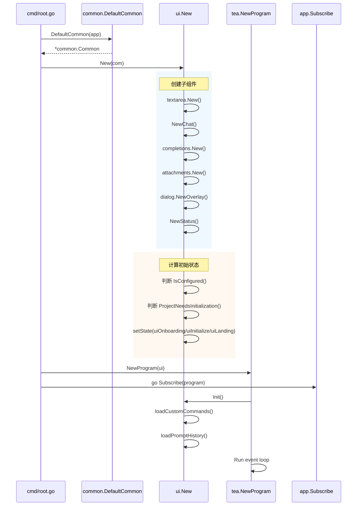
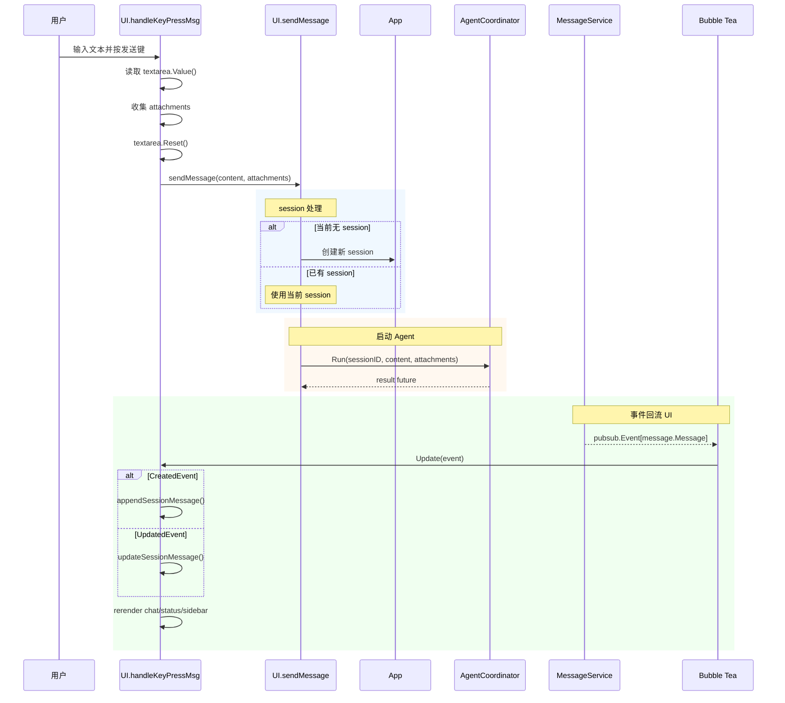
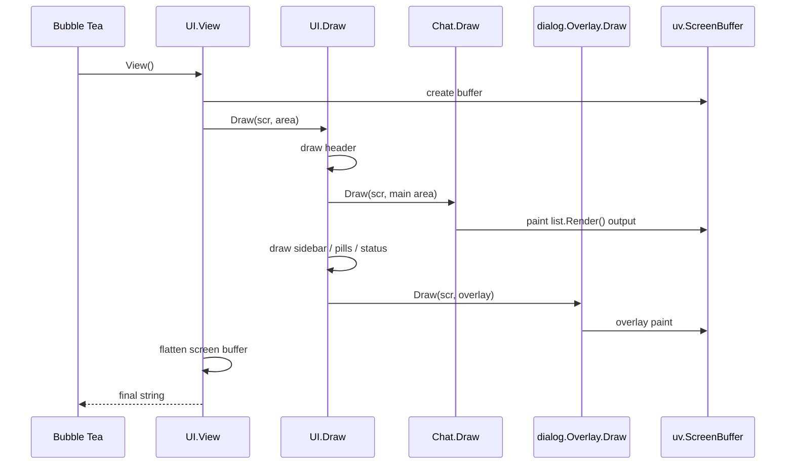
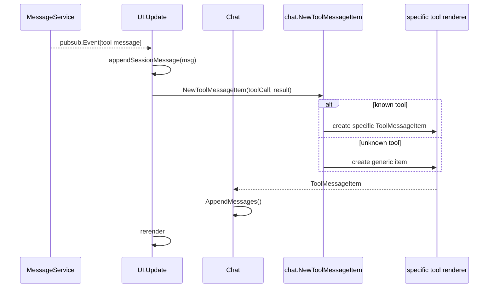
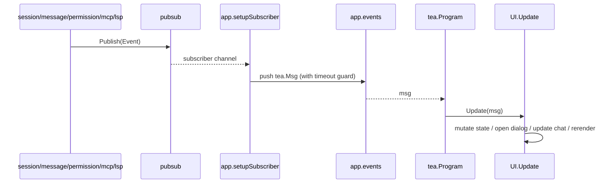
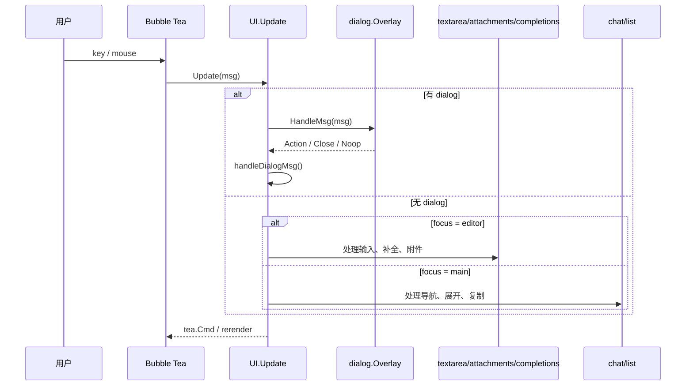
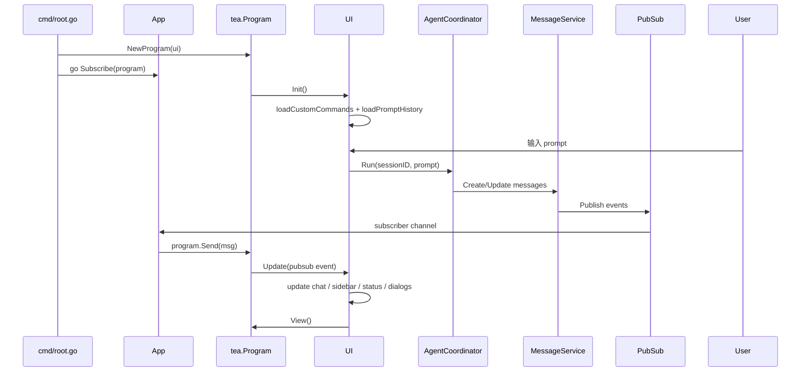
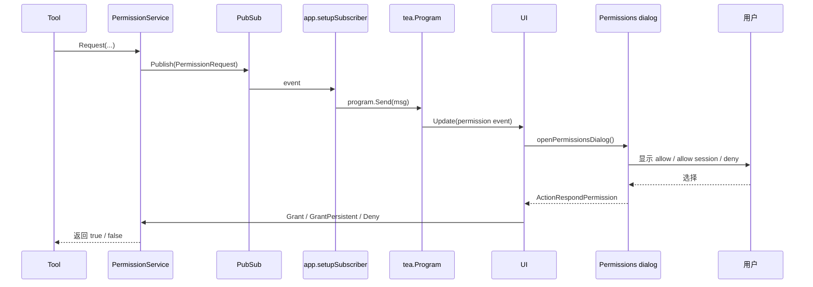
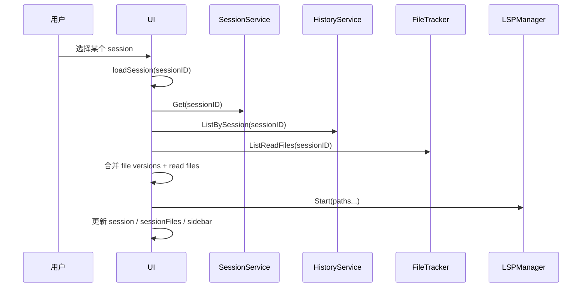
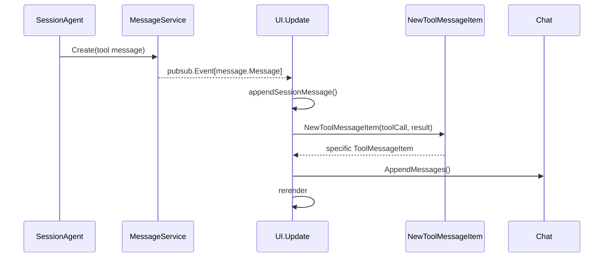

# Crush TUI 与事件系统深度解析（基于最新源码）

> 本文档深入剖析 Crush 最新版本中的 TUI 架构、事件系统、渲染管线、聊天视图、对话框系统、权限交互以及 MCP/LSP 在界面层的呈现方式。
>
> 目标是让读者真正看懂：Crush 的 UI 为什么不是一个普通的 Bubble Tea demo，它是如何把 session/message/permission/mcp/lsp 这些后端事件统一映射成终端中的交互状态机的。

---

## 目录

- [一、TUI 架构概览](#一tui-架构概览)
- [二、UI 核心结构](#二ui-核心结构)
- [三、UI 初始化流程](#三ui-初始化流程)
- [四、消息与交互生命周期](#四消息与交互生命周期)
- [五、渲染管线与布局系统](#五渲染管线与布局系统)
- [六、聊天视图、对话框与工具渲染](#六聊天视图对话框与工具渲染)
- [七、事件流转机制](#七事件流转机制)
- [八、状态管理与输入路由](#八状态管理与输入路由)
- [九、核心时序图](#九核心时序图)
- [十、源码阅读指南](#十源码阅读指南)

---

## 一、TUI 架构概览

### 1.1 TUI 在系统中的位置

Crush 的 TUI 不是一个“直接操作业务对象”的前端，而是：

- 通过 `tea.Program` 运行
- 统一接收 `tea.Msg`
- 主要靠 `pubsub` 事件驱动
- 将服务层状态投射为终端界面

用功能模块关系图表示如下：

```text
┌──────────────────────────────────────────────────────────────────────────────┐
│                                  App 层                                     │
│                            internal/app/app.go                              │
│                                                                              │
│   ┌──────────────┐  ┌──────────────┐  ┌──────────────┐  ┌────────────────┐  │
│   │ Sessions     │  │ Messages     │  │ Permissions  │  │ Agent Notify   │  │
│   └──────────────┘  └──────────────┘  └──────────────┘  └────────────────┘  │
│           │                │                 │                    │           │
│           └────────────────┼─────────────────┼────────────────────┘           │
│                            │                 │                                │
│                       ┌────▼─────────────────▼────┐                           │
│                       │       app.events          │                           │
│                       │    tea.Msg 统一桥接通道    │                           │
│                       └────────────┬──────────────┘                           │
└────────────────────────────────────┼──────────────────────────────────────────┘
                                     ▼
┌──────────────────────────────────────────────────────────────────────────────┐
│                                 Bubble Tea                                  │
│                              tea.Program.Run()                              │
└────────────────────────────────────┬─────────────────────────────────────────┘
                                     ▼
┌──────────────────────────────────────────────────────────────────────────────┐
│                             internal/ui/model.UI                            │
│                                                                              │
│  ┌──────────────┐  ┌──────────────┐  ┌──────────────┐  ┌────────────────┐   │
│  │ Header       │  │ Chat         │  │ Dialog       │  │ Sidebar/Status │   │
│  └──────────────┘  └──────────────┘  └──────────────┘  └────────────────┘   │
│                                                                              │
│      Completions / Attachments / Pills / Layout / Notifications             │
└──────────────────────────────────────────────────────────────────────────────┘
```

### 1.2 TUI 的核心职责

1. **接收输入**
   - 键盘
   - 鼠标
   - 粘贴
   - 对话框动作

2. **发送业务请求**
   - 发送消息给 Agent
   - 切换模型
   - 切换 session
   - 响应权限弹窗

3. **渲染状态**
   - assistant 流式文本
   - tool 执行过程与结果
   - 权限请求
   - MCP/LSP 状态
   - session 文件变更

4. **协调子组件**
   - Chat
   - Dialog
   - Attachments
   - Completions
   - Sidebar
   - Header

5. **把异步事件落成可视状态**
   - pubsub.Event -> UI.Update
   - 统一进一条主消息循环

### 1.3 设计原则

根据 `internal/ui/AGENTS.md`，当前 UI 体系的原则非常明确：

- **单主模型**：`UI` 是唯一顶层 Bubble Tea model。
- **不要在 Update 做 IO**：所有耗时操作都通过 `tea.Cmd`。
- **不要在 Cmd 里改状态**：Cmd 只返回消息，状态必须回主 `Update` 落地。
- **子组件偏命令式，不是嵌套 Elm 模型**。
- **渲染与状态分离**：布局和渲染由 UI 统一调度，子组件只提供局部能力。

---

## 二、UI 核心结构

### 2.1 顶层 UI 结构

`internal/ui/model/ui.go` 中的 `UI` 是整个 TUI 的唯一主模型。

它的字段可以按功能拆成几组来看。

### 2.2 顶层状态分组图

```text
UI
├── 基础上下文
│   ├── com *common.Common
│   ├── session *session.Session
│   └── sessionFiles []SessionFile
├── 终端与布局
│   ├── width / height
│   ├── layout uiLayout
│   └── isTransparent
├── 状态机
│   ├── state uiState
│   ├── focus uiFocusState
│   ├── dialog *dialog.Overlay
│   └── status *Status
├── 输入相关
│   ├── textarea
│   ├── attachments
│   ├── completions
│   └── promptHistory
├── 聊天相关
│   ├── chat *Chat
│   ├── lastUserMessageTime
│   └── promptQueue
├── 扩展状态
│   ├── lspStates
│   ├── mcpStates
│   ├── customCommands
│   └── mcpPrompts
└── 其他
    ├── todoSpinner
    ├── notifyBackend
    ├── pillsExpanded
    └── detailsOpen
```

### 2.3 UI 状态机

当前版本的 UI 状态由两个枚举控制：

#### `uiState`

- `uiOnboarding`
- `uiInitialize`
- `uiLanding`
- `uiChat`

#### `uiFocusState`

- `uiFocusNone`
- `uiFocusEditor`
- `uiFocusMain`

这两组状态共同决定：

- 当前页面处于 onboarding、landing 还是聊天
- 当前按键应交给输入框，还是聊天主区，还是对话框

### 2.4 为什么只有一个顶层 Model

这不是偶然选择，而是项目明确规定：

> `UI` 是 sole Bubble Tea model。  
> `Chat`、`List`、`Attachments`、`Completions`、`Sidebar` 都不是标准 `tea.Model`。

原因有三个：

1. 避免多层 Elm message loop 嵌套，降低复杂度。
2. 所有事件路由都能集中在 `UI.Update()` 的大 switch 里统一管理。
3. 更适合这个项目里“聊天 + 对话框 + 工具消息 + 布局切换”的复杂交互。

### 2.5 顶层 UI 与子组件关系图

```text
UI
├── header *header
├── chat *Chat
│   └── list.List
├── dialog *dialog.Overlay
├── textarea textarea.Model
├── attachments *attachments.Attachments
├── completions *completions.Completions
├── status *Status
└── sidebar (由 UI.drawSidebar() 渲染，不是独立 model)
```

### 2.6 Common 上下文的作用

几乎所有 UI 子组件都通过 `*common.Common` 间接访问：

- `*app.App`
- `*styles.Styles`

这意味着 UI 层不直接全局依赖 app，而是通过共享上下文传递。

---

## 三、UI 初始化流程

### 3.1 初始化入口

TUI 初始化主链路如下：

```text
cmd/root.go
  ↓
common.DefaultCommon(app)
  ↓
ui.New(com)
  ↓
tea.NewProgram(model, ...)
  ↓
go app.Subscribe(program)
  ↓
program.Run()
```

### 3.2 `ui.New(com)` 做了什么

`UI.New()` 其实做了大量装配工作：

1. 创建 textarea
2. 创建 Chat
3. 创建 keyMap
4. 创建 completions
5. 创建 todo spinner
6. 创建 attachments
7. 创建 header
8. 创建 overlay dialog
9. 初始化 lspStates / mcpStates
10. 根据 config 决定：
   - onboarding / initialize / landing 初始状态
   - compact mode
   - transparent mode
   - progress bar 开关

### 3.3 初始页面决策逻辑

当前版本并不是一启动就进入 chat 状态，而是根据配置和项目状态决定：

- 如果 provider 未配置 -> `uiOnboarding`
- 如果项目需要初始化 -> `uiInitialize`
- 否则 -> `uiLanding`

这说明 UI 启动并不只是“开聊天窗口”，而是带有 onboarding 和初始化引导能力。

### 3.4 `Init()` 做了什么

`UI.Init()` 主要负责启动异步初始命令：

- 如果是 onboarding，先打开 models dialog
- 异步加载 custom commands
- 异步加载 prompt history

这意味着：

- UI.New() 负责同步结构装配
- UI.Init() 负责异步启动命令

### 3.5 TUI 初始化时序图



---

## 四、消息与交互生命周期

### 4.1 用户输入到消息发送的入口

当前版本中，用户通常通过编辑器区域输入，然后由 `handleKeyPressMsg()` 捕获发送动作。

核心流程：

1. 用户输入文本
2. 按发送键
3. `handleKeyPressMsg()` 清理 textarea、收集 attachments
4. 调 `sendMessage(...)`
5. `sendMessage()` 内部调用 `App.AgentCoordinator.Run(...)`

### 4.2 `sendMessage()` 做了什么

`sendMessage()` 是 UI 到 Agent 的主要桥：

1. 检查 `AgentCoordinator` 是否存在
2. 必要时创建 session
3. 构造 `tea.Cmd`
4. 在 cmd 中调用：

```go
_, err := m.com.App.AgentCoordinator.Run(context.Background(), sessionID, content, attachments...)
```

也就是说：

- UI 不直接等待运行完成
- 而是启动请求后，依靠服务层事件异步刷新界面

### 4.3 Message 事件进入 UI 后如何更新

`UI.Update()` 中会处理：

- `pubsub.Event[message.Message]`

主要分支是：

- `CreatedEvent` -> `appendSessionMessage(...)`
- `UpdatedEvent` -> `updateSessionMessage(...)`
- `DeletedEvent` -> `chat.RemoveMessage(...)`

### 4.4 `appendSessionMessage()` 的意义

当消息第一次进入 UI 时：

- user message 会变成 user chat item
- assistant message 会变成 assistant chat item
- tool message 会通过 `chat.NewToolMessageItem(...)` 转成对应工具渲染项

这一步完成的是：

> “数据库消息” -> “UI 可渲染 MessageItem” 的第一次投影

### 4.5 `updateSessionMessage()` 的意义

当 assistant 流式更新或 tool call 状态变化时：

- UI 会查找已有 item
- 更新内容、状态、result
- 再触发 rerender

也就是说：

- assistant message 的 streaming 并不是不断 append 新 item
- 而是对同一 message item 做增量更新

### 4.6 生命周期流程图

```text
用户在 textarea 输入
   ↓
handleKeyPressMsg()
   ↓
sendMessage(content, attachments)
   ↓
AgentCoordinator.Run()
   ↓
message/session/pubsub 事件发布
   ↓
UI.Update(pubsub.Event[message.Message])
   ↓
appendSessionMessage / updateSessionMessage
   ↓
Chat / Sidebar / Status / Pills 重新渲染
```

### 4.7 详细时序图



---

## 五、渲染管线与布局系统

### 5.1 渲染管线是混合式的

根据 `internal/ui/AGENTS.md`，当前 UI 使用的是 hybrid rendering：

1. **Screen-based**：顶层 `UI` 使用 Ultraviolet screen buffer。
2. **String-based**：子组件如 `list.List` 渲染成字符串。
3. **View() flatten**：最终由 `canvas.Render()` 扁平化成 Bubble Tea 输出。

### 5.2 为什么不是纯字符串渲染

因为 Crush UI 不只是普通聊天窗口，它要同时支持：

- 布局分区
- sidebar
- dialog overlay
- 高亮选区
- tool diff 展示
- header / pills / status 多区域组合

因此使用 screen buffer 更容易做区域化布局。

### 5.3 布局核心：`uiLayout`

UI 会计算多个矩形区域：

- `header`
- `main`
- `editor`
- `sidebar`
- `pills`
- `status`

然后各组件在自己的区域里绘制。

### 5.4 `Draw()` 和 `View()` 的分工

#### `Draw(scr, area)`

- 负责把各部分画到 screen buffer
- 包括 header、chat、sidebar、dialog

#### `View()`

- 创建 screen buffer
- 调 `Draw()`
- 调 flatten/render
- 返回 Bubble Tea 需要的字符串

### 5.5 布局与渲染关系图

```text
UI.View()
  ↓
create screen buffer
  ↓
UI.Draw(scr, area)
  ├── draw header
  ├── draw chat
  ├── draw sidebar
  ├── draw pills
  ├── draw status
  └── draw dialog overlay
  ↓
flatten to string
  ↓
Bubble Tea output
```

### 5.6 渲染管线时序图



---

## 六、聊天视图、对话框与工具渲染

### 6.1 Chat 不是标准 Bubble Tea 子模型

`Chat` 本质上是对 `list.List` 的包装，提供：

- 消息索引
- 鼠标跟踪
- auto follow
- item 级动画桥接

它没有标准 `Update(tea.Msg)`，而是由 UI 主模型调用命令式方法。

### 6.2 MessageItem 体系

当前聊天消息渲染层不是一个简单的 `[]string`，而是分层接口系统：

- `list.Item`
- `MessageItem`
- `ToolMessageItem`
- `Expandable`
- `Animatable`
- `KeyEventHandler`

这让不同类型消息可以具有不同能力。

### 6.3 ToolMessageItem 工厂

`internal/ui/chat/tools.go` 中的 `NewToolMessageItem(...)` 是核心工厂。

它会根据 tool name 路由到不同 renderer：

- bash
- file 系列（view/write/edit/multiedit/download）
- search 系列（glob/grep/ls/sourcegraph）
- fetch 系列
- agent / agentic_fetch
- diagnostics / references / lsp_restart
- todos
- `mcp_` 前缀工具
- fallback generic

### 6.4 为什么每个工具都单独渲染

因为工具输出差异很大：

- bash 更像命令行输出
- edit/multiedit 需要 diff
- view 可能是代码块
- fetch 可能是 markdown
- mcp 工具可能是任意结构

统一按纯文本显示会极大损失可读性。

### 6.5 Dialog Overlay 的作用

对话框系统用于处理高优先级交互：

- permission request
- model selection
- sessions list
- commands
- file picker
- quit confirm
- reasoning view

它本质上是一个 overlay stack：

- push
- pop
- contains

并且总是在 UI 上层绘制。

### 6.6 Permissions Dialog 的重要性

权限对话框不是一个简单 modal，而是：

- 可以左右选择 Allow / Allow for session / Deny
- 支持 unified / split diff 模式
- 支持 fullscreen
- 支持 viewport 滚动

这是一个非常“工程化”的工具执行确认窗口，而不是单行确认框。

### 6.7 聊天与对话框关系图

```text
UI
├── Chat
│   ├── User messages
│   ├── Assistant messages
│   ├── Tool messages
│   └── Assistant info items
└── Dialog Overlay
    ├── Permissions
    ├── Models
    ├── Sessions
    ├── Commands
    ├── FilePicker
    ├── OAuth / API Key
    └── Quit / Reasoning
```

### 6.8 工具渲染时序图



---

## 七、事件流转机制

### 7.1 当前 UI 的事件来源

UI 主要消费以下事件：

- `pubsub.Event[session.Session]`
- `pubsub.Event[message.Message]`
- `pubsub.Event[permission.PermissionRequest]`
- `pubsub.Event[permission.PermissionNotification]`
- `pubsub.Event[history.File]`
- `pubsub.Event[notify.Notification]`
- `pubsub.Event[mcp.Event]`
- `pubsub.Event[app.LSPEvent]`
- 各类本地 `tea.Msg`

### 7.2 App 是事件桥接器

`app.setupEvents()` 为各服务注册 subscriber，全部汇入：

- `app.events chan tea.Msg`

然后 `App.Subscribe(program)` 把它们送入 Bubble Tea。

也就是说：

> UI 不直接订阅服务，而是由 App 统一桥接消息源。

### 7.3 `setupSubscriber()` 的一个关键设计

`setupSubscriber()` 做了重要的“慢消费者保护”：

- 向 `app.events` 发送消息时设置超时
- 如果 UI 太慢，就丢弃消息而不是阻塞整个应用

这保证了：

- 后端不会因为 UI 渲染卡顿而整体停住

### 7.4 MCP/LSP 事件在 UI 中的意义

#### MCP

MCP 事件会更新：

- server 状态
- 工具数
- prompt 数
- resource 数

UI 可以据此显示：

- 当前有哪些 MCP 已连接
- 是否出现错误
- 工具列表是否发生变化

#### LSP

LSP 事件会更新：

- ready / starting / error / stopped
- diagnostics count

UI 可以据此在 sidebar 或状态区域反映代码智能状态。

### 7.5 事件桥接时序图



---

## 八、状态管理与输入路由

### 8.1 三种重要状态

当前 UI 的状态管理可归纳为三大类：

#### 1. 页面状态

- onboarding
- initialize
- landing
- chat

#### 2. 焦点状态

- editor
- main
- none

#### 3. 临时交互状态

- dialog stack
- completions open/closed
- attachments delete mode
- compact mode / details open
- isCanceling

### 8.2 输入路由优先级

当前版本输入路由遵循一个关键原则：

> dialog 优先于普通界面，focus 决定普通按键分发去向。

大致顺序：

1. 如果有 dialog，先交给 dialog
2. 否则看 focus：
   - editor -> textarea/attachments/completions
   - main -> chat/list

### 8.3 prompt history 与编辑器

UI 除了输入框本身，还维护 prompt history：

- `messages []string`
- `index`
- `draft`

它支持：

- 向上/向下切换历史输入
- 在切换前暂存当前 draft

### 8.4 loadSession 的状态回填逻辑

切换 session 时，UI 不只是换个标题，而是要同时回填：

- session 本身
- sessionFiles
- readFiles
- 派生的 LSP 启动路径

`loadSessionMsg.lspFilePaths()` 会合并：

- modified files
- read files

然后驱动 `startLSPs(paths)`。

这体现了 UI 层不仅展示数据，也负责触发一些“恢复性行为”。

### 8.5 状态管理流程图

```text
tea.Msg 进入
   ↓
UI.Update()
   ↓
┌───────────────────────────┐
│ 先处理 dialog?            │
└───────────────────────────┘
   ↓
┌───────────────────────────┐
│ 再看消息类型               │
│ - key press               │
│ - mouse                   │
│ - pubsub.Event            │
│ - loadSessionMsg          │
│ - permission dialog action│
└───────────────────────────┘
   ↓
更新 UI 状态字段
   ↓
返回 tea.Cmd（如有）
   ↓
下一轮 View() 渲染
```

### 8.6 输入路由时序图



---

## 九、核心时序图

### 9.1 整体 TUI 运行时序图



### 9.2 权限弹窗时序图



### 9.3 session 切换时序图



### 9.4 tool message 渲染时序图



---

## 十、源码阅读指南

### 10.1 必读文件

#### 顶层入口

1. `internal/cmd/root.go`
2. `internal/app/app.go`

#### UI 主干

3. `internal/ui/model/ui.go`
4. `internal/ui/model/session.go`
5. `internal/ui/model/header.go`
6. `internal/ui/model/sidebar.go`

#### Chat 渲染

7. `internal/ui/chat/messages.go`
8. `internal/ui/chat/tools.go`
9. `internal/ui/chat/assistant.go`
10. `internal/ui/chat/user.go`

#### Dialog 系统

11. `internal/ui/dialog/dialog.go`
12. `internal/ui/dialog/permissions.go`
13. `internal/ui/dialog/models.go`
14. `internal/ui/dialog/sessions.go`
15. `internal/ui/dialog/commands.go`

#### 事件与桥接

16. `internal/pubsub/broker.go`
17. `internal/app/app.go`
18. `internal/app/lsp_events.go`
19. `internal/permission/permission.go`

#### UI 约束文档

20. `internal/ui/AGENTS.md`

### 10.2 推荐阅读顺序

#### 路线 1：从一条用户输入开始

```text
ui/model/ui.go (handleKeyPressMsg, sendMessage)
  ↓
app/app.go (Subscribe, setupEvents)
  ↓
message/session events
  ↓
ui/model/ui.go (appendSessionMessage, updateSessionMessage)
  ↓
chat/tools.go / assistant.go
```

#### 路线 2：从事件系统开始

```text
pubsub/broker.go
  ↓
app/setupEvents + setupSubscriber
  ↓
ui.Update(pubsub.Event)
  ↓
dialog/chat/sidebar/status
```

#### 路线 3：从渲染系统开始

```text
ui/AGENTS.md
  ↓
ui/model/ui.go (Draw / View / updateLayoutAndSize)
  ↓
chat/messages.go
  ↓
dialog/*
```

### 10.3 调试建议

#### 断点建议

1. `internal/ui/model/ui.go`: `New`
2. `internal/ui/model/ui.go`: `Init`
3. `internal/ui/model/ui.go`: `Update`
4. `internal/ui/model/ui.go`: `handleKeyPressMsg`
5. `internal/ui/model/ui.go`: `handleDialogMsg`
6. `internal/ui/model/ui.go`: `appendSessionMessage`
7. `internal/ui/model/ui.go`: `updateSessionMessage`
8. `internal/ui/model/ui.go`: `sendMessage`
9. `internal/ui/model/session.go`: `loadSession`
10. `internal/ui/dialog/permissions.go`: `HandleMsg`

#### 观察重点

- dialog 是否先于普通输入被拦截
- assistant message 是 append 还是 update
- tool message 如何被路由到具体 renderer
- loadSession 如何把文件和 readFiles 合并
- LSP/MCP 状态如何更新到 UI

### 10.4 常见问题与答案

**Q1：为什么 UI 不把 Chat、Dialog、Sidebar 都做成独立 tea.Model？**  
A：项目明确采用单主模型模式。这样所有状态和消息路由集中在 `UI.Update()`，更适合复杂聊天界面。

**Q2：为什么 tool 渲染不走一个通用模板？**  
A：不同工具输出差异太大，bash、diff、markdown、mcp 结果、diagnostics 都需要定制展示，统一模板可读性太差。

**Q3：为什么 UI 不直接读数据库更新自己？**  
A：因为当前架构强调服务层事实事件。UI 只消费 pubsub 事件，而不是主动轮询底层状态。

**Q4：loadSession 为什么还要关心 readFiles？**  
A：因为切换 session 后，UI 要恢复这个 session 的工作上下文，其中包括启动相关 LSP，这依赖 readFiles。

**Q5：权限弹窗为什么要做得这么复杂？**  
A：因为工具执行可能涉及 diff、文件路径、命令参数，简单 yes/no 弹框不够表达风险上下文。

---

## 总结

### TUI 系统的核心思想

1. **UI 是唯一主模型**
2. **事件统一从服务层 pubsub 回流**
3. **Chat、Dialog、Sidebar 是命令式子系统，不是独立 Elm 模型**
4. **渲染采用 Ultraviolet screen buffer + string render 混合管线**
5. **dialog 优先，focus 决定输入路由**
6. **工具消息通过专用 renderer 实现高可读性**

### 一句话概括当前版本

当前版 Crush 的 TUI，不是一个简单的终端聊天界面，而是：

> 一个以 `UI` 单主模型为核心、以 `pubsub -> app.events -> tea.Msg` 为事件桥、以 screen buffer 混合渲染、以 chat/dialog/sidebar 多子系统协同的终端状态机。

---

**文档版本**：1.0  
**适用版本**：当前仓库最新实现  
**最后更新**：2026-03-25  

*本文档专注于 TUI 与事件系统，帮助理解 Crush 当前版本的界面架构与交互机制。*
