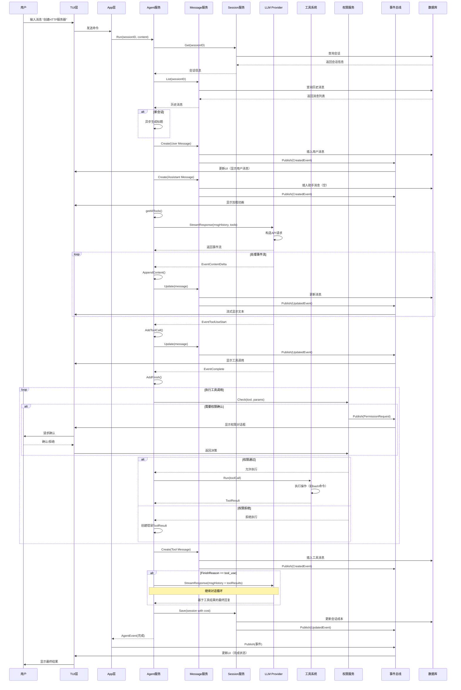
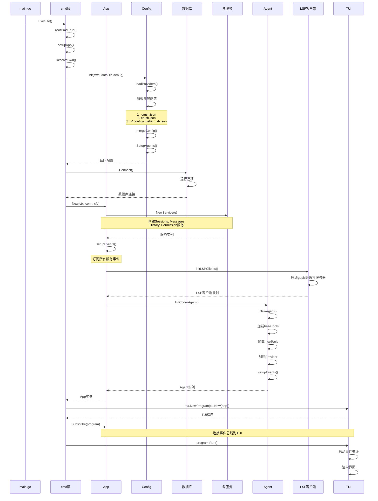
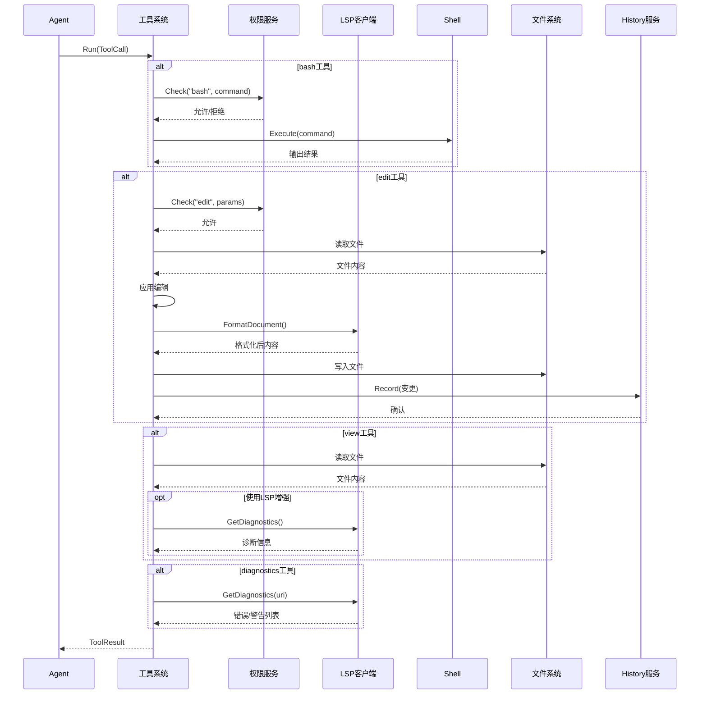
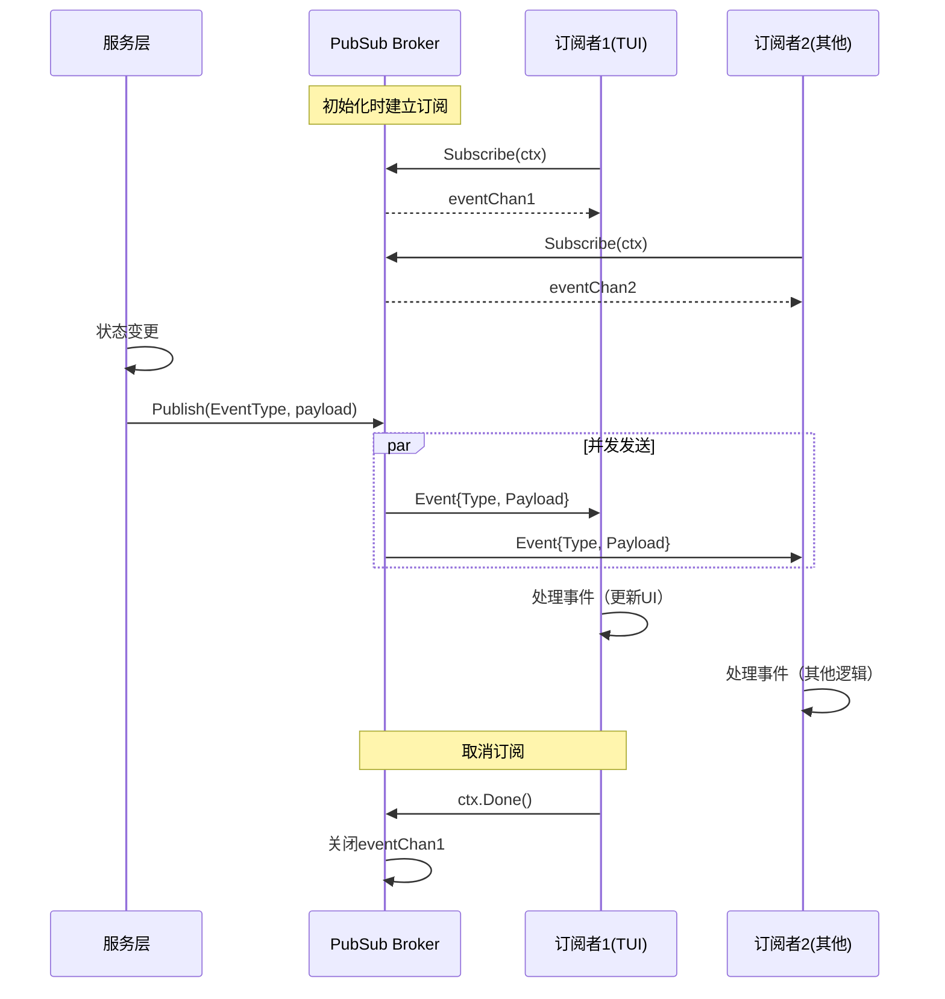
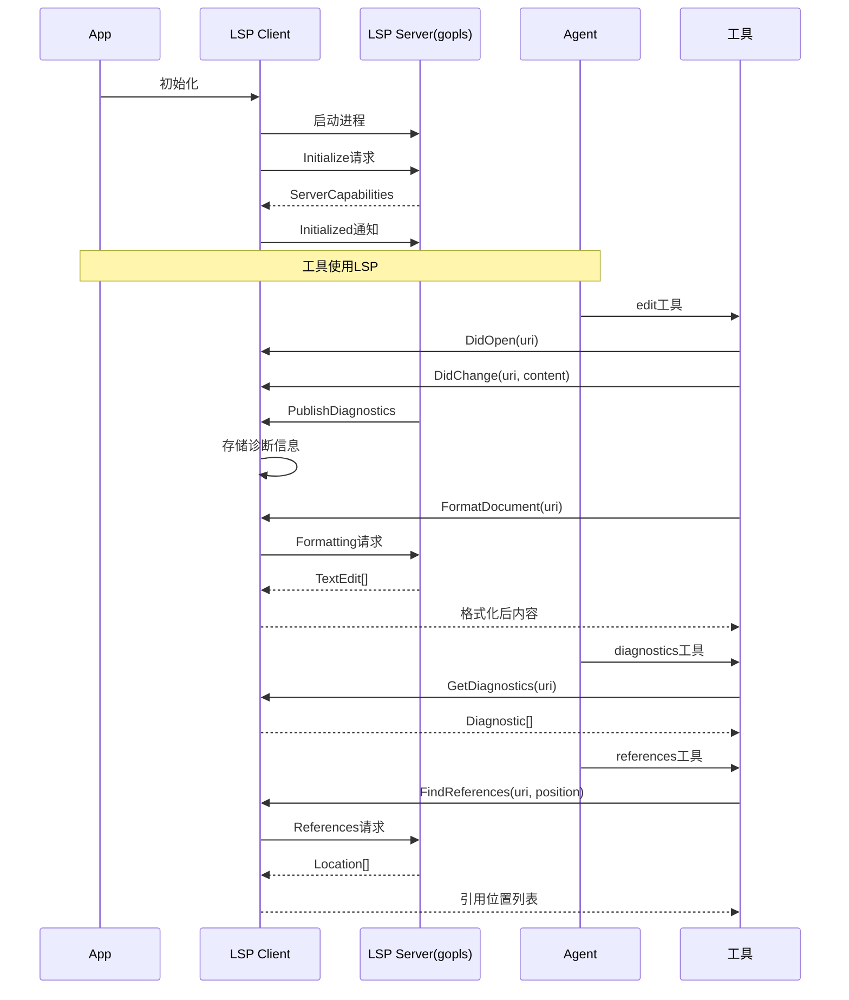

# Crush 项目工作流与数据流详解

## 目录

- [一、项目整体架构](#一项目整体架构)
- [二、核心模块功能划分](#二核心模块功能划分)
- [三、核心数据结构详解](#三核心数据结构详解)
- [四、完整数据流详解](#四完整数据流详解)
- [五、时序图](#五时序图)
- [六、关键设计模式](#六关键设计模式)
- [七、启动流程](#七启动流程)
- [八、数据持久化](#八数据持久化)

## 一、项目整体架构

### 1.1 项目结构分层

```
Crush 项目架构（从上到下）
========================

┌─────────────────────────────────────────┐
│  main.go - 程序入口                      │
│  ├─ pprof 性能分析                       │
│  └─ cmd.Execute() 命令执行               │
└─────────────────────────────────────────┘
                    ↓
┌─────────────────────────────────────────┐
│  internal/cmd/ - 命令行层                │
│  ├─ root.go - cobra 命令定义             │
│  ├─ run.go - 非交互模式                  │
│  └─ setupApp() - 应用初始化              │
└─────────────────────────────────────────┘
                    ↓
┌─────────────────────────────────────────┐
│  internal/app/app.go - 核心应用层        │
│  ├─ App 结构体 - 管理所有服务            │
│  ├─ 事件订阅与分发                       │
│  └─ 生命周期管理                         │
└─────────────────────────────────────────┘
                    ↓
┌──────────────────┬──────────────────┬───────────────────┐
│  业务服务层       │   支撑服务层      │    外部集成层      │
├──────────────────┼──────────────────┼───────────────────┤
│ • Sessions       │ • Config         │ • LSP Clients     │
│ • Messages       │ • Database       │ • MCP Servers     │
│ • Agent (AI)     │ • Permission     │ • LLM Providers   │
│ • History        │ • PubSub         │ • Shell           │
└──────────────────┴──────────────────┴───────────────────┘
                    ↓
┌─────────────────────────────────────────┐
│  internal/tui/ - 终端界面层              │
│  ├─ 聊天界面                             │
│  ├─ 命令面板                             │
│  └─ 文件选择器                           │
└─────────────────────────────────────────┘
```


## 二、核心模块功能划分

### 2.1 目录结构说明

```
internal/
├── app/          【核心应用层 - 整合所有服务】
│   ├── app.go              // App 主结构，管理所有服务的生命周期
│   └── lsp.go              // LSP 集成相关
│
├── cmd/          【命令行层 - CLI 入口】
│   ├── root.go             // Cobra 命令定义，setupApp() 初始化
│   ├── run.go              // 非交互模式执行
│   ├── logs.go             // 日志查看命令
│   └── update_providers.go // 模型提供商更新
│
├── config/       【配置管理层 - 配置加载与合并】
│   ├── config.go           // Config 核心结构
│   ├── init.go             // 配置初始化流程
│   ├── load.go             // 多层配置加载（项目/全局）
│   ├── merge.go            // 配置合并逻辑
│   └── provider.go         // Provider 管理
│
├── message/      【消息服务 - 对话消息管理】
│   ├── message.go          // 消息 CRUD 操作
│   ├── content.go          // 消息内容类型定义
│   └── attachment.go       // 附件处理
│
├── session/      【会话服务 - 对话会话管理】
│   └── session.go          // 会话 CRUD、成本追踪
│
├── llm/          【LLM 核心层 - AI 能力】
│   ├── agent/              // AI Agent 实现
│   │   ├── agent.go        // Agent 主逻辑，对话流程
│   │   ├── agent-tool.go   // Agent 工具
│   │   └── mcp-tools.go    // MCP 工具集成
│   ├── provider/           // LLM 提供商适配
│   │   ├── provider.go     // Provider 接口
│   │   ├── anthropic.go    // Claude 适配
│   │   ├── openai.go       // OpenAI 适配
│   │   ├── gemini.go       // Gemini 适配
│   │   └── ...
│   ├── prompt/             // 提示词管理
│   │   ├── prompt.go       // 提示词加载
│   │   ├── coder.go        // Coder Agent 提示词
│   │   └── *.md            // 提示词模板
│   └── tools/              // AI 工具集
│       ├── bash.go         // Shell 命令执行
│       ├── edit.go         // 文件编辑
│       ├── view.go         // 文件查看
│       ├── grep.go         // 代码搜索
│       └── ...
│
├── lsp/          【LSP 集成 - 语言服务器】
│   ├── client.go           // LSP 客户端实现
│   └── handlers.go         // LSP 事件处理
│
├── tui/          【终端 UI - 用户界面】
│   ├── tui.go              // TUI 主入口
│   ├── components/         // UI 组件
│   │   ├── chat/           // 聊天界面
│   │   ├── dialogs/        // 对话框
│   │   └── ...
│   └── exp/                // 实验性功能
│
├── db/           【数据库层 - SQLite】
│   ├── db.go               // 数据库连接
│   ├── migrations/         // 数据库迁移
│   └── *.sql.go            // SQLC 生成的查询
│
├── pubsub/       【发布订阅 - 事件系统】
│   ├── broker.go           // 事件总线实现
│   └── events.go           // 事件类型定义
│
├── permission/   【权限管理 - 工具权限控制】
│   └── permission.go       // 权限检查服务
│
└── history/      【历史记录 - 文件修改跟踪】
    └── file.go             // 文件变更历史
```


## 三、核心数据结构详解

### 3.1 App - 应用核心结构

```go
// internal/app/app.go
type App struct {
    // 业务服务
    Sessions    session.Service      // 会话管理
    Messages    message.Service      // 消息管理
    History     history.Service      // 文件历史
    Permissions permission.Service   // 权限控制
    
    // AI Agent
    CoderAgent agent.Service         // AI 代理服务
    
    // LSP 客户端映射
    LSPClients *csync.Map[string, *lsp.Client]
    
    // 配置
    config *config.Config
    
    // 事件系统
    events          chan tea.Msg     // 事件通道
    serviceEventsWG *sync.WaitGroup  // 服务事件等待组
    
    // 生命周期管理
    globalCtx    context.Context     // 全局上下文
    cleanupFuncs []func() error      // 清理函数列表
}
```

**App 的职责**：
1. **服务编排**：管理所有业务服务的生命周期
2. **事件总线**：接收各服务事件，转发给 TUI
3. **资源管理**：统一管理 LSP 客户端、数据库连接等资源
4. **优雅关闭**：协调所有服务的关闭流程

### 3.2 Config - 配置结构

```go
// internal/config/config.go
type Config struct {
    // 模型配置
    Models map[SelectedModelType]SelectedModel  // large/small 模型
    
    // 提供商配置
    Providers *csync.Map[string, ProviderConfig] // OpenAI、Anthropic 等
    
    // MCP (Model Context Protocol) 服务器
    MCP MCPs  // stdio/http/sse 类型的 MCP 服务器
    
    // LSP (Language Server Protocol) 配置
    LSP LSPs  // gopls、typescript-language-server 等
    
    // 选项
    Options *Options  // debug、context_paths 等
    
    // 权限
    Permissions *Permissions  // allowed_tools、skip_requests
    
    // 内部字段
    workingDir string        // 工作目录
    Agents     map[string]Agent  // coder、task 等 agent
}
```

**配置加载优先级**（从高到低）：
1. `.crush.json` - 项目本地配置
2. `crush.json` - 项目全局配置  
3. `~/.config/crush/crush.json` - 用户全局配置

### 3.3 Message - 消息结构

```go
// internal/message/content.go
type Message struct {
    ID        string
    Role      MessageRole   // user/assistant/system/tool
    SessionID string
    Parts     []ContentPart // 消息组成部分
    Model     string        // 使用的模型
    Provider  string        // 提供商
    CreatedAt int64
    UpdatedAt int64
}

// 消息内容可以包含多种类型
type ContentPart interface {
    isPart()
}

// 具体类型
type TextContent struct {
    Text string
}

type ReasoningContent struct {  // Claude 的推理过程
    Thinking   string
    Signature  string
    StartedAt  int64
    FinishedAt int64
}

type ToolCall struct {  // AI 调用工具
    ID       string
    Name     string
    Input    string
    Finished bool
}

type ToolResult struct {  // 工具执行结果
    ToolCallID string
    Content    string
    IsError    bool
}

type Finish struct {  // 消息结束标记
    Reason  FinishReason  // end_turn/tool_use/canceled/error
    Time    int64
}
```

**消息设计亮点**：
- **Parts 数组**：一条消息可包含多个部分（文本、工具调用、推理过程）
- **流式更新**：通过 `AppendContent()`、`AppendReasoningContent()` 支持流式响应
- **类型安全**：使用接口 + 类型断言，灵活且类型安全

### 3.4 Session - 会话结构

```go
// internal/session/session.go
type Session struct {
    ID               string
    ParentSessionID  string  // 用于 summarize 后的父会话
    Title            string
    MessageCount     int64
    PromptTokens     int64
    CompletionTokens int64
    SummaryMessageID string  // 会话摘要消息 ID
    Cost             float64 // 累计成本
    CreatedAt        int64
    UpdatedAt        int64
}
```

**会话功能**：
- **多会话管理**：用户可同时维护多个对话
- **成本追踪**：实时计算 token 使用和费用
- **会话摘要**：长对话可 summarize，压缩上下文

### 3.5 Agent - AI 代理

```go
// internal/llm/agent/agent.go
type agent struct {
    agentCfg    config.Agent        // agent 配置
    sessions    session.Service
    messages    message.Service
    permissions permission.Service
    
    // 工具集
    baseTools   *csync.Map[string, tools.BaseTool]  // bash、edit、view 等
    mcpTools    *csync.Map[string, tools.BaseTool]  // MCP 工具
    lspClients  *csync.Map[string, *lsp.Client]     // LSP 客户端
    
    // 提供商
    provider   provider.Provider      // 主模型（large）
    titleProvider provider.Provider   // 标题生成（small）
    summarizeProvider provider.Provider  // 摘要生成（large）
    
    // 请求管理
    activeRequests *csync.Map[string, context.CancelFunc]  // 活跃请求
    promptQueue    *csync.Map[string, []string]            // 提示词队列
}
```

**Agent 设计**：
- **工具系统**：Agent 通过工具与系统交互（文件操作、命令执行等）
- **请求管理**：每个 session 可有一个活跃请求，支持取消
- **多 Provider**：不同任务使用不同模型（主对话用 large，标题用 small）


## 四、完整数据流详解

### 4.1 用户发送消息的完整流程

```
【用户输入】"帮我创建一个 HTTP 服务器"
       ↓
┌──────────────────────────────────────────┐
│ 1. TUI 层 (internal/tui)                 │
│    - 捕获用户输入                         │
│    - 创建 tea.Cmd                        │
└──────────────────────────────────────────┘
       ↓
┌──────────────────────────────────────────┐
│ 2. App 层 (internal/app)                │
│    - 接收命令                            │
│    - 调用 CoderAgent.Run()              │
└──────────────────────────────────────────┘
       ↓
┌──────────────────────────────────────────┐
│ 3. Agent 层 (internal/llm/agent)        │
│    a. 创建 User Message                  │
│       messages.Create(sessionID, ...)   │
│    b. 加载历史消息                        │
│       messages.List(sessionID)          │
│    c. 调用 LLM Provider                  │
│       provider.StreamResponse(messages) │
└──────────────────────────────────────────┘
       ↓
┌──────────────────────────────────────────┐
│ 4. Provider 层 (internal/llm/provider)  │
│    - 构造 API 请求                       │
│    - 发送到 OpenAI/Anthropic            │
│    - 流式接收响应                        │
│    - 解析事件类型                        │
└──────────────────────────────────────────┘
       ↓
┌──────────────────────────────────────────┐
│ 5. 事件处理循环 (agent.processEvent)    │
│    ┌────────────────────────────┐       │
│    │ EventContentDelta          │       │
│    │  → 追加文本内容             │       │
│    │  → messages.Update()       │       │
│    └────────────────────────────┘       │
│    ┌────────────────────────────┐       │
│    │ EventToolUseStart          │       │
│    │  → 添加 ToolCall           │       │
│    │  → messages.Update()       │       │
│    └────────────────────────────┘       │
│    ┌────────────────────────────┐       │
│    │ EventComplete              │       │
│    │  → 添加 Finish             │       │
│    │  → 执行工具调用             │       │
│    └────────────────────────────┘       │
└──────────────────────────────────────────┘
       ↓
┌──────────────────────────────────────────┐
│ 6. 工具执行 (internal/llm/tools)        │
│    例如：bash.Run()                      │
│    ┌────────────────────────────┐       │
│    │ 1. permission.Check()      │       │
│    │    → 检查权限，可能弹窗确认  │       │
│    │ 2. shell.Run(command)      │       │
│    │    → 执行命令                │       │
│    │ 3. 返回 ToolResult          │       │
│    └────────────────────────────┘       │
└──────────────────────────────────────────┘
       ↓
┌──────────────────────────────────────────┐
│ 7. 创建 Tool Message                    │
│    messages.Create(sessionID, {         │
│      Role: message.Tool,                │
│      Parts: [ToolResult...]            │
│    })                                   │
└──────────────────────────────────────────┘
       ↓
┌──────────────────────────────────────────┐
│ 8. 继续对话循环                          │
│    - 将 ToolResult 发送给 LLM           │
│    - LLM 根据结果生成最终回复            │
│    - 返回 AgentEvent                    │
└──────────────────────────────────────────┘
       ↓
┌──────────────────────────────────────────┐
│ 9. PubSub 事件发布                       │
│    - messages.Publish(UpdatedEvent)    │
│    - app.events <- tea.Msg             │
└──────────────────────────────────────────┘
       ↓
┌──────────────────────────────────────────┐
│ 10. TUI 更新                            │
│     - 接收事件                           │
│     - 更新 UI 显示                       │
│     - 渲染新消息                         │
└──────────────────────────────────────────┘
```

### 4.2 核心流程代码解析

#### Agent.Run() - 启动对话流程

```go
// internal/llm/agent/agent.go:348
func (a *agent) Run(ctx context.Context, sessionID string, content string, 
                    attachments ...message.Attachment) (<-chan AgentEvent, error) {
    // 1. 检查会话是否繁忙
    if a.IsSessionBusy(sessionID) {
        // 如果繁忙，加入队列
        existing, _ := a.promptQueue.Get(sessionID)
        existing = append(existing, content)
        a.promptQueue.Set(sessionID, existing)
        return nil, nil
    }
    
    // 2. 创建可取消的上下文
    genCtx, cancel := context.WithCancel(ctx)
    a.activeRequests.Set(sessionID, cancel)
    
    // 3. 异步处理生成
    go func() {
        result := a.processGeneration(genCtx, sessionID, content, attachmentParts)
        events <- result
    }()
    
    return events, nil
}
```

#### processGeneration() - 核心生成逻辑

```go
// internal/llm/agent/agent.go:398
func (a *agent) processGeneration(ctx context.Context, sessionID, content string, 
                                   attachmentParts []message.ContentPart) AgentEvent {
    // 1. 加载历史消息
    msgs, err := a.messages.List(ctx, sessionID)
    
    // 2. 如果是新会话，异步生成标题
    if len(msgs) == 0 {
        go a.generateTitle(ctx, sessionID, content)
    }
    
    // 3. 创建用户消息
    userMsg, err := a.createUserMessage(ctx, sessionID, content, attachmentParts)
    
    // 4. 追加到历史
    msgHistory := append(msgs, userMsg)
    
    // 5. 进入工具调用循环
    for {
        // 流式处理并处理事件
        agentMessage, toolResults, err := a.streamAndHandleEvents(ctx, sessionID, msgHistory)
        
        // 如果需要工具调用，继续循环
        if agentMessage.FinishReason() == message.FinishReasonToolUse {
            msgHistory = append(msgHistory, agentMessage, *toolResults)
            continue  // 再次调用 LLM
        }
        
        // 完成，返回结果
        return AgentEvent{Type: AgentEventTypeResponse, Message: agentMessage}
    }
}
```

#### streamAndHandleEvents() - 流式处理

```go
// internal/llm/agent/agent.go:541
func (a *agent) streamAndHandleEvents(ctx context.Context, sessionID string, 
                                       msgHistory []message.Message) (message.Message, *message.Message, error) {
    // 1. 创建 Assistant 消息（立即显示加载动画）
    assistantMsg, _ := a.messages.Create(ctx, sessionID, message.CreateMessageParams{
        Role: message.Assistant,
        Parts: []ContentPart{},
    })
    
    // 2. 获取所有可用工具
    allTools, _ := a.getAllTools()
    
    // 3. 流式调用 Provider
    eventChan := a.provider.StreamResponse(ctx, msgHistory, allTools)
    
    // 4. 处理事件流
    for event := range eventChan {
        a.processEvent(ctx, sessionID, &assistantMsg, event)
    }
    
    // 5. 执行工具调用
    toolResults := make([]message.ToolResult, len(assistantMsg.ToolCalls()))
    for i, toolCall := range assistantMsg.ToolCalls() {
        tool := findTool(allTools, toolCall.Name)
        response, err := tool.Run(ctx, toolCall)
        toolResults[i] = message.ToolResult{
            ToolCallID: toolCall.ID,
            Content: response.Content,
            IsError: response.IsError,
        }
    }
    
    // 6. 创建 Tool Message
    msg, _ := a.messages.Create(ctx, sessionID, message.CreateMessageParams{
        Role: message.Tool,
        Parts: toolResults,
    })
    
    return assistantMsg, &msg, nil
}
```

#### processEvent() - 处理不同事件类型

```go
// internal/llm/agent/agent.go:710
func (a *agent) processEvent(ctx context.Context, sessionID string, 
                              assistantMsg *message.Message, event provider.ProviderEvent) error {
    switch event.Type {
    case provider.EventThinkingDelta:  // Claude 推理
        assistantMsg.AppendReasoningContent(event.Thinking)
        return a.messages.Update(ctx, *assistantMsg)
        
    case provider.EventContentDelta:  // 文本内容
        assistantMsg.AppendContent(event.Content)
        return a.messages.Update(ctx, *assistantMsg)
        
    case provider.EventToolUseStart:  // 工具调用开始
        assistantMsg.AddToolCall(*event.ToolCall)
        return a.messages.Update(ctx, *assistantMsg)
        
    case provider.EventToolUseDelta:  // 工具参数流式
        assistantMsg.AppendToolCallInput(event.ToolCall.ID, event.ToolCall.Input)
        return a.messages.Update(ctx, *assistantMsg)
        
    case provider.EventComplete:  // 完成
        assistantMsg.AddFinish(event.Response.FinishReason, "", "")
        a.messages.Update(ctx, *assistantMsg)
        return a.trackUsage(ctx, sessionID, a.Model(), event.Response.Usage)
    }
    return nil
}
```


## 五、时序图

### 5.1 完整对话流程时序图



### 5.2 启动流程时序图



### 5.3 工具执行流程时序图



### 5.4 事件发布订阅流程图



### 5.5 LSP集成流程图




## 六、关键设计模式与技术亮点

### 6.1 发布-订阅模式 (PubSub)

```go
// internal/pubsub/broker.go
type Broker[T any] struct {
    subs map[chan Event[T]]struct{}
    mu   sync.RWMutex
}

func (b *Broker[T]) Publish(t EventType, payload T) {
    // 向所有订阅者发送事件
    for sub := range b.subs {
        select {
        case sub <- Event{Type: t, Payload: payload}:
        default:
            // Channel满了，跳过（防止阻塞）
        }
    }
}
```

**应用场景**：
- **Session 服务** → TUI（显示会话列表更新）
- **Message 服务** → TUI（显示新消息）
- **Permission 服务** → TUI（显示权限请求对话框）
- **Agent 服务** → TUI（显示 AI 状态）

**优势**：
- ✅ 解耦：服务之间不直接依赖
- ✅ 实时：事件驱动，UI 实时响应
- ✅ 并发安全：通过锁保护

### 6.2 工具系统 (Tools)

```go
// internal/llm/tools/tools.go
type BaseTool interface {
    Name() string
    Info() ToolInfo
    Run(ctx context.Context, call ToolCall) (ToolResponse, error)
}
```

**内置工具**：

| 工具名 | 功能 | 需要权限 |
|--------|------|----------|
| `bash` | 执行 shell 命令 | ✅ |
| `edit` | 编辑文件（支持 LSP 格式化） | ✅ |
| `write` | 创建文件 | ✅ |
| `view` | 查看文件内容 | ❌ |
| `grep` | 搜索代码 | ❌ |
| `ls` | 列出文件 | ❌ |
| `glob` | 文件匹配 | ❌ |
| `diagnostics` | 获取 LSP 诊断信息 | ❌ |
| `references` | 查找代码引用 | ❌ |

**MCP 工具**：
- 通过 MCP (Model Context Protocol) 扩展
- 支持 stdio、http、sse 三种传输方式
- 示例：文件系统访问、数据库查询、API 调用

**工具执行流程**：
```
LLM 返回 ToolCall
   ↓
Permission.Check()  // 权限检查
   ↓
tool.Run()  // 执行工具
   ↓
返回 ToolResult
   ↓
再次发送给 LLM
```

### 6.3 LSP 集成

```go
// internal/lsp/client.go
type Client struct {
    cmd     *exec.Cmd
    stdin   io.WriteCloser
    stdout  io.ReadCloser
    // ...
}

// 获取诊断信息
func (c *Client) GetDiagnostics(uri string) []Diagnostic

// 查找引用
func (c *Client) FindReferences(uri string, line, char int) []Location
```

**应用场景**：
- **edit 工具**：编辑后自动格式化代码
- **diagnostics 工具**：获取编译错误、警告
- **references 工具**：查找函数/变量引用

**好处**：
- ✅ AI 能够看到编译错误，主动修复
- ✅ AI 能够理解代码结构，做更准确的修改
- ✅ 代码质量保证

### 6.4 并发安全的 Map (csync.Map)

```go
// internal/csync/maps.go
type Map[K comparable, V any] struct {
    m  map[K]V
    mu sync.RWMutex
}

func (m *Map[K, V]) Get(key K) (V, bool) {
    m.mu.RLock()
    defer m.mu.RUnlock()
    v, ok := m.m[key]
    return v, ok
}

func (m *Map[K, V]) Set(key K, value V) {
    m.mu.Lock()
    defer m.mu.Unlock()
    m.m[key] = value
}
```

**用途**：
- 管理 LSP 客户端
- 管理活跃请求
- 管理工具集合
- 管理 Provider 配置

**设计特点**：
- 封装标准 map + 读写锁
- 提供类型安全的泛型接口
- 支持 Go 1.23+ 的迭代器 (Seq/Seq2)
- 延迟加载（LazyMap）

### 6.5 Context 管理

**层级结构**：
```
globalCtx (app 全局)
   ↓
eventsCtx (事件系统)
   ↓
genCtx (单次生成请求)
   ↓
toolCtx (工具执行)
```

**取消机制**：
- 用户取消：`agent.Cancel(sessionID)`
- 应用关闭：`app.Shutdown()`
- 超时控制：`context.WithTimeout()`

**Context 值传递**：
```go
ctx = context.WithValue(ctx, tools.SessionIDContextKey, sessionID)
ctx = context.WithValue(ctx, tools.MessageIDContextKey, messageID)
```

### 6.6 流式响应处理

```go
// 生产者
func (p *provider) StreamResponse(ctx context.Context, msgs []message.Message, tools []tools.BaseTool) <-chan ProviderEvent {
    events := make(chan ProviderEvent)
    go func() {
        defer close(events)
        // 流式读取 API 响应
        for line := range stream {
            event := parseEvent(line)
            events <- event
        }
    }()
    return events
}

// 消费者
for event := range eventChan {
    switch event.Type {
    case EventContentDelta:
        // 流式更新消息
    case EventToolUseStart:
        // 工具调用开始
    }
}
```

**优势**：
- 实时显示：用户立即看到响应
- 可取消：通过 context 随时取消
- 内存友好：不需要等待完整响应


## 七、启动流程详解

### 7.1 完整启动流程

```
main.go
   │
   ├─ 启动 pprof (性能分析)
   │
   └─ cmd.Execute()
         │
         └─ rootCmd.RunE
               │
               ├─ setupApp()
               │     │
               │     ├─ ResolveCwd()  // 解析工作目录
               │     │
               │     ├─ config.Init()  // 加载配置
               │     │     ├─ resolveDataDirectory()
               │     │     ├─ loadFromFile(.crush.json)
               │     │     ├─ loadFromFile(crush.json)
               │     │     ├─ loadFromFile(~/.config/crush/crush.json)
               │     │     ├─ mergeConfig()
               │     │     ├─ loadProviders()
               │     │     └─ SetupAgents()
               │     │
               │     ├─ db.Connect()  // 连接数据库
               │     │     ├─ sqlite3.Open()
               │     │     └─ runMigrations()
               │     │
               │     ├─ app.New()
               │     │     │
               │     │     ├─ 创建服务
               │     │     │   ├─ session.NewService(q)
               │     │     │   ├─ message.NewService(q)
               │     │     │   ├─ history.NewService(q, conn)
               │     │     │   └─ permission.NewPermissionService()
               │     │     │
               │     │     ├─ setupEvents()  // 设置事件订阅
               │     │     │   ├─ setupSubscriber(Sessions)
               │     │     │   ├─ setupSubscriber(Messages)
               │     │     │   ├─ setupSubscriber(Permissions)
               │     │     │   ├─ setupSubscriber(History)
               │     │     │   └─ setupSubscriber(MCP)
               │     │     │
               │     │     ├─ initLSPClients()  // 初始化 LSP
               │     │     │   └─ 后台启动各语言 LSP 服务器
               │     │     │
               │     │     └─ InitCoderAgent()  // 初始化 Agent
               │     │           │
               │     │           ├─ agent.NewAgent()
               │     │           │     │
               │     │           │     ├─ 创建 Provider
               │     │           │     │   ├─ provider.NewProvider(main)
               │     │           │     │   ├─ provider.NewProvider(title)
               │     │           │     │   └─ provider.NewProvider(summarize)
               │     │           │     │
               │     │           │     ├─ 加载 base tools
               │     │           │     │   ├─ NewBashTool()
               │     │           │     │   ├─ NewEditTool()
               │     │           │     │   ├─ NewViewTool()
               │     │           │     │   └─ ...
               │     │           │     │
               │     │           │     ├─ 加载 MCP tools
               │     │           │     │   └─ getMCPTools()
               │     │           │     │
               │     │           │     └─ setupEvents()
               │     │           │
               │     │           └─ setupSubscriber(CoderAgent)
               │     │
               │     └─ event.Init()  // 初始化指标收集
               │
               ├─ 创建 TUI
               │     tea.NewProgram(tui.New(app))
               │
               ├─ app.Subscribe(program)  // 连接事件到 TUI
               │
               └─ program.Run()  // 启动 TUI 事件循环
```

### 7.2 配置加载详解

```go
// internal/config/init.go
func Init(cwd, dataDir string, debug bool) (*Config, error) {
    // 1. 确定数据目录
    dataDir = resolveDataDirectory(cwd, dataDir)
    
    // 2. 定义配置文件优先级
    configs := []string{
        filepath.Join(cwd, ".crush.json"),      // 项目本地（最高优先级）
        filepath.Join(cwd, "crush.json"),       // 项目全局
        filepath.Join(homeDir, ".config/crush/crush.json"), // 用户全局
    }
    
    // 3. 加载并合并配置
    cfg := &Config{}
    for _, path := range configs {
        if fileExists(path) {
            fileCfg, _ := loadFromFile(path)
            cfg = mergeConfig(cfg, fileCfg)  // 高优先级覆盖低优先级
        }
    }
    
    // 4. 加载 provider 数据库
    providers, _ := loadProviders(dataDir)
    cfg.Providers = providers
    
    // 5. 设置 Agent
    cfg.SetupAgents()
    
    return cfg, nil
}
```

### 7.3 数据库迁移

```go
// internal/db/connect.go
func Connect(ctx context.Context, dataDir string) (*sql.DB, error) {
    dbPath := filepath.Join(dataDir, "crush.db")
    
    // 1. 打开 SQLite 数据库
    conn, err := sql.Open("sqlite3", dbPath)
    
    // 2. 执行迁移
    migrations := embed.FS // 嵌入的 SQL 文件
    err = goose.Up(conn, migrations)
    
    return conn, nil
}
```

**迁移文件**：
- `20250424200609_initial.sql` - 初始表结构
- `20250515105448_add_summary_message_id.sql` - 添加摘要字段
- `20250624000000_add_created_at_indexes.sql` - 添加索引
- `20250627000000_add_provider_to_messages.sql` - 添加 provider 字段

### 7.4 LSP 客户端初始化

```go
// internal/app/lsp.go
func (app *App) initLSPClients(ctx context.Context) {
    go func() {
        for name, lspCfg := range app.config.LSP {
            if lspCfg.Disabled {
                continue
            }
            
            client, err := lsp.NewClient(ctx, name, lspCfg)
            if err != nil {
                slog.Error("Failed to start LSP", "name", name, "error", err)
                continue
            }
            
            app.LSPClients.Set(name, client)
            slog.Info("LSP client started", "name", name)
        }
    }()
}
```


## 八、数据持久化

### 8.1 数据库结构

```sql
-- sessions 表
CREATE TABLE sessions (
    id TEXT PRIMARY KEY,
    parent_session_id TEXT,
    title TEXT NOT NULL,
    message_count INTEGER DEFAULT 0,
    prompt_tokens INTEGER DEFAULT 0,
    completion_tokens INTEGER DEFAULT 0,
    summary_message_id TEXT,
    cost REAL DEFAULT 0,
    created_at INTEGER NOT NULL,
    updated_at INTEGER NOT NULL
);

-- messages 表
CREATE TABLE messages (
    id TEXT PRIMARY KEY,
    session_id TEXT NOT NULL,
    role TEXT NOT NULL,  -- user/assistant/system/tool
    parts TEXT NOT NULL,  -- JSON 数组
    model TEXT,
    provider TEXT,
    created_at INTEGER NOT NULL,
    updated_at INTEGER NOT NULL,
    finished_at INTEGER,
    FOREIGN KEY (session_id) REFERENCES sessions(id) ON DELETE CASCADE
);

-- files 表（历史记录）
CREATE TABLE files (
    id INTEGER PRIMARY KEY AUTOINCREMENT,
    session_id TEXT NOT NULL,
    path TEXT NOT NULL,
    content TEXT NOT NULL,
    created_at INTEGER NOT NULL,
    FOREIGN KEY (session_id) REFERENCES sessions(id) ON DELETE CASCADE
);
```

### 8.2 SQLC 生成类型安全代码

使用 [sqlc](https://sqlc.dev/) 从 SQL 生成类型安全的 Go 代码：

**定义查询**：
```sql
-- internal/db/sql/sessions.sql

-- name: CreateSession :one
INSERT INTO sessions (id, parent_session_id, title, created_at, updated_at)
VALUES (?, ?, ?, unixepoch(), unixepoch())
RETURNING *;

-- name: GetSessionByID :one
SELECT * FROM sessions WHERE id = ?;

-- name: ListSessions :many
SELECT * FROM sessions
ORDER BY updated_at DESC;

-- name: UpdateSession :one
UPDATE sessions
SET title = ?,
    prompt_tokens = ?,
    completion_tokens = ?,
    summary_message_id = ?,
    cost = ?,
    updated_at = unixepoch()
WHERE id = ?
RETURNING *;

-- name: DeleteSession :exec
DELETE FROM sessions WHERE id = ?;
```

**生成的 Go 代码**：
```go
// internal/db/sessions.sql.go (自动生成)

type CreateSessionParams struct {
    ID              string
    ParentSessionID sql.NullString
    Title           string
}

func (q *Queries) CreateSession(ctx context.Context, arg CreateSessionParams) (Session, error) {
    row := q.db.QueryRowContext(ctx, createSession,
        arg.ID,
        arg.ParentSessionID,
        arg.Title,
    )
    var i Session
    err := row.Scan(
        &i.ID,
        &i.ParentSessionID,
        &i.Title,
        &i.MessageCount,
        &i.PromptTokens,
        &i.CompletionTokens,
        &i.SummaryMessageID,
        &i.Cost,
        &i.CreatedAt,
        &i.UpdatedAt,
    )
    return i, err
}
```

### 8.3 消息 Parts 的 JSON 存储

```go
// 序列化
func marshallParts(parts []ContentPart) ([]byte, error) {
    wrappedParts := make([]partWrapper, len(parts))
    for i, part := range parts {
        var typ partType
        switch part.(type) {
        case TextContent:
            typ = textType
        case ToolCall:
            typ = toolCallType
        case ToolResult:
            typ = toolResultType
        // ...
        }
        wrappedParts[i] = partWrapper{Type: typ, Data: part}
    }
    return json.Marshal(wrappedParts)
}

// 反序列化
func unmarshallParts(data []byte) ([]ContentPart, error) {
    temp := []json.RawMessage{}
    json.Unmarshal(data, &temp)
    
    parts := make([]ContentPart, 0)
    for _, rawPart := range temp {
        var wrapper struct {
            Type partType        `json:"type"`
            Data json.RawMessage `json:"data"`
        }
        json.Unmarshal(rawPart, &wrapper)
        
        switch wrapper.Type {
        case textType:
            var part TextContent
            json.Unmarshal(wrapper.Data, &part)
            parts = append(parts, part)
        // ...
        }
    }
    return parts, nil
}
```

**存储示例**：
```json
[
  {
    "type": "text",
    "data": {"text": "这是一段文本"}
  },
  {
    "type": "tool_call",
    "data": {
      "id": "call_123",
      "name": "bash",
      "input": "{\"command\":\"ls -la\"}",
      "finished": true
    }
  },
  {
    "type": "finish",
    "data": {
      "reason": "end_turn",
      "time": 1234567890
    }
  }
]
```

### 8.4 数据一致性保证

**事务使用**：
```go
// 删除会话和相关消息
func (s *service) Delete(ctx context.Context, id string) error {
    // 外键级联删除自动处理相关消息
    err := s.q.DeleteSession(ctx, id)
    if err != nil {
        return err
    }
    s.Publish(pubsub.DeletedEvent, session)
    return nil
}
```

**并发控制**：
- 使用 SQLite 的 WAL 模式
- 每个操作在独立事务中
- 通过 context 控制超时

### 8.5 数据目录结构

```
.crush/
├── crush.db           # SQLite 数据库
├── crush.db-shm       # 共享内存文件
├── crush.db-wal       # WAL 日志
├── logs/
│   └── crush.log      # 应用日志
└── .gitignore         # 自动创建，忽略所有文件
```

## 九、配置系统

### 9.1 配置文件示例

```json
{
  "$schema": "https://charm.land/crush.json",
  
  "models": {
    "large": {
      "provider": "anthropic",
      "model": "claude-sonnet-4-20250514",
      "max_tokens": 8000
    },
    "small": {
      "provider": "anthropic",
      "model": "claude-haiku-3-5-20241022",
      "max_tokens": 4000
    }
  },
  
  "providers": {
    "anthropic": {
      "api_key": "$ANTHROPIC_API_KEY",
      "base_url": "https://api.anthropic.com/v1",
      "type": "anthropic"
    },
    "openai": {
      "api_key": "$OPENAI_API_KEY",
      "base_url": "https://api.openai.com/v1",
      "type": "openai"
    }
  },
  
  "lsp": {
    "go": {
      "command": "gopls",
      "enabled": true,
      "env": {
        "GOTOOLCHAIN": "go1.24.5"
      }
    },
    "typescript": {
      "command": "typescript-language-server",
      "args": ["--stdio"],
      "enabled": true
    }
  },
  
  "mcp": {
    "filesystem": {
      "type": "stdio",
      "command": "npx",
      "args": ["-y", "@modelcontextprotocol/server-filesystem", "/Users/me/projects"]
    },
    "github": {
      "type": "http",
      "url": "https://api.example.com/mcp",
      "headers": {
        "Authorization": "$(echo Bearer $GITHUB_TOKEN)"
      }
    }
  },
  
  "permissions": {
    "allowed_tools": ["view", "ls", "grep", "glob"]
  },
  
  "options": {
    "context_paths": ["CRUSH.md", "README.md", ".cursorrules"],
    "debug": false,
    "debug_lsp": false,
    "data_directory": ".crush",
    "attribution": {
      "co_authored_by": true,
      "generated_with": true
    },
    "tui": {
      "compact_mode": false,
      "diff_mode": "unified"
    }
  }
}
```

### 9.2 环境变量解析

支持在配置中使用环境变量：

```json
{
  "providers": {
    "openai": {
      "api_key": "$OPENAI_API_KEY"
    }
  },
  "mcp": {
    "github": {
      "headers": {
        "Authorization": "$(echo Bearer $GITHUB_TOKEN)"
      }
    }
  }
}
```

**解析逻辑**：
```go
// internal/config/resolve.go
func (r *ShellVariableResolver) ResolveValue(value string) (string, error) {
    if strings.HasPrefix(value, "$") && !strings.Contains(value, "$(") {
        // 简单环境变量：$VAR
        varName := strings.TrimPrefix(value, "$")
        return r.env.Get(varName), nil
    }
    
    if strings.Contains(value, "$(") {
        // Shell 命令：$(echo $VAR)
        cmd := extractCommand(value)
        output, err := exec.Command("sh", "-c", cmd).Output()
        return strings.TrimSpace(string(output)), err
    }
    
    return value, nil
}
```


## 十、学习建议与调试技巧

### 10.1 学习路径

#### 阶段 1：理解架构（1-2天）

**目标**：建立整体认知

1. **读懂启动流程**
   - 从 `main.go` 开始
   - 追踪 `cmd/root.go` 的 `setupApp()`
   - 理解 `app/app.go` 的职责

2. **理解事件系统**
   - 学习 `pubsub/broker.go` 的实现
   - 观察各服务如何发布/订阅事件
   - 理解事件如何流向 TUI

3. **掌握数据结构**
   - `Message` 的 Parts 设计
   - `Session` 的成本追踪
   - `Config` 的多层合并

**学习方法**：
```bash
# 启用 debug 模式
crush -d

# 观察日志
crush logs -f

# 查看数据库
sqlite3 .crush/crush.db
.schema
SELECT * FROM sessions;
SELECT * FROM messages WHERE session_id = 'xxx';
```

#### 阶段 2：深入核心（3-5天）

**目标**：理解 AI 对话流程

4. **研究 Agent 的对话循环**
   - `agent/agent.go` 的 `Run()` 方法
   - `processGeneration()` 的工具调用循环
   - `streamAndHandleEvents()` 的事件处理

5. **学习工具系统**
   - `tools/` 目录下各工具的实现
   - `BaseTool` 接口设计
   - 权限检查机制

6. **理解 LSP 集成**
   - `lsp/client.go` 的实现
   - 如何与 gopls 通信
   - edit/diagnostics 工具如何使用 LSP

**学习方法**：
```bash
# 设置断点调试（VS Code）
# 在 agent.Run() 设置断点
# 单步跟踪整个对话流程

# 或者添加日志
slog.Info("Message history", "count", len(msgs))
slog.Info("Tool call", "name", toolCall.Name, "input", toolCall.Input)
```

#### 阶段 3：扩展功能（1-2周）

**目标**：实践应用

7. **添加自定义工具**
   ```go
   // internal/llm/tools/custom.go
   type CustomTool struct {
       BaseTool
   }
   
   func (t *CustomTool) Run(ctx context.Context, call ToolCall) (ToolResponse, error) {
       // 实现你的工具逻辑
   }
   ```

8. **实现 MCP 服务器**
   - 学习 MCP 协议
   - 实现 stdio 类型服务器
   - 在 Crush 中配置使用

9. **优化提示词**
   - 修改 `llm/prompt/*.md`
   - 观察 AI 行为变化
   - 针对特定场景优化

### 10.2 调试技巧

#### 启用详细日志

```bash
# 方法1：命令行参数
crush -d

# 方法2：配置文件
{
  "options": {
    "debug": true,
    "debug_lsp": true
  }
}

# 方法3：环境变量
export CRUSH_DEBUG=1
```

#### 查看实时日志

```bash
# 实时跟踪
crush logs --follow

# 查看最近 N 行
crush logs --tail 1000

# 直接查看文件
tail -f .crush/logs/crush.log
```

#### 性能分析

```bash
# 启用 pprof
CRUSH_PROFILE=1 crush

# 在浏览器访问
open http://localhost:6060/debug/pprof/

# CPU profiling
curl http://localhost:6060/debug/pprof/profile > cpu.prof
go tool pprof cpu.prof

# Memory profiling
curl http://localhost:6060/debug/pprof/heap > mem.prof
go tool pprof mem.prof
```

#### 数据库调试

```bash
# 进入数据库
sqlite3 .crush/crush.db

# 查看表结构
.schema

# 查看会话
SELECT id, title, cost, prompt_tokens, completion_tokens 
FROM sessions 
ORDER BY updated_at DESC 
LIMIT 10;

# 查看消息
SELECT id, role, substr(parts, 1, 100) as parts_preview
FROM messages 
WHERE session_id = 'your-session-id'
ORDER BY created_at;

# 清理测试数据
DELETE FROM sessions WHERE title LIKE 'Test%';
```

#### VS Code 调试配置

```json
// .vscode/launch.json
{
  "version": "0.2.0",
  "configurations": [
    {
      "name": "Debug Crush",
      "type": "go",
      "request": "launch",
      "mode": "debug",
      "program": "${workspaceFolder}",
      "args": ["-d", "-c", "${workspaceFolder}"],
      "env": {
        "ANTHROPIC_API_KEY": "${env:ANTHROPIC_API_KEY}"
      }
    }
  ]
}
```

#### 常见问题排查

**Q: Agent 不响应**
```bash
# 检查 provider 配置
crush dirs  # 查看配置目录
cat ~/.config/crush/crush.json

# 检查 API key
echo $ANTHROPIC_API_KEY

# 查看日志
crush logs | grep -i error
```

**Q: LSP 不工作**
```bash
# 检查 LSP 是否安装
which gopls
gopls version

# 查看 LSP 日志（启用 debug_lsp）
crush -d
crush logs | grep -i lsp
```

**Q: 工具调用失败**
```bash
# 检查权限配置
cat .crush.json | jq '.permissions'

# 查看具体错误
crush logs | grep -i "tool.*error"
```

### 10.3 代码阅读工具推荐

#### VS Code + Go 插件
- **Go to Definition** (F12) - 追踪函数调用
- **Find All References** (Shift+F12) - 查看使用位置
- **Call Hierarchy** (Shift+Alt+H) - 查看调用链
- **Outline** 视图 - 快速浏览文件结构

#### GoLand
- **Find Usages** (Alt+F7) - 查找使用
- **Call Hierarchy** (Ctrl+Alt+H) - 调用层级
- **Type Hierarchy** (Ctrl+H) - 类型层级
- **Structure** 视图 - 代码结构

#### 命令行工具
```bash
# 代码搜索
rg "type Agent struct" --type go

# 查找函数定义
rg "^func.*Run\(" internal/llm/agent/

# 查找接口实现
rg "implements.*Service" --type go
```

## 十一、总结

### 11.1 Crush 的核心设计理念

1. **模块化架构**
   - 清晰的分层设计
   - 每个模块职责单一
   - 通过接口解耦

2. **事件驱动**
   - PubSub 模式实现松耦合
   - 实时响应用户操作
   - 易于扩展新功能

3. **工具扩展性**
   - 标准化的工具接口
   - 支持 MCP 协议扩展
   - 权限控制保证安全

4. **类型安全**
   - 大量使用泛型
   - SQLC 生成类型安全的数据库操作
   - 编译期检查错误

5. **并发友好**
   - Context 传递与取消
   - Channel 实现异步通信
   - sync.Map 保证并发安全

6. **用户体验**
   - 终端 UI 精心设计
   - 权限控制保护用户
   - 成本追踪透明

### 11.2 项目亮点

**技术亮点**：
- ✅ Bubble Tea TUI 框架的优秀应用
- ✅ 多 LLM Provider 的统一适配
- ✅ LSP 协议深度集成
- ✅ MCP 协议支持
- ✅ 流式响应处理
- ✅ SQLC 类型安全数据库操作
- ✅ 并发安全的泛型 Map

**架构亮点**：
- ✅ 清晰的分层架构
- ✅ 事件驱动设计
- ✅ 工具系统的可扩展性
- ✅ 配置系统的灵活性
- ✅ 优雅的生命周期管理

**业务亮点**：
- ✅ 多会话管理
- ✅ 会话摘要压缩上下文
- ✅ 成本实时追踪
- ✅ 文件变更历史
- ✅ 权限细粒度控制

### 11.3 学习价值

这个项目适合学习：

1. **Go 工程实践**
   - 项目结构组织
   - 错误处理模式
   - 并发编程实践

2. **AI 应用开发**
   - LLM API 集成
   - 工具调用（Function Calling）
   - 提示词工程

3. **系统设计**
   - 事件驱动架构
   - 插件系统设计
   - 配置管理

4. **终端应用开发**
   - TUI 框架使用
   - 交互设计
   - 事件处理

### 11.4 后续探索方向

1. **深入 Provider 层**
   - 学习如何适配不同的 LLM API
   - 理解流式响应的处理
   - 研究错误重试机制

2. **TUI 实现细节**
   - Bubble Tea 的 Model-Update-View 模式
   - 组件化设计
   - 键盘事件处理

3. **工具系统扩展**
   - 开发自己的工具
   - 实现 MCP 服务器
   - 工具链组合

4. **性能优化**
   - 减少不必要的数据库操作
   - 优化 LSP 通信
   - 缓存策略

---

## 参考资源

- **项目仓库**: https://github.com/charmbracelet/crush
- **Bubble Tea**: https://github.com/charmbracelet/bubbletea
- **SQLC**: https://sqlc.dev/
- **MCP 协议**: https://modelcontextprotocol.io/
- **LSP 协议**: https://microsoft.github.io/language-server-protocol/

---

**文档版本**: 1.0  
**适用版本**: Crush v0.11.2+  
**最后更新**: 2025-01-20

---

*本文档由 AI 辅助生成，基于 Crush 项目源码分析。*

